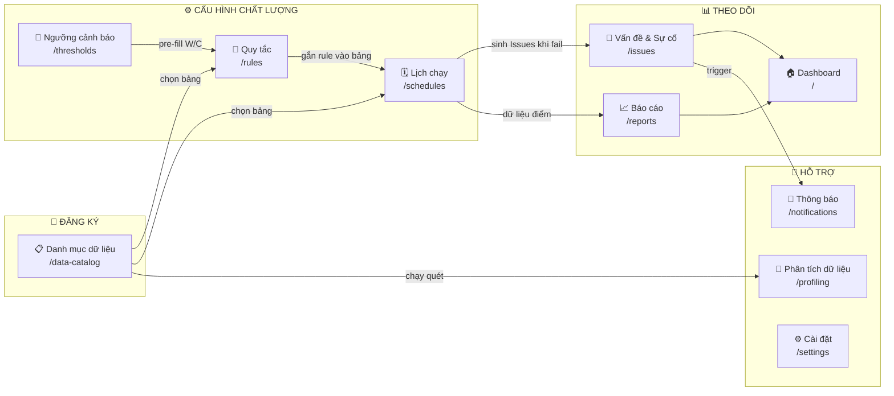
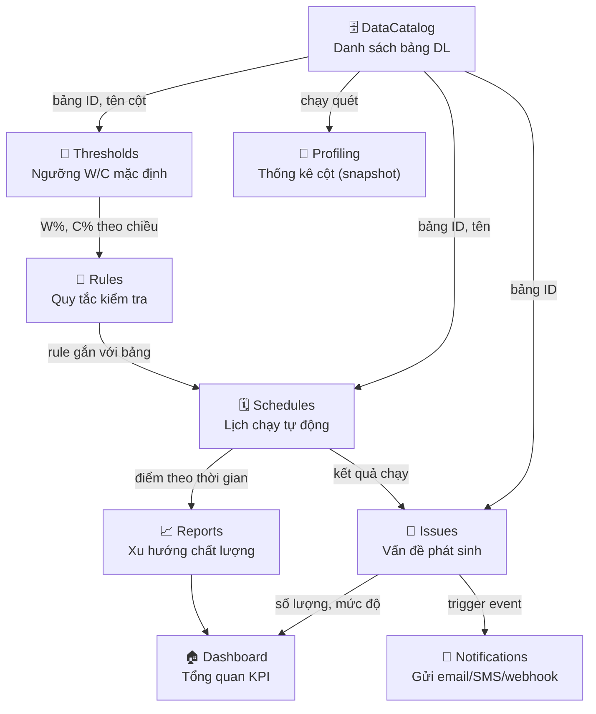
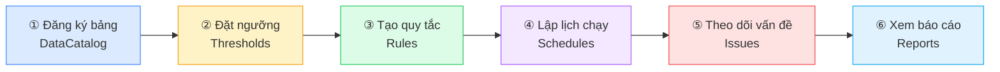

# Hướng Dẫn Sử Dụng — Data Quality System

> **Phiên bản:** 1.1 | **Ngày:** 2026-04-01
> Tài liệu này hướng dẫn toàn bộ quy trình sử dụng hệ thống giám sát chất lượng dữ liệu — từ người chưa từng dùng DQ tool đến quản trị viên nâng cao.

---

## Mục lục

1. [Tổng quan hệ thống](#1-tổng-quan-hệ-thống)
2. [Sơ đồ module và luồng dữ liệu](#2-sơ-đồ-module-và-luồng-dữ-liệu)
3. [Thứ tự cấu hình (Setup lần đầu)](#3-thứ-tự-cấu-hình-setup-lần-đầu)
4. [Bảng INPUT → OUTPUT giữa các menu](#4-bảng-input--output-giữa-các-menu)
5. [Rule DQ: Quy tắc cho Cột hay Bảng?](#5-rule-dq-quy-tắc-cho-cột-hay-bảng)
6. [25 Loại Metric Chi Tiết](#6-25-loại-metric-chi-tiết)
   - 6.1 [Cấp Bảng — 7 metrics](#61-cấp-bảng-table-level--7-metrics)
   - 6.2 [Cấp Cột — 18 metrics](#62-cấp-cột-column-level--18-metrics)
   - 6.3 [Hướng dẫn chi tiết 12 Metric mới](#63-hướng-dẫn-chi-tiết-12-metric-mới)
7. [Hướng dẫn từng menu](#7-hướng-dẫn-từng-menu)
   - 7.1 [Dashboard](#71-dashboard)
   - 7.2 [Danh mục dữ liệu](#72-danh-mục-dữ-liệu)
   - 7.3 [Phân tích dữ liệu (Profiling)](#73-phân-tích-dữ-liệu-profiling)
   - 7.4 [Ngưỡng cảnh báo (Thresholds)](#74-ngưỡng-cảnh-báo-thresholds)
   - 7.5 [Quản lý quy tắc (Rules)](#75-quản-lý-quy-tắc-rules)
   - 7.6 [Lịch chạy (Schedules)](#76-lịch-chạy-schedules)
   - 7.7 [Vấn đề & Sự cố (Issues)](#77-vấn-đề--sự-cố-issues)
   - 7.8 [Báo cáo (Reports)](#78-báo-cáo-reports)
   - 7.9 [Thông báo (Notifications)](#79-thông-báo-notifications)
   - 7.10 [Cài đặt (Settings)](#710-cài-đặt-settings)
8. [Ví dụ thực hành end-to-end](#8-ví-dụ-thực-hành-end-to-end)
   - 8.1 [KH_KHACHHANG — Thiết lập từ đầu](#kịch-bản-thiết-lập-giám-sát-bảng-kh_khachhang-từ-đầu)
   - 8.2 [GD_GIAODICH — Phát hiện vấn đề batch](#kịch-bản-2-giám-sát-bảng-gd_giaodich--phát-hiện-vấn-đề-batch-và-chất-lượng-số-liệu)
9. [Thuật ngữ & Câu hỏi thường gặp](#9-thuật-ngữ--câu-hỏi-thường-gặp)

---

## 1. Tổng quan hệ thống

### Hệ thống này làm gì?

Data Quality System (DQS) là nền tảng **giám sát chất lượng dữ liệu tự động** cho các bảng dữ liệu trong tổ chức. Hệ thống giúp:

- **Phát hiện sớm** các vấn đề dữ liệu: thiếu giá trị, sai định dạng, trùng lặp, lỗi tham chiếu
- **Tự động hóa** kiểm tra chất lượng theo lịch (hàng giờ, hàng ngày, hàng tuần...)
- **Cảnh báo** khi điểm chất lượng vượt ngưỡng cho phép
- **Theo dõi xu hướng** chất lượng dữ liệu theo thời gian

### Ai dùng hệ thống này?

| Vai trò | Chức năng chính |
|---|---|
| **Data Engineer / DBA** | Đăng ký bảng, tạo quy tắc kỹ thuật, cấu hình lịch chạy |
| **Data Steward / BA** | Xem báo cáo chất lượng, theo dõi vấn đề, xác nhận xử lý |
| **Data Owner** | Nhận thông báo, phê duyệt đóng vấn đề |
| **IT Operations** | Cấu hình kết nối, quản lý user, cài đặt thông báo |

### 6 Chiều chất lượng dữ liệu

Hệ thống đánh giá chất lượng theo 6 chiều chuẩn quốc tế:

| Chiều | Tên VN | Ý nghĩa |
|---|---|---|
| **Completeness** | Đầy đủ | Dữ liệu có bị thiếu, NULL hay không? |
| **Validity** | Hợp lệ | Dữ liệu có đúng định dạng, khoảng giá trị, danh sách cho phép? |
| **Consistency** | Nhất quán | Các cột liên quan có logic với nhau không? Tham chiếu có hợp lệ? |
| **Uniqueness** | Duy nhất | Có bị trùng lặp không? |
| **Accuracy** | Chính xác | Dữ liệu có khớp với nguồn chuẩn không? |
| **Timeliness** | Kịp thời | Dữ liệu có đến đúng hạn, còn mới không? |

---

## 2. Sơ đồ module và luồng dữ liệu

### 2.1 Sơ đồ tổng quan các module



### 2.2 Luồng thông tin giữa các menu



---

## 3. Thứ tự cấu hình (Setup lần đầu)

> **Quan trọng:** Hãy thực hiện đúng thứ tự này khi thiết lập hệ thống lần đầu. Các bước sau phụ thuộc vào bước trước.



| Bước | Menu | Làm gì | Mục đích |
|---|---|---|---|
| ① | Danh mục dữ liệu | Thêm bảng cần giám sát | Tạo "registry" — nền tảng cho mọi thứ |
| ② | Ngưỡng cảnh báo | Đặt W%, C% cho 6 chiều | Định nghĩa "tốt / cảnh báo / không đạt" |
| ③ | Quy tắc | Tạo rule kiểm tra cụ thể | Xác định chính xác cái gì cần kiểm tra |
| ④ | Lịch chạy | Cấu hình tần suất tự động | Tự động hóa việc kiểm tra |
| ⑤ | Vấn đề & Sự cố | Xem, gán, xử lý vấn đề | Theo dõi và xử lý khi có lỗi |
| ⑥ | Báo cáo | Phân tích xu hướng | Đánh giá chất lượng dài hạn |

> **Lưu ý:** Bước ② (Ngưỡng) có thể làm sau Bước ③ vì hệ thống có giá trị mặc định. Tuy nhiên khuyến nghị làm trước để tiết kiệm thời gian.

---

## 4. Bảng INPUT → OUTPUT giữa các menu

| Menu | URL | Bạn nhập/cấu hình | Tạo ra (Output) | Được dùng ở menu | Xem kết quả ở |
|---|---|---|---|---|---|
| **Danh mục dữ liệu** | `/data-catalog` | Tên bảng, schema, loại kết nối, chủ sở hữu | Danh sách bảng DL có ID | Rules, Schedules, Thresholds, Profiling | DataCatalog > chi tiết bảng |
| **Phân tích dữ liệu** | `/profiling` | Chọn bảng → nhấn Chạy | Snapshot thống kê cột (null%, distinct%, min/max) | DataCatalog > tab "Phân tích cột" | Profiling > Xem chi tiết |
| **Ngưỡng cảnh báo** | `/thresholds` | W%, C% cho 6 chiều × toàn cục + riêng bảng | Ngưỡng mặc định để pre-fill khi tạo Rule | Rules (pre-fill W/C) | Thresholds > thanh màu trực quan |
| **Quy tắc** | `/rules` | Chọn bảng, chiều, metric type, tham số, W/C | Rule gắn với bảng, chứa logic kiểm tra | Schedules (gắn rule vào lịch) | Rules > cột "Kết quả", "Điểm" |
| **Lịch chạy** | `/schedules` | Chọn bảng, tần suất, giờ chạy | Lịch tự động chạy toàn bộ rule của bảng | Issues (tự sinh), Reports | Schedules > "Xem Issues" |
| **Vấn đề & Sự cố** | `/issues` | *(Tự sinh từ Schedules)* — Gán người, đổi trạng thái | Vấn đề được xử lý, timeline | Dashboard, Reports, Notifications | Issues > chi tiết vấn đề |
| **Báo cáo** | `/reports` | Chọn khoảng thời gian, bảng, chiều | Biểu đồ xu hướng, radar chart | Dashboard | Reports |
| **Thông báo** | `/notifications` | Loại kênh, trigger, người nhận | Thông báo tự động gửi đi | *(nhận về qua email/SMS/webhook)* | Notifications > lịch sử gửi |

### Mối quan hệ 3 cấp của Ngưỡng

```
Ngưỡng toàn cục (Dimension level) — Mặc định cho toàn hệ thống
  └── Ngưỡng riêng theo bảng (Table + Dimension) — Ghi đè toàn cục
        └── Ngưỡng trong Rule (Rule level, W/C field) — Ghi đè tất cả
```

**Ví dụ:** Toàn cục Completeness W=90%, C=80% → Bảng GD_GIAODICH Completeness W=95%, C=90% → Rule "Kiểm tra NULL MA_KH" W=98%, C=95%

---

## 5. Rule DQ: Quy tắc cho Cột hay Bảng?

> **Câu hỏi hay!** Rule DQ **KHÔNG** chỉ dành cho cột. Có 2 loại phạm vi:

### Loại 1: Quy tắc cấp Cột (Column-level) — 18/25 metric

Áp dụng cho **1 cột cụ thể** trong bảng. Cột "Phạm vi" trong danh sách Rule hiển thị `Cột: TÊN_CỘT`.

**Khi nào dùng?** Khi bạn muốn kiểm tra một cột riêng lẻ: `EMAIL` có đúng format không? `SO_CMND` có NULL không? `SO_TIEN` có nằm trong khoảng hợp lệ không?

### Loại 2: Quy tắc cấp Bảng (Table-level) — 7/25 metric

**Không gắn với cột cụ thể** — kiểm tra đặc tính của toàn bảng hoặc ràng buộc giữa nhiều cột. Cột "Phạm vi" hiển thị `Bảng`.

| Metric | Chiều | Mô tả | Ví dụ thực tế |
|---|---|---|---|
| `row_count` | Completeness | Số dòng trong bảng nằm trong [min, max] | `GD_GIAODICH` có 1K–5M dòng — phát hiện truncate/explode |
| `time_coverage` | Completeness | Chuỗi thời gian không bị gián đoạn | `NGAY_GD` có dữ liệu liên tục 30 ngày ≥ 95% |
| `volume_change` | Completeness | % thay đổi số dòng so với N ngày trước | Số dòng không thay đổi quá 30% vs. tuần trước |
| `table_size` | Accuracy | Kích thước bảng trong khoảng [min, max] MB/GB | Partition `GD_GIAODICH` 1–500 GB |
| `custom_expression` | Validity | Điều kiện SQL WHERE tùy chỉnh | `LOAI_GD IN ('DC', 'CK', 'TM') AND SO_TIEN > 0` |
| `cross_column` | Consistency | Ràng buộc logic giữa 2+ cột | `NGAY_KET_THUC > NGAY_HIEU_LUC` |
| `duplicate_composite` | Uniqueness | Khóa duy nhất trên tổ hợp nhiều cột | Combo `(MA_KH, THANG)` trong bảng sao kê phải unique |

---

## 6. 25 Loại Metric Chi Tiết

Hệ thống hỗ trợ **25 metric type** chia thành 2 nhóm: **cấp cột** (18 metric) và **cấp bảng** (7 metric).

### 6.1 Cấp Bảng (Table-level) — 7 metrics

| # | Metric | Chiều | Mô tả | Tham số cần nhập | Ví dụ |
|---|---|---|---|---|---|
| 1 | `row_count` | Đầy đủ | Số dòng bảng phải nằm trong [min, max] — phát hiện bảng bị truncate hoặc explode | min rows, max rows | `GD_GIAODICH` có 1.000 – 5.000.000 dòng |
| 2 | `time_coverage` | Đầy đủ | Chuỗi thời gian không bị gián đoạn trong N ngày gần nhất | Cột thời gian, granularity (ngày/tuần/tháng), số ngày, % phủ tối thiểu | `NGAY_GD` liên tục 30 ngày ≥ 95% |
| 3 | `volume_change` | Đầy đủ | % thay đổi số dòng so với N ngày trước không vượt ngưỡng | Số ngày nhìn lại, % thay đổi tối đa | Số dòng không thay đổi quá 30% so với 7 ngày trước |
| 4 | `table_size` | Chính xác | Kích thước bảng/partition trong khoảng cho phép | min size, max size, đơn vị (MB/GB) | Bảng chiếm 1–500 GB |
| 5 | `custom_expression` | Hợp lệ | Điều kiện SQL WHERE tùy chỉnh cho toàn bảng | Biểu thức SQL | `LOAI_TK IN ('TD','TK') AND LAI_SUAT > 0` |
| 6 | `cross_column` | Nhất quán | Ràng buộc logic giữa 2+ cột | Biểu thức SQL boolean | `NGAY_DONG > NGAY_MO` |
| 7 | `duplicate_composite` | Duy nhất | Tổ hợp nhiều cột phải unique | Danh sách cột | `(MA_KH, THANG)` không trùng |

### 6.2 Cấp Cột (Column-level) — 18 metrics

| # | Metric | Chiều | Mô tả | Tham số cần nhập | Ví dụ |
|---|---|---|---|---|---|
| 1 | `not_null` | Đầy đủ | Cột không được có giá trị NULL | Cột kiểm tra | `MA_KH` không NULL |
| 2 | `fill_rate` | Đầy đủ | % dòng có giá trị phải ≥ ngưỡng tối thiểu | Cột, tỷ lệ tối thiểu (%) | `EMAIL` điền đủ ≥ 80% |
| 3 | `null_rate_by_period` | Đầy đủ | Tỷ lệ null theo chu kỳ không được vượt ngưỡng — phát hiện trend xấu dần | Cột, cột thời gian, granularity, số ngày, max null% | `EMAIL` null ≤ 20%/tháng trong 90 ngày |
| 4 | `conditional_not_null` | Đầy đủ | Cột bắt buộc có giá trị khi thỏa điều kiện WHERE | Cột, điều kiện SQL WHERE | `SO_DU` phải có giá trị khi `TRANG_THAI='ACTIVE'` |
| 5 | `format_regex` | Hợp lệ | Giá trị phải khớp biểu thức chính quy | Cột, pattern regex | `SO_DIEN_THOAI` khớp `^0[0-9]{9}$` |
| 6 | `blacklist_pattern` | Hợp lệ | Giá trị không được match pattern (loại rác: TEST, FAKE, N/A) | Cột, pattern (pipe-separated) | `EMAIL` không chứa `TEST\|FAKE\|N/A` |
| 7 | `value_range` | Hợp lệ | Số phải trong khoảng [min, max] | Cột, min, max | `TUOI` trong [18, 100] |
| 8 | `allowed_values` | Hợp lệ | Giá trị phải thuộc tập cho phép | Cột, danh sách hợp lệ | `GIOI_TINH` ∈ {M, F, Other} |
| 9 | `fixed_datatype` | Nhất quán | Cột phải luôn có kiểu dữ liệu cố định | Cột, kiểu dữ liệu (STRING/INTEGER/DECIMAL/DATE/TIMESTAMP) | `NGAY_SINH` phải là DATE |
| 10 | `mode_check` | Nhất quán | Giá trị phổ biến nhất phải chiếm ≥ X% — phát hiện dữ liệu bị pha tạp | Cột, giá trị mode (tùy chọn), tỷ lệ tối thiểu (%) | `LOAI_TK = 'TD'` chiếm ≥ 60% |
| 11 | `referential_integrity` | Nhất quán | FK phải tồn tại trong bảng tham chiếu | Cột nguồn, bảng đích, cột đích | `MA_KH` phải có trong `KH_KHACHHANG` |
| 12 | `duplicate_single` | Duy nhất | Giá trị trong cột phải unique | Cột | `SO_CMND` không trùng |
| 13 | `reference_match` | Chính xác | So sánh giá trị với bảng chuẩn đã xác thực | Cột nguồn, bảng chuẩn, cột chuẩn | `MA_TINH` khớp với bảng `DM_TINH_THANH` |
| 14 | `statistics_bound` | Chính xác | Giá trị thống kê (min/max/mean/stddev/percentile) nằm trong khoảng cho phép | Cột, loại thống kê, min, max | `SO_TIEN` có mean trong [100K, 50M] |
| 15 | `sum_range` | Chính xác | Tổng cột phải nằm trong [min, max] — phát hiện bảng bị zero-out | Cột, min, max | Tổng `SO_TIEN` > 0 mỗi ngày |
| 16 | `expression_pct` | Chính xác | ≥ X% dòng phải thỏa biểu thức SparkSQL — kiểm tra ràng buộc đa cột | Biểu thức SQL, tỷ lệ pass tối thiểu (%) | `SO_TIEN > 0 AND MA_TK IS NOT NULL` đúng ≥ 99% |
| 17 | `on_time` | Kịp thời | Dữ liệu phải có mặt trước thời hạn SLA | Cột timestamp, giờ SLA, cửa sổ cảnh báo (phút) | `NGAY_TAO` trước 08:00 ± 30 phút |
| 18 | `freshness` | Kịp thời | Cột timestamp phải được cập nhật trong X thời gian | Cột timestamp, thời gian tối đa, đơn vị | `NGAY_CAP_NHAT` trong vòng 5 phút qua |

### 6.3 Hướng dẫn chi tiết 12 Metric mới

#### `row_count` — Kiểm tra số dòng

**Mục đích:** Phát hiện bảng bị **truncate** (mất dữ liệu) hoặc **data explosion** (insert nhầm, lặp batch).

**Tham số:**
| Tham số | Bắt buộc | Giải thích |
|---|---|---|
| Số dòng tối thiểu (min) | ✅ | Ngưỡng dưới — ít hơn → bảng đang thiếu dữ liệu |
| Số dòng tối đa (max) | | Ngưỡng trên — nhiều hơn → có thể bị insert trùng |

**Ví dụ thực tế:**
```
Bảng GD_GIAODICH: min=1000, max=5000000
→ Nếu hôm nay chỉ có 50 dòng → FAIL (truncate hoặc job chết giữa chừng)
→ Nếu hôm nay có 10 triệu dòng → FAIL (có thể chạy batch 2 lần)
```

> **Lưu ý:** Đây là metric **cấp bảng** — không chọn cột.

---

#### `time_coverage` — Phủ chuỗi thời gian

**Mục đích:** Đảm bảo dữ liệu time-series **không bị gap** — phát hiện ngày/tuần/tháng bị thiếu.

**Tham số:**
| Tham số | Bắt buộc | Giải thích |
|---|---|---|
| Cột thời gian | ✅ | Cột DATE/TIMESTAMP chứa mốc thời gian |
| Granularity | ✅ | Kiểm tra theo: `Ngày` / `Tuần` / `Tháng` |
| Số ngày nhìn lại | ✅ | Kiểm tra N ngày gần nhất (VD: 30) |
| % phủ tối thiểu | ✅ | Bao nhiêu % kỳ phải có dữ liệu (VD: 95%) |

**Ví dụ thực tế:**
```
NGAY_GD, granularity=Ngày, lookback=30 ngày, minCoverage=95%
→ 30 ngày qua phải có ít nhất 29 ngày có dữ liệu
→ Nếu thiếu 3 ngày liên tiếp → FAIL (có thể pipeline bị dừng cuối tuần)
```

---

#### `volume_change` — Biến động khối lượng

**Mục đích:** Cảnh báo khi số dòng **tăng hoặc giảm đột biến** so với kỳ trước — phát hiện mất batch, load nhầm, hoặc surge bất thường.

**Tham số:**
| Tham số | Bắt buộc | Giải thích |
|---|---|---|
| Số ngày nhìn lại | ✅ | So sánh với trung bình N ngày trước (VD: 7) |
| % thay đổi tối đa | ✅ | Cho phép biến động tối đa X% (VD: 30%) |

**Ví dụ thực tế:**
```
lookbackPeriod=7, maxChangePct=30
→ Trung bình 7 ngày trước: 100,000 dòng/ngày
→ Hôm nay: 20,000 dòng → thay đổi -80% → FAIL
→ Hôm nay: 110,000 dòng → thay đổi +10% → PASS
```

> **Phân biệt với `row_count`:** `row_count` kiểm tra giá trị tuyệt đối; `volume_change` kiểm tra % biến động tương đối.

---

#### `table_size` — Kích thước bảng

**Mục đích:** Theo dõi dung lượng vật lý — phát hiện partition phình to bất thường hoặc bảng bị xóa nhầm.

**Tham số:**
| Tham số | Bắt buộc | Giải thích |
|---|---|---|
| Kích thước tối thiểu | | VD: `1` (MB/GB) |
| Kích thước tối đa | | VD: `500` (MB/GB) |
| Đơn vị | ✅ | `MB` hoặc `GB` |

---

#### `null_rate_by_period` — Tỷ lệ null theo chu kỳ

**Mục đích:** Không chỉ kiểm tra null tại thời điểm hiện tại — mà phát hiện **xu hướng null tăng dần** theo thời gian (dấu hiệu pipeline đang xấu đi).

**Tham số:**
| Tham số | Bắt buộc | Giải thích |
|---|---|---|
| Cột kiểm tra | ✅ | Cột cần theo dõi null rate |
| Cột thời gian | ✅ | Cột date để chia kỳ |
| Granularity | ✅ | Chia theo Ngày / Tuần / Tháng |
| Số ngày nhìn lại | ✅ | Kiểm tra trong N ngày gần nhất |
| Null rate tối đa (%) | ✅ | Mỗi kỳ không được vượt X% null |

**Ví dụ thực tế:**
```
Cột EMAIL, timeColumn=NGAY_TAO, granularity=Tháng, lookback=90 ngày, maxNullPct=20%
→ Tháng 1: null 10% ✅ | Tháng 2: null 15% ✅ | Tháng 3: null 25% ❌ FAIL
→ Phát hiện: từ tháng 3 nguồn không gửi email → cần check upstream
```

> **Phân biệt với `fill_rate`:** `fill_rate` snapshot tại thời điểm hiện tại; `null_rate_by_period` phân tích xu hướng theo thời gian.

---

#### `conditional_not_null` — Bắt buộc có giá trị theo điều kiện

**Mục đích:** Ràng buộc NULL phụ thuộc ngữ cảnh nghiệp vụ — "**nếu** trạng thái là X **thì** trường Y bắt buộc".

**Tham số:**
| Tham số | Bắt buộc | Giải thích |
|---|---|---|
| Cột kiểm tra | ✅ | Cột phải có giá trị khi điều kiện đúng |
| Điều kiện SQL WHERE | ✅ | Biểu thức điều kiện (viết như mệnh đề WHERE) |

**Ví dụ thực tế:**
```
Cột: SO_DU, Điều kiện: TRANG_THAI = 'ACTIVE'
→ Tài khoản ACTIVE phải có SO_DU
→ Tài khoản CLOSED được phép SO_DU = NULL

Cột: MA_HOP_DONG, Điều kiện: LOAI_GD = 'VAY'
→ Giao dịch vay phải gắn hợp đồng
```

> **Tip:** Điều kiện viết như SQL WHERE không có từ khóa WHERE: `TRANG_THAI = 'ACTIVE' AND LOAI_KH = 'CN'`

---

#### `blacklist_pattern` — Giá trị không được match pattern

**Mục đích:** Loại bỏ **giá trị rác** trong dữ liệu — các giá trị test, placeholder, sentinel values mà nguồn upstream hay để lại.

**Tham số:**
| Tham số | Bắt buộc | Giải thích |
|---|---|---|
| Cột kiểm tra | ✅ | Cột cần lọc rác |
| Pattern blacklist | ✅ | Regex hoặc chuỗi, nhiều pattern ngăn cách bằng `\|` |

**Ví dụ thực tế:**
```
Cột EMAIL, pattern: TEST|FAKE|N/A|test@test|example\.com|@localhost
→ Phát hiện: email@test.com, fake@fake.com, N/A → đây là dữ liệu rác

Cột MA_KHACH_HANG, pattern: 0000000|9999999|TEST|DUMMY
→ Phát hiện mã KH placeholder được insert nhầm lên production
```

> **Phân biệt với `format_regex`:** `format_regex` kiểm tra dữ liệu **PHẢI** match pattern; `blacklist_pattern` kiểm tra dữ liệu **KHÔNG ĐƯỢC** match pattern.

---

#### `fixed_datatype` — Kiểu dữ liệu cố định

**Mục đích:** Đảm bảo cột luôn chứa đúng kiểu dữ liệu — phát hiện "rogue values" như chuỗi text lẫn vào cột số, hoặc cột ngày chứa chuỗi không parse được.

**Tham số:**
| Tham số | Bắt buộc | Giải thích |
|---|---|---|
| Cột kiểm tra | ✅ | Cột cần kiểm tra kiểu |
| Kiểu dữ liệu | ✅ | `STRING` / `INTEGER` / `DECIMAL` / `DATE` / `TIMESTAMP` |

**Ví dụ thực tế:**
```
Cột NGAY_SINH, dataType=DATE
→ Phát hiện bản ghi có NGAY_SINH = '32/13/1990' (string không parse được thành DATE)

Cột SO_TIEN, dataType=DECIMAL
→ Phát hiện bản ghi có SO_TIEN = 'N/A' (text lẫn vào cột số)
```

---

#### `mode_check` — Giá trị phổ biến nhất chiếm tỷ lệ tối thiểu

**Mục đích:** Phát hiện dữ liệu bị **pha tạp** — khi một cột có giá trị thống trị (domain-specific), tỷ lệ của nó không được giảm xuống bất thường.

**Tham số:**
| Tham số | Bắt buộc | Giải thích |
|---|---|---|
| Cột kiểm tra | ✅ | Cột cần kiểm tra |
| Giá trị mode | | (Tùy chọn) Cố định giá trị cần chiếm đa số. Để trống = lấy giá trị phổ biến nhất |
| Tỷ lệ tối thiểu (%) | ✅ | Mode phải chiếm ít nhất X% |

**Ví dụ thực tế:**
```
Cột LOAI_TK, modeValue='TD', minFreqPct=60%
→ Tài khoản tiêu dùng (TD) phải chiếm ≥ 60% trong hệ thống
→ Nếu tháng này chỉ 30% là TD → pipeline đang insert sai loại tài khoản

Cột MA_CHI_NHANH (để trống modeValue), minFreqPct=5%
→ Không chi nhánh nào được chiếm quá 95% → phát hiện data skew
```

---

#### `statistics_bound` — Thống kê nằm trong khoảng

**Mục đích:** Kiểm tra các đặc trưng thống kê (mean, stddev, percentile...) của cột số nằm trong khoảng hợp lý — phát hiện outlier hệ thống, không phải outlier từng dòng.

**Tham số:**
| Tham số | Bắt buộc | Giải thích |
|---|---|---|
| Cột kiểm tra | ✅ | Cột số cần kiểm tra |
| Loại thống kê | ✅ | `min` / `max` / `mean` / `stddev` / `p25` / `p50` / `p75` |
| Giá trị tối thiểu | | Ngưỡng dưới của thống kê |
| Giá trị tối đa | | Ngưỡng trên của thống kê |

**Ví dụ thực tế:**
```
Cột SO_TIEN, statisticType=mean, min=100000, max=50000000
→ Giá trị trung bình giao dịch phải trong [100K, 50M] đồng
→ Nếu mean = 1,000 đồng → có vấn đề (có thể unit conversion lỗi, đơn vị tính sai)
→ Nếu mean = 500 tỷ → bất thường (input sai magnitude)

Cột LAI_SUAT, statisticType=p99, max=0.25
→ 99th percentile lãi suất không quá 25%/năm (phát hiện dữ liệu nhập sai)
```

---

#### `sum_range` — Tổng cột nằm trong khoảng

**Mục đích:** Đảm bảo tổng của cột (theo batch/ngày) không bằng 0 hoặc vượt ngưỡng — phát hiện bảng bị **zero-out** hoặc tổng phát sinh bất thường.

**Tham số:**
| Tham số | Bắt buộc | Giải thích |
|---|---|---|
| Cột kiểm tra | ✅ | Cột số cần tính tổng |
| Giá trị tổng tối thiểu | | Tổng phải ≥ min |
| Giá trị tổng tối đa | | Tổng phải ≤ max |

**Ví dụ thực tế:**
```
Cột SO_TIEN, min=1000000 (1 triệu đồng)
→ Tổng giao dịch cả ngày phải > 1 triệu → nếu = 0 là bảng bị truncate hoặc job chết

Cột SO_DIEM_TICH_LUY, min=0, max=1000000000
→ Tổng điểm tích lũy cả hệ thống phải hợp lý
```

> **Phân biệt với `statistics_bound`:** `sum_range` kiểm tra SUM (tổng cộng); `statistics_bound` kiểm tra mean/stddev/percentile.

---

#### `expression_pct` — % dòng thỏa biểu thức

**Mục đích:** Kiểm tra **ràng buộc đa cột** phức tạp mà các metric đơn lẻ không làm được — ít nhất X% dòng phải thỏa mãn điều kiện SQL.

**Tham số:**
| Tham số | Bắt buộc | Giải thích |
|---|---|---|
| Biểu thức SQL | ✅ | Điều kiện boolean trên 1 dòng (như mệnh đề WHERE) |
| % dòng pass tối thiểu | ✅ | Bao nhiêu % dòng phải thỏa mãn (VD: 99%) |

**Ví dụ thực tế:**
```
Expression: SO_TIEN > 0 AND MA_TK IS NOT NULL AND LOAI_GD IN ('DC','CK','TM')
minPassPct: 99
→ 99% dòng giao dịch phải thỏa đồng thời 3 điều kiện trên

Expression: NGAY_KET_THUC > NGAY_BAT_DAU AND TRANG_THAI != 'ERROR'
minPassPct: 100
→ 100% hợp đồng phải hợp lệ về cả logic ngày lẫn trạng thái
```

> **Phân biệt với `custom_expression`:** `custom_expression` kiểm tra **toàn bảng** (1 điều kiện tổng hợp dạng aggregate); `expression_pct` kiểm tra **từng dòng** và tính % pass.

---

## 7. Hướng dẫn từng menu

---

### 7.1 Dashboard

**URL:** `/` | **Mục đích:** Xem tổng quan sức khỏe dữ liệu, xác định nhanh điểm nóng cần chú ý.

**Các thành phần trên Dashboard:**

| Thành phần | Hiển thị gì | Nhấn vào để làm gì |
|---|---|---|
| Thẻ KPI (4 thẻ) | Tổng bảng DL / Rule đang active / Vấn đề mở / Điểm TB hệ thống | Điều hướng sang menu tương ứng |
| Biểu đồ radar 6 chiều | Điểm trung bình toàn hệ thống theo 6 chiều DL | Xem menu Báo cáo |
| Bảng "Cần chú ý" | Các bảng có điểm chất lượng thấp nhất | Nhấn vào bảng → DataCatalog chi tiết |
| Danh sách vấn đề gần đây | 5-10 Issue mới nhất | Nhấn → IssueDetail |
| Phân bổ theo chiều | Bar chart điểm 6 chiều | Tham khảo |

> Dashboard **chỉ đọc** — không có form nhập liệu. Mọi thông tin tự tổng hợp từ Rules và Issues.

---

### 7.2 Danh mục dữ liệu

**URL:** `/data-catalog` | **Mục đích:** Registry (danh bạ) của tất cả bảng dữ liệu cần giám sát. Đây là **bước đầu tiên bắt buộc** trước khi cấu hình bất kỳ thứ gì.

#### Danh sách bảng (`/data-catalog`)

Hiển thị tất cả bảng đã đăng ký, kèm:
- **Điểm tổng** (Overall Score): trung bình điểm 6 chiều
- **Trạng thái**: Active / Inactive
- **Loại kết nối**: Database / SQL / File / API
- **Lần phân tích cuối**: thời gian quét Profiling gần nhất

**Thao tác có thể làm:**

| Nút | Chức năng |
|---|---|
| Thêm nguồn dữ liệu | Đăng ký bảng mới |
| Sửa (✏️) | Cập nhật thông tin bảng |
| Xóa (🗑️) | Xóa bảng khỏi danh sách giám sát |
| Quét ngay (▶️) | Chạy profiling ngay lập tức (cập nhật thống kê cột) |
| Xem chi tiết | Vào trang chi tiết bảng |

#### Form Thêm/Sửa bảng dữ liệu

| Field | Bắt buộc | Giải thích | Ví dụ |
|---|---|---|---|
| **Tên hiển thị** | ✅ | Tên thân thiện để nhận biết | `Bảng khách hàng` |
| **Mô tả** | | Mô tả ngắn nội dung bảng | `Chứa thông tin định danh khách hàng cá nhân` |
| **Loại kết nối** | ✅ | Nguồn dữ liệu: Database / SQL / File / API | `database` |
| **Schema** | | Tên schema trong database | `dbo` |
| **Tên bảng vật lý** | ✅ | Tên bảng thực trong database | `KH_KHACHHANG` |
| **Danh mục** | | Nhóm nghiệp vụ | `Khách hàng` |
| **Chủ sở hữu** | | Người chịu trách nhiệm | `Nguyễn Văn A` |
| **Nhóm** | | Nhóm/team sở hữu dữ liệu | `Data Engineering` |

#### Trang chi tiết bảng (`/data-catalog/:id`)

Xem 4 nhóm thông tin:

1. **6 thẻ điểm dimension** — Điểm chất lượng hiện tại của bảng theo từng chiều
   - Tính từ: `avg(rule.lastScore)` của tất cả Rule đang active trên bảng này + chiều đó
   - Nếu chưa có Rule → hiển thị "Chưa có rule"

2. **Thông tin bảng + Xu hướng điểm 30 ngày** — Schema, owner, rowCount, biểu đồ trend

3. **Phân tích cột dữ liệu** — Thống kê cột từ lần Profiling gần nhất: null%, distinct%, min, max, issues
   - Nếu chưa có Profiling → hiển thị "Chưa phân tích, hãy chạy Phân tích dữ liệu"

4. **Quy tắc chất lượng áp dụng** — Danh sách Rule đang active, kèm ngưỡng W/C và kết quả lần chạy cuối

---

### 7.3 Phân tích dữ liệu (Profiling)

**URL:** `/profiling` | **Mục đích:** Xem **lịch sử các lần quét thống kê cột** (snapshot). Mỗi hàng = 1 lần quét tại thời điểm cụ thể.

> **Phân biệt với Danh mục dữ liệu:**
> - **Danh mục**: Điểm chất lượng = từ Rules (live, kết quả kiểm tra business logic)
> - **Profiling**: Điểm = từ thống kê cột (null rate, format tự nhiên...) — chỉ mang tính kỹ thuật

#### Danh sách lịch sử quét

| Cột | Ý nghĩa |
|---|---|
| Tên bảng | Bảng được quét |
| Thời gian chạy | Timestamp lúc quét |
| Trạng thái | `running` (đang chạy) / `completed` (xong) / `failed` (lỗi) |
| Tổng dòng | Số bản ghi tại thời điểm quét |
| Điểm chất lượng ℹ | Tính từ tỷ lệ cột có vấn đề trong lần quét này |
| Thời lượng ℹ | Thời gian thực hiện quét (giây) |

**Thao tác:**

| Nút | Chức năng |
|---|---|
| 👁️ Xem | Vào trang ProfilingDetail — xem thống kê chi tiết từng cột |
| 🔄 Chạy lại | Tạo một lần quét mới cho cùng bảng đó (mô phỏng ~2 giây) |

#### Trang ProfilingDetail (`/profiling/:id`)

> ⚠️ **Banner quan trọng:** "Snapshot lần quét [ngày] — Điểm ở đây tính từ thống kê cột, **khác** với điểm tổng hợp từ Rules ở Danh mục dữ liệu"

Hiển thị:
- 4 thẻ tóm tắt: Tổng dòng / Tổng cột / Điểm / Thời lượng
- Biểu đồ cột: **Điểm phân tích cột theo chiều dữ liệu**
- Bảng chi tiết cột: columnName, dataType, null%, distinct%, min, max, danh sách vấn đề
- Nút **Tải báo cáo**: Xuất CSV toàn bộ thống kê cột

#### Cột "Vấn đề" trong bảng Phân tích cột — Template sinh text

Khi Profiling chạy, hệ thống tự động tính thống kê và điền cột **Vấn đề** theo template dưới đây:

| Loại vấn đề | Điều kiện kích hoạt | Template text hiển thị |
|---|---|---|
| Null rate thấp | `nullRate > 1% AND nullRate ≤ 5%` | `{nullRate}% giá trị null` |
| Null rate cao | `nullRate > 5%` | `{nullRate}% giá trị null — vượt ngưỡng` |
| Định dạng sai | Profiling phát hiện format issue | `{pct}% giá trị sai định dạng` |
| Phân phối lệch | `distinctCount < 3` hoặc `distinctRate < 1%` | `Phân phối lệch — chỉ {distinctCount} giá trị phân biệt` |
| Outlier thống kê | Max > mean + 3×stddev | `Phát hiện outlier — max = {maxValue}` |
| Sai kiểu dữ liệu | Có giá trị không parse được thành kiểu khai báo | `Có giá trị không đúng kiểu {dataType}` |
| **Không có vấn đề** | `nullRate ≤ 1%` và không có issue nào khác | *(badge xanh "Không có")* |

> **Lưu ý quan trọng:** Cột "Vấn đề" trong Profiling là **nhận xét kỹ thuật tự động từ thống kê** (null rate, format rate...). Đây **khác hoàn toàn** với Issues ở menu "Vấn đề & Sự cố" — Issues là vi phạm **business logic** do Rules định nghĩa.

---

### 7.4 Ngưỡng cảnh báo (Thresholds)

**URL:** `/thresholds` | **Mục đích:** Định nghĩa "thế nào là tốt, thế nào là cần cảnh báo, thế nào là không đạt" — giá trị này được **tự động điền vào khi tạo Rule mới**.

#### Công thức đánh giá (áp dụng TOÀN hệ thống)

```
Điểm ≥ W%      →  ✅ ĐẠT
C% ≤ Điểm < W% →  ⚠️ CẢNH BÁO
Điểm < C%      →  ❌ KHÔNG ĐẠT
```

> **Ví dụ:** W=90%, C=80% → Điểm 95 = Đạt | Điểm 85 = Cảnh báo | Điểm 75 = Không đạt

#### Ngưỡng mặc định của hệ thống

| Chiều | W (Cảnh báo) | C (Không đạt) |
|---|---|---|
| Đầy đủ (Completeness) | 90% | 80% |
| Hợp lệ (Validity) | 85% | 70% |
| Nhất quán (Consistency) | 85% | 70% |
| Duy nhất (Uniqueness) | 95% | 90% |
| Chính xác (Accuracy) | 85% | 70% |
| Kịp thời (Timeliness) | 80% | 60% |

#### Cấu hình toàn cục (Global)

Chỉnh trực tiếp các ô số W / C cho từng chiều → nhấn **Lưu cấu hình**.
Thanh màu hiển thị trực quan: 🔴 Không đạt | 🟡 Cảnh báo | 🟢 Đạt

#### Cấu hình riêng theo bảng

Để ghi đè ngưỡng toàn cục cho **1 bảng cụ thể + 1 chiều cụ thể**:

| Field | Bắt buộc | Giải thích |
|---|---|---|
| **Bảng dữ liệu** | ✅ | Chọn bảng cần ghi đè ngưỡng |
| **Chiều dữ liệu** | ✅ | Chiều cần ghi đè (VD: chỉ ghi đè Uniqueness) |
| **Ngưỡng cảnh báo W (%)** | ✅ | Giá trị W riêng cho bảng này |
| **Ngưỡng không đạt C (%)** | ✅ | Giá trị C riêng cho bảng này |

> **Khi nào dùng?** Ví dụ: Bảng GD_GIAODICH yêu cầu Uniqueness rất cao → đặt W=99%, C=98% (thay vì mặc định 95/90)

> **⚠️ Lưu ý quan trọng về hiệu lực của Thresholds:**
> - Ngưỡng ở menu Thresholds chỉ được **tự động điền (pre-fill)** vào form khi **tạo Rule mới**.
> - Rule đã lưu **KHÔNG tự cập nhật** khi bạn thay đổi Thresholds sau này.
> - Nếu muốn cập nhật ngưỡng cho rule cũ → phải vào **Quản lý quy tắc → Chỉnh sửa** từng rule thủ công.
> - Ưu tiên ngưỡng: **Per-table** (nếu có) > **Toàn cục** → được pre-fill khi chọn bảng + chiều khi tạo rule.

---

### 7.5 Quản lý quy tắc (Rules)

**URL:** `/rules` | **Mục đích:** Tạo các quy tắc kiểm tra chất lượng dữ liệu cụ thể cho từng bảng.

#### Danh sách quy tắc

Các cột trong bảng:

| Cột | Ý nghĩa |
|---|---|
| Tên quy tắc | Tên mô tả quy tắc |
| Chiều DL | 1 trong 6 dimension |
| Bảng · Chỉ số | Tên bảng + mô tả metric config |
| **Phạm vi** | `Cột: TÊN_CỘT` hoặc `Bảng` |
| Ngưỡng W/C | Ngưỡng cảnh báo / không đạt |
| Chạy lần cuối | Timestamp lần chạy gần nhất |
| Kết quả | ✅ Đạt / ⚠️ Cảnh báo / ❌ Không đạt |
| Kích hoạt | Toggle bật/tắt rule |

#### Form Thêm/Sửa quy tắc

**Bước 1 — Thông tin cơ bản**

| Field | Bắt buộc | Giải thích | Ví dụ |
|---|---|---|---|
| **Tên quy tắc** | ✅ | Đặt tên ngắn gọn, mô tả rõ | `Kiểm tra số CMND không rỗng` |
| **Mô tả** | | Chi tiết hơn về mục đích | `Đảm bảo mọi KH đều có số CMND/CCCD` |
| **Bảng dữ liệu** | ✅ | Chọn từ DataCatalog | `KH_KHACHHANG` |
| **Kích hoạt ngay** | | Toggle: Hoạt động / Không HĐ | Bật → rule chạy theo lịch |

**Bước 2 — Chọn Chiều dữ liệu (Dimension)**

Nhấn vào 1 trong 6 nút dimension. Sau khi chọn, danh sách Metric sẽ hiện ra phù hợp.

**Bước 3 — Chọn loại Metric**

Dropdown chỉ hiện các metric phù hợp với dimension đã chọn. Có tooltip giải thích.

**Bước 4 — Điền tham số kiểm tra** (tùy metric type)

Xem [Phần 6 — 25 Loại Metric](#6-25-loại-metric-chi-tiết) để biết tham số cụ thể.

**Bước 5 — Ngưỡng W/C**

> Tự động điền từ Thresholds toàn cục khi bạn chọn Dimension. Có thể chỉnh lại.

| Field | Giải thích |
|---|---|
| **Ngưỡng cảnh báo W (%)** | Điểm nhỏ hơn W → Cảnh báo |
| **Ngưỡng không đạt C (%)** | Điểm nhỏ hơn C → Không đạt |

Ô thông tin hiển thị ngay phía dưới:
```
✅ Điểm ≥ W% → Đạt
⚠️ C% ≤ Điểm < W% → Cảnh báo
❌ Điểm < C% → Không đạt
```

#### Tab Templates

Thay vì tạo mới từ đầu, có thể chọn template sẵn có → tự động pre-fill form. Template được quản lý ở **Cài đặt > Quy tắc mặc định**.

#### Cơ chế chạy Rule

> - Rule **KHÔNG tự chạy** — phải được gắn vào một **Schedule** để chạy tự động.
> - Mỗi Schedule gắn với 1 bảng → chạy **toàn bộ rule active** của bảng đó theo tần suất đã đặt.
> - Nút **"Chạy ngay"** (▶️): chạy thủ công 1 rule duy nhất, ngay lập tức, ngoài lịch. Kết quả được ghi vào lịch sử và tự sinh Issue nếu vi phạm.

#### Lịch sử chạy và Xem kết quả

Mỗi rule có 2 nút trong cột Hành động:

| Nút | Icon | Chức năng |
|---|---|---|
| **Lịch sử chạy** | 🕐 History | Xem 7 lần chạy gần nhất: thời gian, trigger (Lịch/Thủ công), kết quả, điểm, Issue liên quan |
| **Xem kết quả** | 🔍 FileSearch | Xem chi tiết lần chạy cuối: điểm, ngưỡng W/C, % vi phạm, mẫu dữ liệu vi phạm |

> **Trigger types:**
> - `Lịch tự động` — do Schedule kích hoạt theo tần suất
> - `Chạy thủ công` — do user nhấn nút "Chạy ngay"

---

### 7.6 Lịch chạy (Schedules)

**URL:** `/schedules` | **Mục đích:** Cấu hình lịch tự động kiểm tra chất lượng cho từng bảng. Mỗi lịch = 1 bảng chạy toàn bộ rule của bảng đó theo tần suất định sẵn.

#### Danh sách lịch chạy

| Cột | Ý nghĩa |
|---|---|
| Tên lịch | Tên mô tả |
| Bảng dữ liệu | Bảng được kiểm tra |
| Tần suất | Realtime / Hàng giờ / Hàng ngày / Hàng tuần / Hàng tháng / Tùy chỉnh |
| Chạy tiếp theo | Lần chạy tự động tiếp theo |
| Chạy lần cuối | Timestamp lần chạy gần nhất |
| **Kết quả** | `success` / `partial` / `failed` (xem bảng bên dưới) |
| Số QT | Số rule đang active của bảng này |
| Kích hoạt | Toggle bật/tắt lịch |
| **Xem Issues** | Nhấn → chuyển sang Issues đã lọc theo bảng này |

**Ý nghĩa cột Kết quả:**

| Giá trị | Ý nghĩa |
|---|---|
| ✅ `success` | Tất cả rule của bảng → Đạt |
| ⚠️ `partial` | Có rule cảnh báo hoặc không đạt (nhưng lịch chạy được) |
| ❌ `failed` | Lịch không chạy được (lỗi kết nối, timeout) HOẶC >50% rule fail |

#### Form Thêm/Sửa lịch chạy

| Field | Bắt buộc | Giải thích | Ví dụ |
|---|---|---|---|
| **Tên lịch chạy** | ✅ | Tên mô tả | `Kiểm tra KH hàng ngày` |
| **Bảng dữ liệu** | ✅ | Chọn bảng cần lịch | `KH_KHACHHANG` |
| **Tần suất** | ✅ | Mức độ tự động | `daily` |
| **Giờ chạy** | (nếu daily/weekly) | Giờ thực hiện | `06:00` |
| **Ngày trong tuần** | (nếu weekly) | Checkbox T2-T7, CN | `T2, T4, T6` |
| **Cron expression** | (nếu custom) | Cú pháp cron Unix | `0 6 * * 1-5` |
| **Kích hoạt ngay** | | Toggle | Bật để lịch tự chạy |

**Tần suất — giải thích chi tiết:**

| Tần suất | Khi nào chạy | Phù hợp với |
|---|---|---|
| `realtime` | Liên tục (trigger-based) | Dữ liệu streaming, critical |
| `hourly` | Mỗi giờ tròn | Dữ liệu cập nhật thường xuyên |
| `daily` | 1 lần/ngày theo giờ đặt | Phổ biến nhất, phù hợp batch hàng ngày |
| `weekly` | 1+ ngày trong tuần | Báo cáo, dữ liệu ít thay đổi |
| `monthly` | 1 lần/tháng | Dữ liệu tháng, báo cáo tổng hợp |
| `custom` | Cron tùy chỉnh | Nâng cao, lịch phức tạp |

---

### 7.7 Vấn đề & Sự cố (Issues)

**URL:** `/issues` | **Mục đích:** Xem, tra cứu và xử lý các vấn đề chất lượng dữ liệu được phát hiện tự động từ khi Schedules chạy Rule và có kết quả fail/warning.

> **Lưu ý:** Issues **không thêm thủ công** — tự động sinh khi rule fail.

#### Nguồn gốc dữ liệu Issues — Data Flow

```
Schedule chạy (hoặc user nhấn "Chạy ngay") → Rule cho kết quả fail / warning
    ↓
Hệ thống AUTO tạo Issue với:
  title     = "{Tên rule} — {Đạt/Cảnh báo/Không đạt}"         ← tự sinh
  description = "Phát hiện X% vi phạm — Điểm: Y/100 ..."      ← tự sinh từ score + threshold
  severity  = tính từ (score, W, C)                            ← tự tính
  status    = 'new'                                            ← mặc định khi tạo
  tableId / dimension / ruleId = lấy trực tiếp từ Rule        ← từ Rule
    ↓
User vào Issues → thấy Issue mới → gán người → xử lý → đổi trạng thái
```

#### Định nghĩa trạng thái (Status)

| Status | Tên hiển thị | Ý nghĩa | Ai đặt |
|---|---|---|---|
| `new` | Mới | Vừa tự sinh khi rule fail | **Hệ thống** tự tạo |
| `assigned` | Đã gán | Đã gán người xử lý | User |
| `in_progress` | Đang xử lý | Người xử lý đang làm | User |
| `pending_review` | Chờ duyệt | Xử lý xong, chờ xác nhận | User |
| `resolved` | Đã xử lý | Đã xác nhận xử lý xong | User/Reviewer |
| `closed` | Đóng | Đóng hẳn, không theo dõi nữa | User |

#### Định nghĩa mức độ (Severity) — tự tính từ điểm

Severity **KHÔNG phải do user chọn ban đầu** — hệ thống tự tính từ điểm và ngưỡng:

```
score < C (critical threshold)  →  severity = 'critical'  (Nghiêm trọng)
C ≤ score < W (warning)         →  severity = 'high'       (Cao)
score ≥ W nhưng tạo issue       →  severity = 'medium'     (Trung bình)
```

> User có thể **chỉnh sửa lại mức độ** sau khi issue được tạo (upgrade/downgrade) nếu cần.

#### Các thẻ thống kê đầu trang

| Thẻ | Điều kiện tính |
|---|---|
| **Mới** | `status === 'new'` |
| **Đang xử lý** | `status === 'in_progress' OR status === 'assigned'` |
| **Chờ xét duyệt** | `status === 'pending_review'` |
| **Đã giải quyết** | `status === 'resolved' OR status === 'closed'` |

#### Trường "Mô tả vấn đề" — từ đâu ra?

**Tự sinh tự động** theo pattern:
```
"Phát hiện {X}% vi phạm trong {cột/toàn bảng} — Điểm: {score}/100
(ngưỡng cảnh báo: {W}%, không đạt: {C}%) · {Trigger}"
```

Ví dụ: `"Phát hiện 12.7% vi phạm trong cột EMAIL — Điểm: 87.3/100 (ngưỡng cảnh báo: 95%, không đạt: 85%) · Lịch tự động"`

> Trường **"Thêm bình luận hoặc ghi chú xử lý"** trong chi tiết issue là để user ghi chú thêm vào timeline — KHÔNG phải nguồn của mô tả vấn đề.

#### Lọc danh sách Issues

| Bộ lọc | Lựa chọn |
|---|---|
| Tìm kiếm | Tên issue |
| Mức độ | Critical / High / Medium / Low |
| Trạng thái | Mới / Đã gán / Đang xử lý / Chờ duyệt / Đã xử lý / Đóng |
| Bảng dữ liệu | Dropdown bảng |
| Chiều DL | 6 chiều |
| Từ ngày / Đến ngày | Khoảng thời gian phát hiện |

> **Tip:** Nhấn "Xem Issues" từ Schedules → tự động lọc theo bảng đó

#### Trang chi tiết Issue (`/issues/:id`)

Gồm 2 phần:

**Panel trái — Thông tin & timeline:**
- Mô tả chi tiết vấn đề
- Bảng/cột/dimension liên quan
- Điểm lúc phát hiện vs ngưỡng W/C
- Timeline sự kiện: `created` → `assigned` → `status_changed` → `resolved`

**Panel phải — Xử lý:**
- **Gán cho:** Nhập tên người xử lý → nhấn Cập nhật
- **Chuyển trạng thái:** Đổi sang `in_progress`, `pending_review`, `resolved`...
- **Đóng vấn đề:** Nút đặc biệt, yêu cầu xác nhận

**Thứ tự xử lý vấn đề điển hình:**
```
Mới (new) → Đã gán (assigned) → Đang xử lý (in_progress) → Chờ duyệt (pending_review) → Đã xử lý (resolved) → Đóng (closed)
```

---

### 7.8 Báo cáo (Reports)

**URL:** `/reports` | **Mục đích:** Phân tích xu hướng chất lượng dữ liệu theo thời gian, so sánh giữa các bảng.

**Nội dung báo cáo:**
- **Biểu đồ xu hướng điểm** theo thời gian (line chart)
- **Radar chart** 6 chiều — so sánh trực quan
- **Bảng chi tiết** từng bảng với điểm 6 dimension
- Lọc theo: khoảng thời gian, bảng, chiều

---

### 7.9 Thông báo (Notifications)

**URL:** `/notifications` | **Mục đích:** Cấu hình gửi thông báo tự động khi phát sinh hoặc giải quyết vấn đề.

#### Form Thêm/Sửa thông báo

| Field | Bắt buộc | Giải thích | Ví dụ |
|---|---|---|---|
| **Tên cấu hình** | ✅ | Tên mô tả | `Cảnh báo critical cho Data Team` |
| **Loại thông báo** | ✅ | `email` / `sms` / `webhook` | `email` |
| **Người nhận** | ✅ | Email/SĐT (mỗi dòng 1) hoặc Webhook URL | `datateam@company.com` |
| **Trigger khi** | ✅ | Chọn 1+ sự kiện: Cảnh báo / Critical / Đã giải quyết | `critical` ✅ |
| **Áp dụng cho** | | Tất cả bảng hoặc chọn bảng cụ thể | `GD_GIAODICH, KH_KHACHHANG` |
| **Kích hoạt** | | Toggle bật/tắt | Bật |

---

### 7.10 Cài đặt (Settings)

**URL:** `/settings` | Gồm 3 mục con:

#### Quy tắc mặc định (`/settings/default-rules`)
Template Rule tái sử dụng. Tạo template → khi vào menu Rules > tab Templates có thể chọn để pre-fill form nhanh.

#### Lịch mặc định (`/settings/default-schedules`)
Template Schedule. Hữu ích khi thêm nhiều bảng mới với cùng cấu hình lịch.

#### Quản lý người dùng (`/settings/users`)
Quản lý user trong hệ thống:
- Thêm/sửa/khóa user
- Phân quyền: Admin / Data Steward / Viewer
- Gán vào team

---

## 8. Ví dụ thực hành end-to-end

### Kịch bản: Thiết lập giám sát bảng `KH_KHACHHANG` từ đầu

> **Mục tiêu:** Đảm bảo bảng khách hàng luôn đầy đủ, đúng định dạng, không trùng lặp — chạy kiểm tra tự động 6:00 mỗi ngày.

---

**① Kiểm tra bảng đã có trong DataCatalog**

1. Vào **Danh mục dữ liệu** (`/data-catalog`)
2. Tìm `KH_KHACHHANG` trong danh sách
3. Nếu chưa có → nhấn **Thêm nguồn dữ liệu** → điền:
   - Tên: `Bảng khách hàng`
   - Loại: `database`
   - Tên bảng vật lý: `KH_KHACHHANG`
   - Chủ sở hữu: `Nguyễn Văn A`
4. Nhấn **Lưu**

---

**② Đặt ngưỡng chất lượng**

1. Vào **Ngưỡng cảnh báo** (`/thresholds`)
2. Kiểm tra ngưỡng toàn cục Completeness: W=90%, C=80% (OK)
3. Uniqueness cần cao hơn mặc định → nhấn **Thêm cấu hình** trong phần "riêng theo bảng":
   - Bảng: `KH_KHACHHANG`
   - Chiều: `Uniqueness (Duy nhất)`
   - W: `98%`, C: `95%`
4. Nhấn **Lưu cấu hình** (toàn cục) và **Lưu cấu hình** (theo bảng)

---

**③ Tạo các quy tắc kiểm tra**

Vào **Quản lý quy tắc** (`/rules`) → nhấn **Thêm quy tắc** cho từng quy tắc:

**Rule 1 — Số CMND không được rỗng:**
- Tên: `CMND/CCCD không được rỗng`
- Bảng: `KH_KHACHHANG`
- Chiều: `Đầy đủ (Completeness)` → Metric: `Không được rỗng (NOT NULL)`
- Cột: `SO_CMND`
- W/C: tự điền 90/80 → giữ nguyên
- Kích hoạt: ✅

**Rule 2 — Số điện thoại đúng định dạng:**
- Tên: `Số điện thoại đúng định dạng`
- Chiều: `Hợp lệ (Validity)` → Metric: `Đúng định dạng (Regex)`
- Cột: `DIEN_THOAI`, Pattern: `^0[0-9]{9}$`
- W/C: 85/70

**Rule 3 — Không có khách hàng trùng CMND:**
- Tên: `CMND không trùng lặp`
- Chiều: `Duy nhất (Uniqueness)` → Metric: `Không trùng lặp (1 cột)`
- Cột: `SO_CMND`
- W/C: tự điền 98/95 (từ bước ②) → giữ nguyên

---

**④ Lập lịch chạy tự động**

Vào **Lịch chạy** (`/schedules`) → nhấn **Thêm lịch chạy**:
- Tên: `KH hàng ngày 6h`
- Bảng: `KH_KHACHHANG`
- Tần suất: `Hàng ngày`
- Giờ chạy: `06:00`
- Kích hoạt: ✅
- Nhấn **Lưu lịch chạy**

---

**⑤ Theo dõi kết quả**

Ngày hôm sau lúc 06:00, lịch tự chạy. Vào kiểm tra:

1. **Schedules** → cột "Kết quả" của lịch `KH hàng ngày 6h`:
   - `success` = tốt
   - `partial` = có vấn đề nhỏ → nhấn **🔗 Xem Issues**
   - `failed` = cần kiểm tra kết nối

2. **Issues** (nếu có vấn đề):
   - Nhấn vào issue để xem chi tiết
   - Gán cho người xử lý → nhấn **Cập nhật**
   - Sau khi xử lý → đổi trạng thái → **Đóng vấn đề**

3. **Danh mục dữ liệu** → chi tiết `KH_KHACHHANG`:
   - Xem điểm 6 dimension cập nhật sau khi rule chạy

---

### Kịch bản 2: Giám sát bảng `GD_GIAODICH` — phát hiện vấn đề batch và chất lượng số liệu

> **Mục tiêu:** Dùng các metric mới (row_count, volume_change, statistics_bound, expression_pct) để phát hiện pipeline lỗi và dữ liệu sai nghiệp vụ.

---

**① Tạo Rule kiểm tra số dòng giao dịch**

Vào **Quy tắc** → Thêm quy tắc:
- Chiều: `Đầy đủ (Completeness)` → Metric: `Số dòng (Row Count) [Bảng]`
- Số dòng tối thiểu: `1000`
- Số dòng tối đa: `5000000`
- W/C: `5 / 20`
- Phạm vi hiển thị: **Bảng** (không cần chọn cột)

**② Tạo Rule biến động số dòng**

- Chiều: `Đầy đủ (Completeness)` → Metric: `Biến động khối lượng (Volume Change) [Bảng]`
- Số ngày nhìn lại: `7`
- % thay đổi tối đa: `30`
- W/C: `20 / 50`

**③ Tạo Rule thống kê SO_TIEN**

- Chiều: `Chính xác (Accuracy)` → Metric: `Thống kê (Statistics Bound)`
- Cột: `SO_TIEN`
- Loại thống kê: `mean (Trung bình)`
- Giá trị tối thiểu: `100000`
- Giá trị tối đa: `50000000`
- W/C: `5 / 20`

**④ Tạo Rule expression đa điều kiện**

- Chiều: `Chính xác (Accuracy)` → Metric: `% dòng thỏa biểu thức (Expression %)`
- Biểu thức: `SO_TIEN > 0 AND MA_TK IS NOT NULL`
- % pass tối thiểu: `99`
- W/C: `1 / 5`

**⑤ Gắn vào lịch chạy hàng giờ**

- Lịch: `GD_GIAODICH - Hàng giờ`
- Tần suất: `Hàng giờ`
- Kích hoạt: ✅

**⑥ Khi phát hiện vấn đề**

Nếu batch đêm bị lỗi → rule `row_count` fail (chỉ 50 dòng) → Issue tự sinh:
1. **Schedules** → "Xem Issues" → thấy issue mức độ Critical
2. **Issue detail** → gán cho kỹ sư data pipeline
3. Sau khi fix batch → chạy lại → đổi trạng thái → Đóng vấn đề

---

## 9. Thuật ngữ & Câu hỏi thường gặp

### Bảng thuật ngữ

| Thuật ngữ | Giải thích |
|---|---|
| **Dimension** | Chiều chất lượng dữ liệu (6 chiều: Completeness, Validity...) |
| **Metric / Metric Type** | Loại phép đo cụ thể trong 1 chiều (VD: not_null, format_regex...) |
| **Rule / Quy tắc** | Một quy tắc kiểm tra cụ thể = bảng + chiều + metric + tham số + ngưỡng |
| **Score / Điểm** | Kết quả rule (0-100%). Ví dụ: 95% dòng không NULL → điểm 95 |
| **W (Warning Threshold)** | Ngưỡng cảnh báo (%). Điểm ≥ W → Đạt; C ≤ Điểm < W → Cảnh báo |
| **C (Critical Threshold)** | Ngưỡng không đạt (%). Điểm < C → Không đạt |
| **Profiling** | Quét thống kê kỹ thuật của cột: null rate, distinct count, min/max... |
| **Schedule** | Lịch tự động chạy toàn bộ rule của 1 bảng theo tần suất |
| **Issue** | Vấn đề phát sinh khi rule fail, cần xử lý |
| **Severity** | Mức độ nghiêm trọng của Issue: Critical > High > Medium > Low |

### Câu hỏi thường gặp

**❓ Tại sao điểm ở Danh mục dữ liệu khác điểm ở Phân tích dữ liệu (Profiling)?**

Hai nguồn tính toán hoàn toàn khác nhau:
- **Danh mục dữ liệu**: Điểm = `avg(rule.lastScore)` của tất cả Rule active → phản ánh chất lượng theo **business logic** (quy tắc mà tổ chức tự định nghĩa)
- **Profiling**: Điểm = tỷ lệ cột "sạch" theo thống kê kỹ thuật (null rate, format...) → là **snapshot kỹ thuật** tại thời điểm quét

---

**❓ Rule chỉ dành cho từng cột riêng lẻ à? Kiểm tra quan hệ giữa các cột thì dùng gì?**

Không — có **7 metric type** dành cho **toàn bảng** (không gắn với cột cụ thể):

| Metric | Mục đích chính |
|---|---|
| `row_count` | Kiểm tra số dòng tuyệt đối [min, max] |
| `time_coverage` | Chuỗi thời gian không bị gap |
| `volume_change` | % biến động số dòng so với kỳ trước |
| `table_size` | Dung lượng vật lý bảng |
| `cross_column` | Ràng buộc logic giữa 2+ cột |
| `duplicate_composite` | Khóa duy nhất tổ hợp nhiều cột |
| `custom_expression` | Điều kiện SQL WHERE bất kỳ |

---

**❓ Tôi vừa sửa ngưỡng ở Thresholds, các Rule cũ có tự cập nhật không?**

**Không.** Ngưỡng ở Thresholds chỉ được tự động điền (pre-fill) vào các **Rule mới** khi bạn tạo rule. Các rule cũ vẫn giữ nguyên W/C đã lưu. Nếu muốn cập nhật, phải vào sửa từng rule.

---

**❓ Lịch chạy (Schedule) có tự động phát hiện Rule mới thêm vào không?**

Có. Mỗi lần lịch chạy, nó sẽ chạy **tất cả** Rule active đang gắn với bảng đó (kể cả rule mới thêm sau khi lịch được tạo).

---

**❓ Sự khác biệt giữa `failed` và `partial` trong kết quả lịch chạy?**

- `partial`: Lịch chạy **thành công** (kết nối được, thực hiện được) nhưng có rule cho kết quả Cảnh báo hoặc Không đạt → sinh Issues
- `failed`: Lịch **không chạy được** (lỗi kết nối, timeout...) hoặc hơn 50% rule fail → cần kiểm tra hạ tầng

---

**❓ Sự khác biệt giữa `fill_rate`, `not_null`, và `null_rate_by_period` — dùng cái nào?**

| Metric | Khi nào dùng |
|---|---|
| `not_null` | Cột bắt buộc 100% — không cho phép NULL dù chỉ 1 dòng |
| `fill_rate` | Cột không bắt buộc — nhưng phải điền đủ ≥ X% (VD: email khuyến nghị nhưng không ép) |
| `null_rate_by_period` | Bạn muốn phát hiện **xu hướng xấu đi theo thời gian** — mỗi tháng null rate tăng dần là dấu hiệu pipeline upstream có vấn đề |

---

**❓ `expression_pct` và `custom_expression` dùng biểu thức SQL nhưng khác nhau thế nào?**

```
custom_expression:
  → Kiểm tra TOÀN BẢng theo 1 aggregate condition (dạng đúng/sai)
  → VD: "ABS(SUM(col_a) - SUM(col_b)) / SUM(col_b) <= 0.01"
  → Kết quả: PASS hoặc FAIL (không có %)

expression_pct:
  → Kiểm tra TỪNG DÒNG — đếm % dòng thỏa mãn điều kiện
  → VD: "SO_TIEN > 0 AND MA_TK IS NOT NULL"
  → Kết quả: 99.4% dòng pass → điểm 99.4
```

---

**❓ Tôi nên dùng `statistics_bound` hay `value_range` để kiểm tra SO_TIEN?**

- **`value_range`**: Kiểm tra từng dòng — giá trị của mỗi dòng phải trong [min, max]. Phát hiện **outlier từng giao dịch**.
- **`statistics_bound`**: Kiểm tra thống kê tổng hợp — giá trị MEAN/STDDEV/P99... của toàn bộ cột phải trong [min, max]. Phát hiện **vấn đề hệ thống** (VD: unit conversion lỗi làm toàn bộ giá trị ÷100).

Thực tế nên dùng cả hai: `value_range` bắt từng giao dịch bất thường, `statistics_bound` bắt vấn đề cả batch.

---

**❓ `blacklist_pattern` viết pattern thế nào nếu muốn loại nhiều giá trị?**

Dùng pipe `|` để OR nhiều pattern. Pattern hỗ trợ regex:
```
TEST|FAKE|N/A|n/a|null|NULL|0000-00-00|example\.com|@localhost|@test\.
```
Hệ thống sẽ FAIL nếu giá trị **khớp với bất kỳ pattern nào** trong danh sách trên.

---

**❓ Tôi muốn nhận email ngay khi có vấn đề nghiêm trọng — cấu hình ở đâu?**

Vào **Thông báo** (`/notifications`) → Thêm cấu hình:
- Loại: `email`
- Người nhận: địa chỉ email của bạn
- Trigger khi: chọn `Critical`
- Áp dụng cho: Tất cả bảng (hoặc chọn bảng cụ thể)

---

*Hết tài liệu — Phiên bản 1.1 | Data Quality System | Cập nhật 2026-04-01 — 25 metric types*
