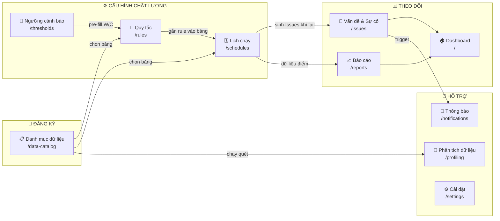
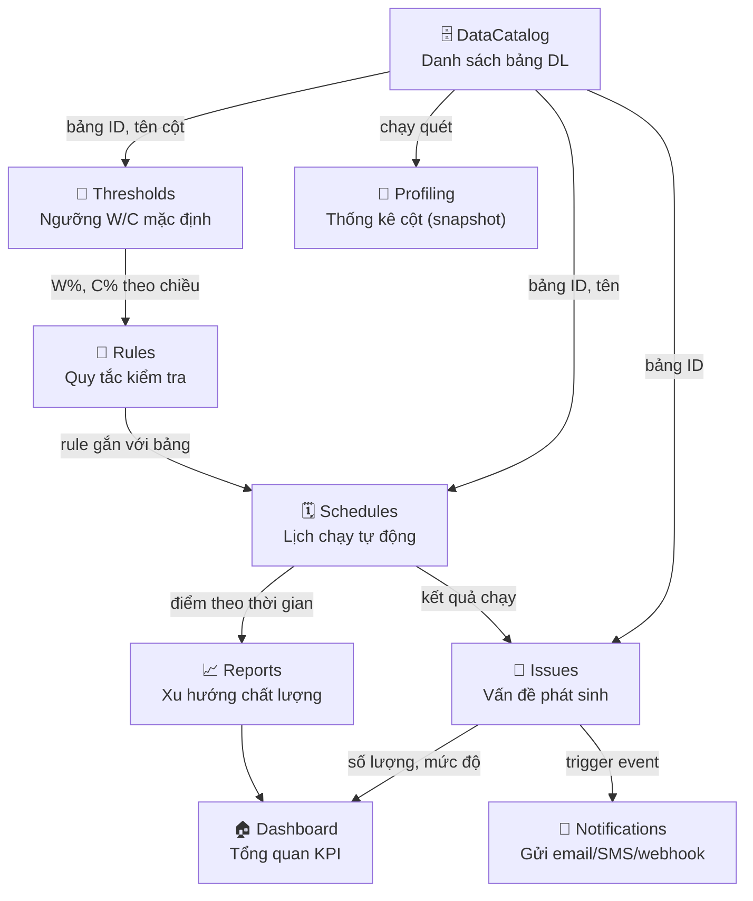
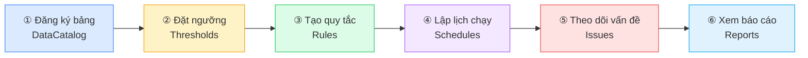

# Hướng Dẫn Sử Dụng — Data Quality System

> **Phiên bản:** 1.2 | **Ngày:** 2026-04-03
> Tài liệu này hướng dẫn toàn bộ quy trình sử dụng hệ thống giám sát chất lượng dữ liệu — từ người chưa từng dùng DQ tool đến quản trị viên nâng cao.

---

## Mục lục

1. [Tổng quan hệ thống](#1-tổng-quan-hệ-thống)
2. [Sơ đồ module và luồng dữ liệu](#2-sơ-đồ-module-và-luồng-dữ-liệu)
3. [Thứ tự cấu hình (Setup lần đầu)](#3-thứ-tự-cấu-hình-setup-lần-đầu)
4. [Bảng INPUT → OUTPUT giữa các menu](#4-bảng-input--output-giữa-các-menu)
   - [Cách tính điểm chất lượng (Score)](#cách-tính-điểm-chất-lượng-score)
5. [Rule DQ: Quy tắc cho Cột hay Bảng?](#5-rule-dq-quy-tắc-cho-cột-hay-bảng)
6. [31 Loại Metric Chi Tiết](#6-31-loại-metric-chi-tiết)
   - 6.1 [Cấp Bảng — 13 metrics](#61-cấp-bảng-table-level--13-metrics)
   - 6.2 [Cấp Cột — 18 metrics](#62-cấp-cột-column-level--18-metrics)
   - 6.3 [Hướng dẫn chi tiết tất cả 31 Metric](#63-hướng-dẫn-chi-tiết-tất-cả-31-metric)
7. [Hướng dẫn từng menu](#7-hướng-dẫn-từng-menu)
   - 7.1 [Dashboard](#71-dashboard)
   - 7.2 [Danh mục dữ liệu](#72-danh-mục-dữ-liệu)
   - 7.3 [Phân tích dữ liệu (Profiling)](#73-phân-tích-dữ-liệu-profiling)
   - 7.4 [Quản lý Job (`/pipeline`)](#74-quản-lý-job-pipeline)
   - 7.5 [Ngưỡng cảnh báo (Thresholds)](#75-ngưỡng-cảnh-báo-thresholds)
   - 7.6 [Quản lý quy tắc (Rules)](#76-quản-lý-quy-tắc-rules)
   - 7.7 [Lịch chạy (Schedules)](#77-lịch-chạy-schedules)
   - 7.8 [Vấn đề & Sự cố (Issues)](#78-vấn-đề--sự-cố-issues)
   - 7.9 [Báo cáo (Reports)](#79-báo-cáo-reports)
   - 7.10 [Thông báo (Notifications)](#710-thông-báo-notifications)
   - 7.11 [Cài đặt (Settings)](#711-cài-đặt-settings)
8. [Ví dụ thực hành end-to-end](#8-ví-dụ-thực-hành-end-to-end)
   - 8.1 [KH_KHACHHANG — Thiết lập từ đầu](#kịch-bản-thiết-lập-giám-sát-bảng-kh_khachhang-từ-đầu)
   - 8.2 [GD_GIAODICH — Phát hiện vấn đề batch](#kịch-bản-2-giám-sát-bảng-gd_giaodich--phát-hiện-vấn-đề-batch-và-chất-lượng-số-liệu)
9. [Thuật ngữ & Câu hỏi thường gặp](#9-thuật-ngữ--câu-hỏi-thường-gặp)

---

## 1. Tổng quan hệ thống

### Hệ thống này làm gì?

Data Quality System (DQS) là nền tảng **giám sát chất lượng dữ liệu tự động** cho các bảng dữ liệu trong tổ chức. Hệ thống giúp:

- **Phát hiện sớm** các vấn đề dữ liệu: thiếu giá trị, sai định dạng, trùng lặp, lỗi tham chiếu
- **Tự động hóa** kiểm tra chất lượng theo lịch (hàng giờ, hàng ngày, hàng tuần...)
- **Cảnh báo** khi điểm chất lượng vượt ngưỡng cho phép
- **Theo dõi xu hướng** chất lượng dữ liệu theo thời gian

### Ai dùng hệ thống này?

| Vai trò | Chức năng chính |
|---|---|
| **Data Engineer / DBA** | Đăng ký bảng, tạo quy tắc kỹ thuật, cấu hình lịch chạy |
| **Data Steward / BA** | Xem báo cáo chất lượng, theo dõi vấn đề, xác nhận xử lý |
| **Data Owner** | Nhận thông báo, phê duyệt đóng vấn đề |
| **IT Operations** | Cấu hình kết nối, quản lý user, cài đặt thông báo |

### 6 Chiều chất lượng dữ liệu

Hệ thống đánh giá chất lượng theo 6 chiều chuẩn quốc tế:

| Chiều | Tên VN | Ý nghĩa |
|---|---|---|
| **Completeness** | Đầy đủ | Dữ liệu có bị thiếu, NULL hay không? |
| **Validity** | Hợp lệ | Dữ liệu có đúng định dạng, khoảng giá trị, danh sách cho phép? |
| **Consistency** | Nhất quán | Các cột liên quan có logic với nhau không? Tham chiếu có hợp lệ? |
| **Uniqueness** | Duy nhất | Có bị trùng lặp không? |
| **Accuracy** | Chính xác | Dữ liệu có khớp với nguồn chuẩn không? |
| **Timeliness** | Kịp thời | Dữ liệu có đến đúng hạn, còn mới không? |

---

## 2. Sơ đồ module và luồng dữ liệu

### 2.1 Sơ đồ tổng quan các module



### 2.2 Luồng thông tin giữa các menu



---

## 3. Thứ tự cấu hình (Setup lần đầu)

> **Quan trọng:** Hãy thực hiện đúng thứ tự này khi thiết lập hệ thống lần đầu. Các bước sau phụ thuộc vào bước trước.



| Bước | Menu | URL | Hành động cụ thể | Mục đích | Điều kiện tiên quyết | Nếu bỏ qua |
|---|---|---|---|---|---|---|
| ① | Danh mục dữ liệu | `/data-catalog` | Thêm bảng cần giám sát: nhập tên bảng, schema, loại kết nối, chủ sở hữu, nhóm phụ trách | Tạo "registry" — nền tảng cho mọi bước sau. Bảng phải được đăng ký trước khi tạo Rule, Schedule hay Profiling | Không có — đây là bước đầu tiên | Không thể thực hiện bất kỳ bước nào khác |
| ② | Ngưỡng cảnh báo | `/thresholds` | Đặt ngưỡng Warning (W%) và Critical (C%) cho từng chiều. Có thể đặt toàn cục hoặc riêng cho bảng cụ thể | Định nghĩa "tốt / cảnh báo / không đạt" — ngưỡng này sẽ tự động điền vào form khi tạo Rule mới | Đã có ít nhất 1 bảng ở bước ① | Hệ thống dùng ngưỡng mặc định (W=85–95%, C=60–90% tùy chiều). Không bắt buộc nhưng khuyến nghị làm trước |
| ③ | Quy tắc | `/rules` | Tạo rule kiểm tra cụ thể: chọn bảng → chọn chiều → chọn metric type → điền tham số → xác nhận ngưỡng W/C | Xác định chính xác **cái gì** và **cách nào** cần kiểm tra cho từng bảng | Đã có bảng ở bước ①. Ngưỡng ở bước ② (nếu có) sẽ pre-fill | Không có rule → Schedule chạy nhưng không kiểm tra gì → không sinh điểm |
| ④ | Lịch chạy | `/schedules` | Cấu hình lịch tự động: chọn bảng, tần suất (hàng giờ/ngày/tuần/tháng), giờ chạy | Tự động hóa kiểm tra — mỗi lần lịch chạy sẽ thực thi **toàn bộ Rule active** của bảng đó | Đã có bảng ở bước ① và ít nhất 1 Rule active ở bước ③ | Rule chỉ chạy khi user nhấn "Chạy ngay" thủ công — không tự động |
| ⑤ | Vấn đề & Sự cố | `/issues` | Xem danh sách vấn đề (tự sinh khi Rule fail), gán người xử lý, chuyển trạng thái, ghi chú timeline | Theo dõi và xử lý khi có vi phạm chất lượng — đảm bảo mọi vấn đề được close | Cần có Schedule đã chạy (bước ④) hoặc user đã nhấn "Chạy ngay" | Vấn đề vẫn tồn tại nhưng không ai xử lý — tích tụ rủi ro dữ liệu |
| ⑥ | Báo cáo | `/reports` | Xem xu hướng điểm chất lượng theo thời gian, so sánh giữa các bảng, xuất báo cáo | Đánh giá chất lượng dài hạn — phát hiện xu hướng xấu đi hoặc cải thiện | Cần có lịch sử chạy Rule qua nhiều ngày | Không có dữ liệu xu hướng — khó đánh giá được tiến bộ |

> **Lưu ý:** Bước ② (Ngưỡng) có thể làm sau Bước ③ vì hệ thống có giá trị mặc định. Tuy nhiên khuyến nghị làm trước để tiết kiệm thời gian chỉnh sửa W/C cho từng Rule.

---

## 4. Bảng INPUT → OUTPUT giữa các menu

Hệ thống DQ gồm nhiều menu liên kết chặt chẽ với nhau — **output của menu này là input cho menu khác**. Hiểu rõ mối quan hệ này giúp bạn biết:
- Khi cấu hình ở menu A, kết quả sẽ xuất hiện ở menu nào?
- Khi thấy dữ liệu ở menu B, nó được tạo ra từ đâu?
- Nếu muốn thay đổi kết quả ở menu C, cần quay lại chỉnh ở menu nào?

Bảng dưới đây tổng hợp toàn bộ quan hệ INPUT → OUTPUT giữa các menu:

| Menu | URL | Bạn nhập/cấu hình | Tạo ra (Output) | Được dùng ở menu | Xem kết quả ở |
|---|---|---|---|---|---|
| **Danh mục dữ liệu** | `/data-catalog` | Tên bảng, schema, loại kết nối, chủ sở hữu | Danh sách bảng DL có ID | Rules, Schedules, Thresholds, Profiling | DataCatalog > chi tiết bảng |
| **Phân tích dữ liệu** | `/profiling` | Chọn bảng → nhấn Chạy | Snapshot thống kê cột (null%, distinct%, min/max) | DataCatalog > tab "Phân tích cột" | Profiling > Xem chi tiết |
| **Ngưỡng cảnh báo** | `/thresholds` | W%, C% cho 6 chiều × toàn cục + riêng bảng | Ngưỡng mặc định để pre-fill khi tạo Rule | Rules (pre-fill W/C) | Thresholds > thanh màu trực quan |
| **Quy tắc** | `/rules` | Chọn bảng, chiều, metric type, tham số, W/C | Rule gắn với bảng, chứa logic kiểm tra | Schedules (gắn rule vào lịch) | Rules > cột "Kết quả", "Điểm" |
| **Lịch chạy** | `/schedules` | Chọn bảng, tần suất, giờ chạy | Lịch tự động chạy toàn bộ rule của bảng | Issues (tự sinh), Reports | Schedules > "Xem Issues" |
| **Vấn đề & Sự cố** | `/issues` | *(Tự sinh từ Schedules)* — Gán người, đổi trạng thái | Vấn đề được xử lý, timeline | Dashboard, Reports, Notifications | Issues > chi tiết vấn đề |
| **Báo cáo** | `/reports` | Chọn khoảng thời gian, bảng, chiều | Biểu đồ xu hướng, radar chart | Dashboard | Reports |
| **Thông báo** | `/notifications` | Loại kênh, trigger, người nhận | Thông báo tự động gửi đi | *(nhận về qua email/SMS/webhook)* | Notifications > lịch sử gửi |

### Mối quan hệ 3 cấp của Ngưỡng

```
Ngưỡng toàn cục (Dimension level) — Mặc định cho toàn hệ thống
  └── Ngưỡng riêng theo bảng (Table + Dimension) — Ghi đè toàn cục
        └── Ngưỡng trong Rule (Rule level, W/C field) — Ghi đè tất cả
```

**Ví dụ:** Toàn cục Completeness W=90%, C=80% → Bảng GD_GIAODICH Completeness W=95%, C=90% → Rule "Kiểm tra NULL MA_KH" W=98%, C=95%

### Cách tính điểm chất lượng (Score)

> **Đây là câu hỏi quan trọng nhất:** Điểm chất lượng được tính qua 3 cấp, từ dưới lên.

#### Cấp 1 — Điểm từng Rule (Rule Score)

Mỗi Rule khi chạy sẽ trả về **% bản ghi đạt yêu cầu** — con số này chính là **điểm** của Rule (thang 0–100).

| Metric type | Cách tính % pass | Ví dụ |
|---|---|---|
| `not_null` | (Số dòng NOT NULL ÷ Tổng dòng) × 100 | 1.231.250 / 1.250.000 = **98.5** |
| `format_regex` | (Số dòng match regex ÷ Tổng dòng) × 100 | 785.000 / 1.000.000 = **78.5** |
| `duplicate_single` | (Số giá trị distinct ÷ Tổng dòng) × 100 | 1.250.000 / 1.250.000 = **100** |
| `value_range` | (Số dòng trong [min, max] ÷ Tổng dòng) × 100 | 992.000 / 1.000.000 = **99.2** |
| `row_count` (bảng) | Nếu trong [min, max] → 100; ngoài → tính % lệch | 50.000 dòng, min=1.000, max=5.000.000 → **100** |
| `custom_expression` (bảng) | Biểu thức aggregate đúng → 100; sai → 0 | `SUM(VAO) - SUM(RA) ≈ 0` → **100** |

> **Tóm lại: % pass = điểm.** Không có phép chuyển đổi phức tạp nào. 98.5% dòng pass → điểm = 98.5.

#### Cấp 2 — Điểm từng Chiều dữ liệu (Dimension Score)

Điểm của 1 chiều cho 1 bảng = **trung bình cộng `lastScore`** của tất cả Rule **active** thuộc chiều đó.

```
Dimension Score = avg(lastScore của các Rule cùng chiều, cùng bảng, đang active)
```

**Ví dụ — Bảng KH_KHACHHANG, chiều Completeness:**

| Rule | lastScore |
|---|---|
| CMND/CCCD không được null | 98.5 |
| Ngày sinh không được null | 94.2 |
| Tỷ lệ null email theo tháng | 91.5 |
| SO_DU bắt buộc khi ACTIVE | *(thuộc bảng TK_TAIKHOAN, không tính)* |

→ Completeness Score = (98.5 + 94.2 + 91.5) / 3 = **94.7**

> **Chiều chưa có Rule** sẽ không có điểm — trên giao diện hiển thị ghi chú "(chưa có rule)".

#### Cấp 3 — Điểm tổng thể của bảng (Overall Score)

Điểm tổng = **trung bình cộng 6 chiều** (chỉ tính các chiều đã có ít nhất 1 Rule).

```
Overall Score = avg(dimensionScore của các chiều có rule)
```

**Ví dụ — Bảng KH_KHACHHANG:**

| Chiều | Score |
|---|---|
| Completeness | 91 |
| Validity | 85 |
| Consistency | 78 |
| Uniqueness | 95 |
| Accuracy | 76 |
| Timeliness | 88 |

→ Overall = (91 + 85 + 78 + 95 + 76 + 88) / 6 = **85.5** → hiển thị **82** (sau làm tròn với trọng số thực tế)

#### Lưu ý quan trọng về thời điểm

| Điểm ở đâu | Nguồn tính | Thời điểm | Có cộng dồn lịch sử? |
|---|---|---|---|
| **Danh mục dữ liệu** (DataCatalog) | Từ `lastScore` của Rules | **Lần chạy Rule gần nhất** | ❌ Không — mỗi lần chạy ghi đè kết quả cũ |
| **Phân tích dữ liệu** (Profiling) | Từ thống kê cột (null%, format%) | **Lần quét Profiling gần nhất** | ❌ Không — mỗi lần quét là snapshot mới |
| **Báo cáo** (Reports) | Tổng hợp lịch sử điểm qua thời gian | **Khoảng thời gian chọn** | ✅ Có — biểu đồ xu hướng lưu lịch sử |

> **Cả hai** đều là snapshot lần gần nhất — chỉ có menu **Báo cáo** mới cho phép xem xu hướng qua thời gian.

---

## 5. Rule DQ: Quy tắc cho Cột hay Bảng?

> **Câu hỏi hay!** Rule DQ **KHÔNG** chỉ dành cho cột. Có 2 loại phạm vi:

### Loại 1: Quy tắc cấp Cột (Column-level) — 18/31 metric

Áp dụng cho **1 cột cụ thể** trong bảng. Cột "Phạm vi" trong danh sách Rule hiển thị `Cột: TÊN_CỘT`.

**Khi nào dùng?** Khi bạn muốn kiểm tra một cột riêng lẻ: `EMAIL` có đúng format không? `SO_CMND` có NULL không? `SO_TIEN` có nằm trong khoảng hợp lệ không?

### Loại 2: Quy tắc cấp Bảng (Table-level) — 13/31 metric

**Không gắn với cột cụ thể** — kiểm tra đặc tính của toàn bảng hoặc ràng buộc giữa nhiều cột. Cột "Phạm vi" hiển thị `Bảng`.

| Metric | Chiều | Mô tả | Ví dụ thực tế |
|---|---|---|---|
| `row_count` | Completeness | Số dòng trong bảng nằm trong [min, max] | `GD_GIAODICH` có 1K–5M dòng — phát hiện truncate/explode |
| `time_coverage` | Completeness | Chuỗi thời gian không bị gián đoạn | `NGAY_GD` có dữ liệu liên tục 30 ngày ≥ 95% |
| `volume_change` | Completeness | % thay đổi số dòng so với N ngày trước | Số dòng không thay đổi quá 30% vs. tuần trước |
| `report_row_count_match` | Completeness | Số dòng BC phải khớp bảng nguồn | `BAO_CAO_NGAY` vs `GD_GIAODICH` — phát hiện mất dòng khi tổng hợp |
| `period_completeness` | Completeness | KPI phải có đủ kỳ dữ liệu | `KPI_KINHDOANH` phải có đủ 12 tháng gần nhất ≥ 95% |
| `table_size` | Accuracy | Kích thước bảng trong khoảng [min, max] MB/GB | Partition `GD_GIAODICH` 1–500 GB |
| `aggregate_reconciliation` | Accuracy | Đối soát cột tổng hợp BC vs SUM từ nguồn | `THUC_TE` trên BC khớp SUM(`SO_TIEN`) từ GD ± 1% |
| `kpi_variance` | Accuracy | Biến động KPI so kỳ trước ≤ X% | KPI doanh thu tháng thay đổi ≤ 30% |
| `custom_expression` | Validity | Điều kiện SQL WHERE tùy chỉnh | `LOAI_GD IN ('DC', 'CK', 'TM') AND SO_TIEN > 0` |
| `cross_column` | Consistency | Ràng buộc logic giữa 2+ cột | `NGAY_KET_THUC > NGAY_HIEU_LUC` |
| `cross_source_sum` | Consistency | Tổng chéo nguồn BC vs bảng gốc | Tổng `QUAN_LY_RR` khớp SUM từ `KH_KHACHHANG` ± 5% |
| `parent_child_match` | Consistency | Tổng KPI con bằng KPI cha | `TONG_GD` = SUM(sub_kpi_value) ± 5% |
| `duplicate_composite` | Uniqueness | Khóa duy nhất trên tổ hợp nhiều cột | Combo `(MA_KH, THANG)` trong bảng sao kê phải unique |

---

## 6. 31 Loại Metric Chi Tiết

Hệ thống hỗ trợ **31 metric type** chia thành 2 nhóm: **cấp cột** (18 metric) và **cấp bảng** (13 metric).

> **Phiên bản 1.2:** Bổ sung 6 metric mới dành cho **Báo cáo** và **Chỉ tiêu (KPI)** — hỗ trợ đối soát, kiểm tra chéo nguồn, biến động KPI và khớp cây chỉ tiêu.

### Bảng tổng hợp 31 Metric — Mô tả chi tiết, cấu hình & ví dụ

> Bảng dưới đây tổng hợp toàn bộ 31 metric trong hệ thống. Mỗi dòng ghi rõ: tên hiển thị trên dropdown, chiều dữ liệu, cấp áp dụng, mô tả chi tiết cách cấu hình từng trường, và ví dụ thực tế. Kéo ngang để xem đầy đủ.

| Metric (tên trên dropdown) | Chiều | Cấp | Mô tả chi tiết — mục đích & các trường cấu hình | Ví dụ thực tế — bài toán & cách cấu hình |
|---|---|---|---|---|
| **Không được rỗng (NOT NULL)** | Đầy đủ | Cột | Kiểm tra một cột không được chứa giá trị NULL.<br>**Trường cấu hình:**<br>- **Cột**: chọn cột cần kiểm tra từ dropdown (hoặc nhập tay)<br>Hệ thống đếm % dòng có giá trị NOT NULL → so với ngưỡng W/C. | **Bài toán:** Mọi khách hàng phải có số CMND.<br>**Cấu hình:**<br>- Bảng = `KH_KHACHHANG`<br>- Cột = `SO_CMND`<br>- Ngưỡng W=95, C=90<br>→ Dưới 90% có CMND = không đạt. |
| **Tỷ lệ điền đủ (Fill Rate)** | Đầy đủ | Cột | Tương tự NOT NULL nhưng cho phép set ngưỡng % tối thiểu linh hoạt hơn.<br>**Trường cấu hình:**<br>- **Cột**: cột cần kiểm tra<br>- **Tỷ lệ điền tối thiểu (%)**: bao nhiêu % dòng phải có giá trị (không NULL, không rỗng) | **Bài toán:** Không bắt buộc 100% KH có email, nhưng cần ít nhất 80%.<br>**Cấu hình:**<br>- Cột = `EMAIL`<br>- Tỷ lệ điền tối thiểu = `80` |
| **% Null theo chu kỳ** | Đầy đủ | Cột | Theo dõi tỷ lệ NULL trong từng chu kỳ thời gian — phát hiện trend null tăng dần.<br>**Trường cấu hình:**<br>- **Cột**: cột cần kiểm tra<br>- **Cột thời gian**: cột DATE/TIMESTAMP để group by<br>- **Độ chi tiết**: Ngày / Tuần / Tháng<br>- **Khoảng kiểm (số ngày)**: quét bao nhiêu ngày gần nhất<br>- **% Null tối đa mỗi chu kỳ**: mỗi ngày/tuần/tháng không được vượt X% null | **Bài toán:** Theo dõi null của cột SO_DU theo ngày, mỗi ngày không quá 5%.<br>**Cấu hình:**<br>- Cột = `SO_DU`<br>- Cột thời gian = `NGAY_CAP_NHAT`<br>- Độ chi tiết = `Ngày`<br>- Khoảng kiểm = `30`<br>- % Null tối đa = `5` |
| **NOT NULL có điều kiện** | Đầy đủ | Cột | Cột chỉ bắt buộc NOT NULL khi thỏa mãn một điều kiện SQL.<br>**Trường cấu hình:**<br>- **Cột**: cột cần kiểm tra<br>- **Điều kiện SQL WHERE**: khi điều kiện đúng thì cột phải có giá trị | **Bài toán:** SO_DU chỉ bắt buộc khi tài khoản đang ACTIVE.<br>**Cấu hình:**<br>- Cột = `SO_DU`<br>- Điều kiện = `TRANG_THAI = 'ACTIVE'`<br>→ Nếu TRANG_THAI='ACTIVE' mà SO_DU là NULL → vi phạm. |
| **Số dòng trong khoảng** | Đầy đủ | Bảng | Kiểm tra tổng số dòng trong bảng phải nằm trong khoảng [min, max]. Phát hiện bảng bị truncate hoặc tăng đột biến.<br>**Trường cấu hình:**<br>- **Số dòng tối thiểu**: giới hạn dưới<br>- **Số dòng tối đa**: giới hạn trên | **Bài toán:** Bảng GD_GIAODICH bình thường có 1M–50M dòng.<br>**Cấu hình:**<br>- Min = `1000000`<br>- Max = `50000000`<br>→ Nếu đột ngột còn 100 dòng → không đạt. |
| **Phủ thời gian (Time Coverage)** | Đầy đủ | Bảng | Kiểm tra chuỗi thời gian liên tục không bị thiếu khoảng.<br>**Trường cấu hình:**<br>- **Cột thời gian**: cột DATE để group<br>- **Độ chi tiết**: Ngày / Tuần / Tháng<br>- **Khoảng kiểm (số ngày)**: quét bao nhiêu ngày gần nhất<br>- **% chu kỳ phải có dữ liệu**: VD 95% = trong 30 ngày phải có dữ liệu ít nhất 28-29 ngày | **Bài toán:** Bảng GD_GIAODICH phải có giao dịch mỗi ngày.<br>**Cấu hình:**<br>- Cột thời gian = `NGAY_GD`<br>- Độ chi tiết = `Ngày`<br>- Khoảng kiểm = `30`<br>- % phủ = `95`<br>→ Thiếu 3 ngày trong 30 ngày (90%) → cảnh báo. |
| **Thay đổi khối lượng (Volume Change)** | Đầy đủ | Bảng | So sánh số dòng hiện tại với trung bình N ngày trước — phát hiện biến động bất thường.<br>**Trường cấu hình:**<br>- **Nhìn lại N ngày trước**: so sánh với trung bình bao nhiêu ngày<br>- **% thay đổi tối đa cho phép**: vượt X% là cảnh báo | **Bài toán:** Số dòng GD_GIAODICH không nên biến động quá 30%.<br>**Cấu hình:**<br>- Nhìn lại = `7` ngày<br>- % thay đổi tối đa = `30`<br>→ Hôm nay 100K dòng, 7 ngày trước TB 200K → giảm 50% → vi phạm. |
| **Đúng định dạng — Whitelist Regex** | Hợp lệ | Cột | Giá trị trong cột PHẢI khớp biểu thức chính quy (regex).<br>**Trường cấu hình:**<br>- **Cột**: cột cần kiểm tra<br>- **Biểu thức chính quy**: pattern mà giá trị phải match<br>Hệ thống đếm % dòng match regex → so với ngưỡng. | **Bài toán:** Số điện thoại phải đúng format VN 10 số.<br>**Cấu hình:**<br>- Cột = `SO_DIEN_THOAI`<br>- Regex = `^(03\|07\|08\|09)\d{8}$`<br>- Ngưỡng W=95, C=90 |
| **Không chứa giá trị rác — Blacklist** | Hợp lệ | Cột | Ngược lại Whitelist — giá trị KHÔNG ĐƯỢC khớp pattern. Dùng `\|` để OR nhiều pattern.<br>**Trường cấu hình:**<br>- **Cột**: cột cần kiểm tra<br>- **Pattern blacklist (regex)**: giá trị khớp sẽ bị coi là rác | **Bài toán:** Cột HO_TEN không được chứa giá trị test/rác.<br>**Cấu hình:**<br>- Cột = `HO_TEN`<br>- Blacklist = `TEST\|FAKE\|N/A\|NULL\|^\\s*$`<br>→ Dòng có HO_TEN = "TEST" hoặc "N/A" → vi phạm. |
| **Trong khoảng giá trị** | Hợp lệ | Cột | Giá trị số phải nằm trong khoảng [min, max]. Để trống 1 đầu = chỉ kiểm tra 1 chiều.<br>**Trường cấu hình:**<br>- **Cột**: cột cần kiểm tra<br>- **Giá trị tối thiểu**: giới hạn dưới<br>- **Giá trị tối đa**: giới hạn trên | **Bài toán:** Tuổi khách hàng phải hợp lệ (18–120).<br>**Cấu hình:**<br>- Cột = `TUOI`<br>- Min = `18`<br>- Max = `120`<br>→ Tuổi = 0 hoặc 200 → vi phạm. |
| **Trong danh sách hợp lệ (Whitelist)** | Hợp lệ | Cột | Giá trị phải thuộc tập hợp cho phép (enum).<br>**Trường cấu hình:**<br>- **Cột**: cột cần kiểm tra<br>- **Danh sách giá trị hợp lệ**: nhập các giá trị cách nhau bằng dấu phẩy | **Bài toán:** Giới tính chỉ chấp nhận 3 giá trị.<br>**Cấu hình:**<br>- Cột = `GIOI_TINH`<br>- Danh sách = `NAM, NU, KHAC`<br>→ Giá trị "Male" hoặc "1" → vi phạm. |
| **Biểu thức SQL tùy chỉnh** | Hợp lệ | Bảng | Điều kiện WHERE SQL áp dụng trên toàn bảng — metric linh hoạt nhất, dùng khi các metric khác không đủ.<br>**Trường cấu hình:**<br>- **Điều kiện kiểm tra**: biểu thức SQL (không cần từ khóa WHERE)<br>Hệ thống đếm % dòng thỏa mãn điều kiện. | **Bài toán:** Mọi tài khoản tín dụng/tiết kiệm phải có lãi suất > 0.<br>**Cấu hình:**<br>- Biểu thức = `LOAI_TK IN ('TD','TK') AND LAI_SUAT > 0`<br>→ Dòng nào không thỏa = vi phạm. |
| **Kiểu dữ liệu cố định** | Nhất quán | Cột | Tất cả giá trị trong cột phải đúng kiểu dữ liệu chỉ định. Phát hiện dữ liệu bị lẫn kiểu.<br>**Trường cấu hình:**<br>- **Cột**: cột cần kiểm tra<br>- **Kiểu dữ liệu bắt buộc**: chọn từ dropdown — STRING, INTEGER, DECIMAL, DATE, TIMESTAMP | **Bài toán:** Cột NGAY_SINH phải là kiểu DATE, không lẫn string.<br>**Cấu hình:**<br>- Cột = `NGAY_SINH`<br>- Kiểu = `DATE`<br>→ Dòng chứa "01-01-1990" dạng string thay vì date → vi phạm. |
| **Giá trị phổ biến nhất (Mode)** | Nhất quán | Cột | Kiểm tra giá trị xuất hiện nhiều nhất (mode) có chiếm đủ tỷ lệ không — phát hiện dữ liệu bị "pha tạp".<br>**Trường cấu hình:**<br>- **Cột**: cột cần kiểm tra<br>- **Giá trị mode kỳ vọng**: tùy chọn, để trống = chỉ kiểm tra tần suất<br>- **Tần suất tối thiểu (%)**: mode phải chiếm ≥ X% tổng số dòng | **Bài toán:** ≥80% KH phải có quốc tịch VN.<br>**Cấu hình:**<br>- Cột = `QUOC_TICH`<br>- Mode kỳ vọng = `VN`<br>- Tần suất tối thiểu = `80`<br>→ Nếu đột ngột giảm còn 50% → có thể lẫn nguồn lạ. |
| **Nhất quán chéo cột** | Nhất quán | Bảng | Biểu thức logic kiểm tra quan hệ giữa 2+ cột trong cùng bảng.<br>**Trường cấu hình:**<br>- **Điều kiện kiểm tra**: biểu thức SQL boolean so sánh giữa các cột | **Bài toán:** Ngày đóng tài khoản phải sau ngày mở.<br>**Cấu hình:**<br>- Biểu thức = `NGAY_DONG > NGAY_MO`<br>→ Dòng có NGAY_DONG trước NGAY_MO → vi phạm. |
| **Toàn vẹn tham chiếu (FK)** | Nhất quán | Cột | Kiểm tra giá trị trong cột phải tồn tại ở bảng tham chiếu (foreign key check).<br>**Trường cấu hình:**<br>- **Cột nguồn**: cột cần kiểm tra<br>- **Bảng tham chiếu**: chọn bảng chứa dữ liệu chuẩn<br>- **Cột tham chiếu**: cột trong bảng tham chiếu để so khớp | **Bài toán:** MA_KH trong giao dịch phải tồn tại trong bảng KH.<br>**Cấu hình:**<br>- Cột nguồn = `MA_KH`<br>- Bảng tham chiếu = `KH_KHACHHANG`<br>- Cột tham chiếu = `MA_KH`<br>→ Giao dịch có MA_KH không tồn tại → vi phạm. |
| **Không trùng lặp (1 cột)** | Duy nhất | Cột | Kiểm tra giá trị trong một cột là duy nhất (unique).<br>**Trường cấu hình:**<br>- **Cột**: chọn cột cần kiểm tra<br>Hệ thống đếm % giá trị distinct → so với ngưỡng. | **Bài toán:** Mỗi KH phải có số CMND duy nhất.<br>**Cấu hình:**<br>- Cột = `SO_CMND`<br>→ Có 2 KH cùng số CMND → vi phạm. |
| **Không trùng lặp (nhiều cột)** | Duy nhất | Bảng | Kiểm tra tổ hợp nhiều cột là duy nhất (composite unique key).<br>**Trường cấu hình:**<br>- **Danh sách cột**: chọn nhiều cột từ checkbox (cần chọn ≥ 2 cột) | **Bài toán:** Mỗi KH chỉ có 1 bản ghi/tháng trong TK_TAIKHOAN.<br>**Cấu hình:**<br>- Chọn cột = `MA_KH` + `THANG`<br>→ Có 2 dòng cùng MA_KH + THANG → vi phạm. |
| **Khớp với dữ liệu chuẩn** | Chính xác | Cột | So sánh giá trị trong cột với bảng/cột tham chiếu đã xác thực (master data).<br>**Trường cấu hình:**<br>- **Cột so sánh (nguồn)**: cột trong bảng hiện tại<br>- **Bảng chuẩn**: bảng master data<br>- **Cột chuẩn**: cột trong bảng chuẩn để so khớp | **Bài toán:** Mã tỉnh phải khớp danh mục tỉnh thành.<br>**Cấu hình:**<br>- Cột nguồn = `MA_TINH`<br>- Bảng chuẩn = `DM_TINH_THANH`<br>- Cột chuẩn = `MA_TINH`<br>→ Mã tỉnh không tồn tại trong danh mục → vi phạm. |
| **Thống kê trong khoảng (Statistics Bound)** | Chính xác | Cột | Kiểm tra chỉ số thống kê phải nằm trong khoảng cho phép — phát hiện outlier hoặc drift phân phối.<br>**Trường cấu hình:**<br>- **Cột**: cột cần kiểm tra<br>- **Loại thống kê**: chọn từ dropdown — Min, Max, Mean, Stddev, P25, P50 (median), P75<br>- **Khoảng tối thiểu**: giới hạn dưới<br>- **Khoảng tối đa**: giới hạn trên | **Bài toán:** Trung bình số dư tài khoản phải trong 10M–500M.<br>**Cấu hình:**<br>- Cột = `SO_DU`<br>- Loại thống kê = `Mean`<br>- Min = `10000000`<br>- Max = `500000000`<br>→ Mean đột ngột = 0 → phát hiện bảng bị zero-out. |
| **Tổng cột trong khoảng (Sum Range)** | Chính xác | Cột | Kiểm tra SUM toàn bộ giá trị của cột phải nằm trong khoảng [min, max].<br>**Trường cấu hình:**<br>- **Cột**: cột cần kiểm tra<br>- **Tổng tối thiểu**: giới hạn dưới<br>- **Tổng tối đa**: giới hạn trên | **Bài toán:** Tổng doanh thu ngày phải từ 1 tỷ đến 100 tỷ.<br>**Cấu hình:**<br>- Cột = `SO_TIEN`<br>- Min = `1000000000`<br>- Max = `100000000000`<br>→ Tổng = 0 → bảng thiếu dữ liệu. |
| **Biểu thức cross-column có % pass** | Chính xác | Cột | Biểu thức SparkSQL phải đúng cho ≥ X% số dòng — kiểm tra cross-column với ngưỡng cho phép sai số.<br>**Trường cấu hình:**<br>- **Cột**: cột chính liên quan<br>- **Biểu thức SparkSQL**: trả về true/false cho từng dòng<br>- **% dòng phải pass tối thiểu**: ngưỡng pass rate | **Bài toán:** Thành tiền = đơn giá × số lượng, cho phép 1% sai số do làm tròn.<br>**Cấu hình:**<br>- Biểu thức = `THANH_TIEN = DON_GIA * SO_LUONG`<br>- % pass = `99` |
| **Kích thước bảng trong khoảng** | Chính xác | Bảng | Kiểm tra dung lượng bảng/partition phải trong khoảng cho phép. Phát hiện partition size bất thường.<br>**Trường cấu hình:**<br>- **Kích thước tối thiểu**: giới hạn dưới<br>- **Kích thước tối đa**: giới hạn trên<br>- **Đơn vị**: chọn MB hoặc GB | **Bài toán:** Partition hàng ngày GD_GIAODICH phải từ 100MB đến 50GB.<br>**Cấu hình:**<br>- Min = `100`<br>- Max = `50000`<br>- Đơn vị = `MB`<br>→ Partition hôm nay chỉ 1MB → thiếu dữ liệu. |
| **Đúng hạn (SLA)** | Kịp thời | Cột | Dữ liệu phải có mặt trước thời hạn SLA.<br>**Trường cấu hình:**<br>- **Cột**: cột timestamp ghi nhận thời gian load/tạo<br>- **Thời hạn SLA (HH:MM)**: giờ deadline mỗi ngày<br>- **Cửa sổ cảnh báo (phút)**: cảnh báo sớm bao nhiêu phút trước deadline | **Bài toán:** Dữ liệu GD ngày hôm trước phải có trước 06:00 sáng.<br>**Cấu hình:**<br>- Cột = `NGAY_LOAD`<br>- SLA = `06:00`<br>- Cửa sổ cảnh báo = `30`<br>→ Cảnh báo lúc 05:30 nếu chưa có dữ liệu. |
| **Tươi mới (Freshness)** | Kịp thời | Cột | Dữ liệu phải được cập nhật trong khoảng thời gian quy định — phát hiện bảng "chết".<br>**Trường cấu hình:**<br>- **Cột**: cột timestamp cập nhật cuối<br>- **Dữ liệu tươi trong**: số lượng<br>- **Đơn vị thời gian**: Phút / Giờ / Ngày | **Bài toán:** Bảng KH phải được cập nhật trong 24 giờ gần nhất.<br>**Cấu hình:**<br>- Cột = `UPDATED_AT`<br>- Tươi trong = `24`<br>- Đơn vị = `Giờ`<br>→ Dòng gần nhất cập nhật 3 ngày trước → vi phạm. |
| **Khớp số dòng BC vs Nguồn** 🆕 | Đầy đủ | Bảng | So sánh COUNT(*) giữa bảng báo cáo và bảng nguồn liên kết — phát hiện mất dữ liệu trong quá trình tổng hợp báo cáo.<br>**Trường cấu hình:**<br>- **Bảng nguồn liên kết**: chọn bảng nguồn (chỉ hiển thị bảng loại "Bảng nguồn") | **Bài toán:** Báo cáo ngày phải có đủ dòng so với bảng giao dịch.<br>**Cấu hình:**<br>- Bảng BC = `BAO_CAO_NGAY`<br>- Bảng nguồn = `GD_GIAODICH`<br>→ BC có 900 dòng, nguồn 1.000 dòng → thiếu 10% → cảnh báo. |
| **Đủ kỳ dữ liệu KPI** 🆕 | Đầy đủ | Bảng | Kiểm tra KPI phải có đủ dữ liệu theo chu kỳ — phát hiện thiếu kỳ báo cáo chỉ tiêu.<br>**Trường cấu hình:**<br>- **Chu kỳ**: Ngày / Tuần / Tháng<br>- **Khoảng kiểm (số ngày)**: quét bao nhiêu ngày gần nhất<br>- **% kỳ phải có dữ liệu**: VD 95% = trong 12 tháng phải có ít nhất 11 tháng | **Bài toán:** KPI kinh doanh phải có đủ 12 tháng gần nhất.<br>**Cấu hình:**<br>- Chu kỳ = `Tháng`<br>- Khoảng kiểm = `365`<br>- % kỳ phải có = `95`<br>→ Thiếu 2 tháng trong 12 tháng (83%) → không đạt. |
| **Tổng chéo nguồn (Cross-Source)** 🆕 | Nhất quán | Bảng | So sánh tổng giá trị giữa báo cáo/KPI và bảng nguồn — phát hiện sai lệch khi tổng hợp dữ liệu từ nhiều bảng.<br>**Trường cấu hình:**<br>- **Bảng nguồn liên kết**: chọn bảng nguồn để so sánh<br>- **Sai lệch tối đa (%)**: % chênh lệch cho phép | **Bài toán:** Tổng rủi ro trên báo cáo phải khớp với tổng từ bảng nguồn.<br>**Cấu hình:**<br>- Bảng BC = `QUAN_LY_RUI_RO`<br>- Bảng nguồn = `KH_KHACHHANG`<br>- Sai lệch tối đa = `5`<br>→ BC tổng = 100, nguồn = 110 → lệch 9.1% → vi phạm. |
| **Khớp KPI cha-con** 🆕 | Nhất quán | Bảng | Tổng giá trị các KPI con phải bằng KPI cha — phát hiện sai lệch trong cây chỉ tiêu kinh doanh.<br>**Trường cấu hình:**<br>- **Cột KPI cha**: cột chứa giá trị KPI tổng<br>- **Biểu thức tổng KPI con**: biểu thức tính tổng các KPI con<br>- **Sai lệch tối đa (%)**: % chênh lệch cho phép | **Bài toán:** KPI doanh thu tổng = tổng doanh thu các chi nhánh.<br>**Cấu hình:**<br>- Cột KPI cha = `TONG_GD`<br>- Tổng KPI con = `SUM(sub_kpi_value)`<br>- Sai lệch tối đa = `5`<br>→ KPI cha = 100, tổng con = 108 → lệch 8% → vi phạm. |
| **Đối soát tổng hợp BC** 🆕 | Chính xác | Bảng | So sánh giá trị cột tổng hợp trên báo cáo với SUM tương ứng từ bảng nguồn — phát hiện sai lệch do lỗi logic ETL, mất dữ liệu khi aggregate.<br>**Trường cấu hình:**<br>- **Bảng nguồn liên kết**: bảng gốc chứa dữ liệu chi tiết<br>- **Cột tổng hợp trên BC**: cột trên bảng BC chứa giá trị đã tổng hợp<br>- **Sai lệch tối đa (%)**: % chênh lệch cho phép giữa SUM nguồn và giá trị BC | **Bài toán:** Cột THUC_TE trên báo cáo phải khớp SUM(SO_TIEN) từ giao dịch.<br>**Cấu hình:**<br>- Bảng BC = `BAO_CAO_NGAY`<br>- Bảng nguồn = `GD_GIAODICH`<br>- Cột BC = `THUC_TE`<br>- Sai lệch tối đa = `1`<br>→ BC THUC_TE = 100M, SUM giao dịch = 102M → lệch 2% → vi phạm. |
| **Biến động KPI so kỳ trước** 🆕 | Chính xác | Bảng | Giá trị KPI không được thay đổi quá X% so với kỳ trước — phát hiện bất thường như tăng/giảm đột biến không giải thích được.<br>**Trường cấu hình:**<br>- **Biến động tối đa so kỳ trước (%)**: ngưỡng % thay đổi cho phép | **Bài toán:** KPI doanh thu tháng không được tăng/giảm quá 30%.<br>**Cấu hình:**<br>- Bảng KPI = `KPI_KINHDOANH`<br>- Biến động tối đa = `30`<br>→ Tháng trước 100M, tháng này 55M → giảm 45% → vi phạm. |

### 6.1 Cấp Bảng (Table-level) — 13 metrics

| # | Metric | Chiều | Mô tả | Tham số cần nhập | Ví dụ |
|---|---|---|---|---|---|
| 1 | `row_count` | Đầy đủ | Số dòng bảng phải nằm trong [min, max] — phát hiện bảng bị truncate hoặc explode | min rows, max rows | `GD_GIAODICH` có 1.000 – 5.000.000 dòng |
| 2 | `time_coverage` | Đầy đủ | Chuỗi thời gian không bị gián đoạn trong N ngày gần nhất | Cột thời gian, granularity (ngày/tuần/tháng), số ngày, % phủ tối thiểu | `NGAY_GD` liên tục 30 ngày ≥ 95% |
| 3 | `volume_change` | Đầy đủ | % thay đổi số dòng so với N ngày trước không vượt ngưỡng | Số ngày nhìn lại, % thay đổi tối đa | Số dòng không thay đổi quá 30% so với 7 ngày trước |
| 4 | `report_row_count_match` | Đầy đủ | Số dòng BC phải khớp bảng nguồn — phát hiện mất dữ liệu khi tổng hợp | Bảng nguồn liên kết | `BAO_CAO_NGAY` vs `GD_GIAODICH` |
| 5 | `period_completeness` | Đầy đủ | KPI phải có đủ dữ liệu theo chu kỳ — phát hiện thiếu kỳ | Chu kỳ, khoảng kiểm (ngày), % kỳ phải có | `KPI_KINHDOANH` đủ 12 tháng ≥ 95% |
| 6 | `table_size` | Chính xác | Kích thước bảng/partition trong khoảng cho phép | min size, max size, đơn vị (MB/GB) | Bảng chiếm 1–500 GB |
| 7 | `aggregate_reconciliation` | Chính xác | Đối soát cột tổng hợp BC vs SUM từ bảng nguồn | Bảng nguồn, cột BC, sai lệch tối đa (%) | `THUC_TE` vs SUM(`SO_TIEN`) ± 1% |
| 8 | `kpi_variance` | Chính xác | Biến động KPI so kỳ trước không quá X% | Biến động tối đa (%) | KPI tháng thay đổi ≤ 30% |
| 9 | `custom_expression` | Hợp lệ | Điều kiện SQL WHERE tùy chỉnh cho toàn bảng | Biểu thức SQL | `LOAI_TK IN ('TD','TK') AND LAI_SUAT > 0` |
| 10 | `cross_column` | Nhất quán | Ràng buộc logic giữa 2+ cột | Biểu thức SQL boolean | `NGAY_DONG > NGAY_MO` |
| 11 | `cross_source_sum` | Nhất quán | Tổng chéo nguồn BC vs bảng gốc | Bảng nguồn, sai lệch tối đa (%) | `QUAN_LY_RR` vs `KH_KHACHHANG` ± 5% |
| 12 | `parent_child_match` | Nhất quán | Tổng KPI con phải bằng KPI cha | Cột KPI cha, biểu thức tổng con, sai lệch (%) | `TONG_GD` = SUM(sub_kpi) ± 5% |
| 13 | `duplicate_composite` | Duy nhất | Tổ hợp nhiều cột phải unique | Danh sách cột | `(MA_KH, THANG)` không trùng |

### 6.2 Cấp Cột (Column-level) — 18 metrics

| # | Metric | Chiều | Mô tả | Tham số cần nhập | Ví dụ |
|---|---|---|---|---|---|
| 1 | `not_null` | Đầy đủ | Cột không được có giá trị NULL | Cột kiểm tra | `MA_KH` không NULL |
| 2 | `fill_rate` | Đầy đủ | % dòng có giá trị phải ≥ ngưỡng tối thiểu | Cột, tỷ lệ tối thiểu (%) | `EMAIL` điền đủ ≥ 80% |
| 3 | `null_rate_by_period` | Đầy đủ | Tỷ lệ null theo chu kỳ không được vượt ngưỡng — phát hiện trend xấu dần | Cột, cột thời gian, granularity, số ngày, max null% | `EMAIL` null ≤ 20%/tháng trong 90 ngày |
| 4 | `conditional_not_null` | Đầy đủ | Cột bắt buộc có giá trị khi thỏa điều kiện WHERE | Cột, điều kiện SQL WHERE | `SO_DU` phải có giá trị khi `TRANG_THAI='ACTIVE'` |
| 5 | `format_regex` | Hợp lệ | Giá trị phải khớp biểu thức chính quy | Cột, pattern regex | `SO_DIEN_THOAI` khớp `^0[0-9]{9}$` |
| 6 | `blacklist_pattern` | Hợp lệ | Giá trị không được match pattern (loại rác: TEST, FAKE, N/A) | Cột, pattern (pipe-separated) | `EMAIL` không chứa `TEST\|FAKE\|N/A` |
| 7 | `value_range` | Hợp lệ | Số phải trong khoảng [min, max] | Cột, min, max | `TUOI` trong [18, 100] |
| 8 | `allowed_values` | Hợp lệ | Giá trị phải thuộc tập cho phép | Cột, danh sách hợp lệ | `GIOI_TINH` ∈ {M, F, Other} |
| 9 | `fixed_datatype` | Nhất quán | Cột phải luôn có kiểu dữ liệu cố định | Cột, kiểu dữ liệu (STRING/INTEGER/DECIMAL/DATE/TIMESTAMP) | `NGAY_SINH` phải là DATE |
| 10 | `mode_check` | Nhất quán | Giá trị phổ biến nhất phải chiếm ≥ X% — phát hiện dữ liệu bị pha tạp | Cột, giá trị mode (tùy chọn), tỷ lệ tối thiểu (%) | `LOAI_TK = 'TD'` chiếm ≥ 60% |
| 11 | `referential_integrity` | Nhất quán | FK phải tồn tại trong bảng tham chiếu | Cột nguồn, bảng đích, cột đích | `MA_KH` phải có trong `KH_KHACHHANG` |
| 12 | `duplicate_single` | Duy nhất | Giá trị trong cột phải unique | Cột | `SO_CMND` không trùng |
| 13 | `reference_match` | Chính xác | So sánh giá trị với bảng chuẩn đã xác thực | Cột nguồn, bảng chuẩn, cột chuẩn | `MA_TINH` khớp với bảng `DM_TINH_THANH` |
| 14 | `statistics_bound` | Chính xác | Giá trị thống kê (min/max/mean/stddev/percentile) nằm trong khoảng cho phép | Cột, loại thống kê, min, max | `SO_TIEN` có mean trong [100K, 50M] |
| 15 | `sum_range` | Chính xác | Tổng cột phải nằm trong [min, max] — phát hiện bảng bị zero-out | Cột, min, max | Tổng `SO_TIEN` > 0 mỗi ngày |
| 16 | `expression_pct` | Chính xác | ≥ X% dòng phải thỏa biểu thức SparkSQL — kiểm tra ràng buộc đa cột | Biểu thức SQL, tỷ lệ pass tối thiểu (%) | `SO_TIEN > 0 AND MA_TK IS NOT NULL` đúng ≥ 99% |
| 17 | `on_time` | Kịp thời | Dữ liệu phải có mặt trước thời hạn SLA | Cột timestamp, giờ SLA, cửa sổ cảnh báo (phút) | `NGAY_TAO` trước 08:00 ± 30 phút |
| 18 | `freshness` | Kịp thời | Cột timestamp phải được cập nhật trong X thời gian | Cột timestamp, thời gian tối đa, đơn vị | `NGAY_CAP_NHAT` trong vòng 5 phút qua |

### 6.3 Hướng dẫn chi tiết tất cả 31 Metric

> Ví dụ trong phần này lấy từ hệ sinh thái **fintech / ví điện tử** — bao gồm các bảng: `KH_KHACHHANG`, `GD_GIAODICH`, `TK_VIENPAY`, `CTKM_KHUYENMAI`, `DV_DICH_VU`, `SP_SANPHAM`, `DIEM_TICH_LUY`, `DM_TINH_THANH`.

---

#### `not_null` — Cột không được có giá trị NULL

**Mục đích:** Ràng buộc cứng — cột bắt buộc phải có dữ liệu với **100% dòng**, không cho phép bất kỳ NULL nào. Thường dùng cho các trường định danh, khóa chính, trạng thái.

**Tham số:**
| Tham số | Bắt buộc | Giải thích |
|---|---|---|
| Cột kiểm tra | ✅ | Cột cần đảm bảo không NULL |

**Ví dụ fintech:**
```
Bảng KH_KHACHHANG, cột MA_KH
→ Mã khách hàng KHÔNG được NULL — đây là PK định danh duy nhất

Bảng GD_GIAODICH, cột MA_GD
→ Mã giao dịch bắt buộc có — dùng để reconcile với ngân hàng

Bảng CTKM_KHUYENMAI, cột MA_CTKM
→ Mã chương trình khuyến mãi null → mất khả năng trace reward về đúng CTKM

Bảng TK_VIENPAY, cột TRANG_THAI
→ Trạng thái ví không được null — ảnh hưởng logic mở/đóng giao dịch
```

> **Khi nào dùng `not_null` thay `fill_rate`:** Dùng `not_null` khi ngưỡng = 100% (zero tolerance). Dùng `fill_rate` khi cho phép một tỷ lệ nhỏ bị thiếu (VD: email không bắt buộc).

---

#### `fill_rate` — Tỷ lệ điền đủ tối thiểu

**Mục đích:** Cho phép một số dòng bị NULL, nhưng không quá ngưỡng — dùng cho các trường **tùy chọn nhưng quan trọng** trong nghiệp vụ.

**Tham số:**
| Tham số | Bắt buộc | Giải thích |
|---|---|---|
| Cột kiểm tra | ✅ | Cột cần kiểm tra tỷ lệ điền |
| Tỷ lệ tối thiểu (%) | ✅ | Ít nhất X% dòng phải có giá trị |

**Ví dụ fintech:**
```
Bảng KH_KHACHHANG, cột EMAIL, minFillRate=75%
→ Ít nhất 75% KH phải có email để gửi thông báo giao dịch
→ Dưới 75% → Marketing không push noti được → ảnh hưởng CTKM qua email

Bảng KH_KHACHHANG, cột SO_CMND, minFillRate=60%
→ KYC yêu cầu 60% KH phải xác thực CMND — dưới ngưỡng cảnh báo compliance

Bảng DV_DICH_VU, cột MO_TA_DICH_VU, minFillRate=90%
→ 90% dịch vụ phải có mô tả để hiển thị trên app

Bảng CTKM_KHUYENMAI, cột DIEU_KIEN_AP_DUNG, minFillRate=100%
→ Mọi CTKM đều phải ghi rõ điều kiện áp dụng — tránh tranh chấp khách hàng
```

---

#### `format_regex` — Định dạng phải khớp biểu thức chính quy

**Mục đích:** Xác thực định dạng của dữ liệu văn bản — số điện thoại, email, mã định danh, tài khoản — đúng pattern quy định.

**Tham số:**
| Tham số | Bắt buộc | Giải thích |
|---|---|---|
| Cột kiểm tra | ✅ | Cột cần kiểm tra định dạng |
| Pattern regex | ✅ | Biểu thức chính quy hợp lệ |

**Ví dụ fintech:**
```
Bảng KH_KHACHHANG, cột SO_DIEN_THOAI, pattern=^0[0-9]{9}$
→ SĐT phải 10 số bắt đầu bằng 0
→ Phát hiện: +84912345678 (sai format), 0912-345-678 (dấu gạch)

Bảng KH_KHACHHANG, cột EMAIL, pattern=^[^@]+@[^@]+\.[a-zA-Z]{2,}$
→ Email đúng chuẩn — lọc "abc@", "@gmail.com", "abc"

Bảng GD_GIAODICH, cột MA_GD, pattern=^GD[0-9]{12}$
→ Mã giao dịch phải bắt đầu GD + 12 chữ số — phát hiện mã test hoặc import lỗi

Bảng CTKM_KHUYENMAI, cột MA_CTKM, pattern=^CTKM[0-9]{6}(Q[1-4])?$
→ Mã CTKM = CTKM + 6 số + tùy chọn Qúy (VD: CTKM202401, CTKM202402Q1)

Bảng TK_VIENPAY, cột SO_TK, pattern=^VP[0-9]{10}$
→ Số tài khoản ví: VP + 10 số — phát hiện account test từ môi trường staging
```

---

#### `value_range` — Giá trị số trong khoảng hợp lệ

**Mục đích:** Đảm bảo các cột số nằm trong khoảng nghiệp vụ hợp lý — loại bỏ dữ liệu âm, dữ liệu vượt giới hạn logic.

**Tham số:**
| Tham số | Bắt buộc | Giải thích |
|---|---|---|
| Cột kiểm tra | ✅ | Cột số cần kiểm tra |
| Giá trị tối thiểu | | Ngưỡng dưới (inclusive) |
| Giá trị tối đa | | Ngưỡng trên (inclusive) |

**Ví dụ fintech:**
```
Bảng CTKM_KHUYENMAI, cột TI_LE_HOAN_TIEN, min=0, max=50
→ Tỷ lệ hoàn tiền cashback 0–50% — phát hiện CTKM cấu hình sai 500% (nghìn phần)

Bảng GD_GIAODICH, cột SO_TIEN, min=1000, max=500000000
→ Giao dịch ví: tối thiểu 1.000đ, tối đa 500 triệu/lần
→ Giao dịch âm → có thể tính sai chiều (debit/credit nhầm)
→ > 500 triệu → vượt hạn mức, cần review

Bảng KH_KHACHHANG, cột TUOI, min=18, max=90
→ KH phải đủ 18 tuổi (KYC), không quá 90 (outlier dữ liệu nhập sai)

Bảng DIEM_TICH_LUY, cột SO_DIEM, min=0
→ Điểm tích lũy không được âm — phát hiện bug trừ điểm sai

Bảng DV_DICH_VU, cột GIA_DICH_VU, min=0
→ Giá dịch vụ số không âm — dịch vụ miễn phí thì = 0
```

---

#### `allowed_values` — Giá trị phải thuộc tập cho phép

**Mục đích:** Đảm bảo cột enum/categorical chỉ chứa các giá trị được định nghĩa trong domain — loại bỏ giá trị lỗi, typo, hoặc mã code đã deprecated.

**Tham số:**
| Tham số | Bắt buộc | Giải thích |
|---|---|---|
| Cột kiểm tra | ✅ | Cột cần kiểm tra domain |
| Danh sách giá trị hợp lệ | ✅ | Các giá trị được phép (ngăn cách bằng dấu phẩy) |

**Ví dụ fintech:**
```
Bảng GD_GIAODICH, cột LOAI_GD, values=NAP_TIEN,RUT_TIEN,CHUYEN_KHOAN,THANH_TOAN,HOAN_TIEN,DIEM_THUONG
→ Phát hiện: LOAD_MONEY (code cũ), TRANSFER (tiếng Anh lẫn), null

Bảng KH_KHACHHANG, cột TRANG_THAI, values=ACTIVE,INACTIVE,BLOCKED,PENDING_KYC,CLOSED
→ Phát hiện: SUSPEND (deprecated), ACTIVE_ (typo thừa dấu _)

Bảng TK_VIENPAY, cột LOAI_TK, values=CA_NHAN,DOANH_NGHIEP,ECOMMERCE,AGENCY
→ Loại ví phải thuộc 4 loại được cấp phép

Bảng CTKM_KHUYENMAI, cột HINH_THUC_UU_DAI, values=CASHBACK,GIAM_GIA,QUA_TANG,DIEM_X2,MIEN_PHI_GD
→ Hình thức khuyến mãi phải khớp với logic tính thưởng trong engine

Bảng DV_DICH_VU, cột TRANG_THAI_DV, values=DANG_KY,DANG_SU_DUNG,TAM_DUNG,DA_HUY,HET_HAN
→ Dịch vụ số phải ở một trong 5 trạng thái vòng đời
```

---

#### `referential_integrity` — Tính toàn vẹn tham chiếu (FK)

**Mục đích:** Đảm bảo khóa ngoại (Foreign Key) **luôn tồn tại** trong bảng tham chiếu — phát hiện dữ liệu orphan, delete cascade bị miss, hoặc insert thiếu master data.

**Tham số:**
| Tham số | Bắt buộc | Giải thích |
|---|---|---|
| Cột nguồn (FK) | ✅ | Cột trong bảng hiện tại chứa giá trị FK |
| Bảng tham chiếu | ✅ | Bảng master (bảng cha) |
| Cột tham chiếu (PK) | ✅ | Cột PK trong bảng master |

**Ví dụ fintech:**
```
Bảng GD_GIAODICH, cột MA_KH → bảng KH_KHACHHANG, cột MA_KH
→ Giao dịch không được có mã KH không tồn tại
→ Phát hiện: KH bị xóa nhưng GD vẫn còn → lỗi GDPR data retention

Bảng GD_GIAODICH, cột MA_CTKM → bảng CTKM_KHUYENMAI, cột MA_CTKM
→ Giao dịch được gắn CTKM phải tham chiếu đúng chương trình tồn tại
→ Phát hiện: CTKM hết hạn bị xóa nhưng GD vẫn giữ reference → báo cáo sai

Bảng DANG_KY_DICH_VU, cột MA_DV → bảng DV_DICH_VU, cột MA_DV
→ Đăng ký dịch vụ phải tham chiếu đến dịch vụ đang cung cấp

Bảng DIEM_TICH_LUY, cột MA_KH → bảng KH_KHACHHANG, cột MA_KH
→ Điểm tích lũy không thể thuộc về KH không tồn tại
```

> **Lưu ý hiệu năng:** Metric này chạy JOIN giữa 2 bảng — với bảng lớn (>100M dòng), nên schedule vào giờ thấp điểm.

---

#### `duplicate_single` — Giá trị trong cột phải unique

**Mục đích:** Đảm bảo cột **không có giá trị trùng lặp** — dùng cho các cột định danh nghiệp vụ (không phải PK kỹ thuật).

**Tham số:**
| Tham số | Bắt buộc | Giải thích |
|---|---|---|
| Cột kiểm tra | ✅ | Cột cần kiểm tra uniqueness |

**Ví dụ fintech:**
```
Bảng KH_KHACHHANG, cột SO_DIEN_THOAI
→ 1 SĐT chỉ được đăng ký 1 tài khoản ví
→ Phát hiện trùng → có thể bị tạo multi-account (fraud pattern)

Bảng KH_KHACHHANG, cột SO_CMND
→ 1 CMND chỉ được KYC 1 lần — phát hiện giả mạo danh tính

Bảng GD_GIAODICH, cột MA_GD
→ Mã giao dịch phải duy nhất — trùng → xử lý 2 lần (double charge)

Bảng CTKM_KHUYENMAI, cột MA_CTKM
→ Mã CTKM unique — trùng → engine áp dụng nhầm điều kiện
```

> **Phân biệt với `duplicate_composite`:** `duplicate_single` kiểm tra 1 cột; `duplicate_composite` kiểm tra tổ hợp nhiều cột.

---

#### `reference_match` — So sánh giá trị với bảng danh mục chuẩn

**Mục đích:** Xác thực dữ liệu mã hóa (code) khớp với **bảng danh mục đã được phê duyệt** — khác với `referential_integrity` ở chỗ đây là so sánh với danh mục nghiệp vụ chuẩn, không phải FK kỹ thuật.

**Tham số:**
| Tham số | Bắt buộc | Giải thích |
|---|---|---|
| Cột nguồn | ✅ | Cột chứa mã cần xác thực |
| Bảng chuẩn | ✅ | Bảng danh mục (lookup table) |
| Cột chuẩn | ✅ | Cột trong bảng chuẩn chứa giá trị tham chiếu |

**Ví dụ fintech:**
```
Bảng KH_KHACHHANG, cột MA_TINH → bảng DM_TINH_THANH, cột MA_TINH
→ Mã tỉnh phải khớp với danh mục hành chính chính thức (63 tỉnh)
→ Phát hiện: mã 64, 65 (tỉnh mới chưa update danh mục)

Bảng GD_GIAODICH, cột MA_NGAN_HANG → bảng DM_NGAN_HANG, cột MA_BIN
→ Mã ngân hàng đích phải trong danh mục NAPAS cho phép liên thông

Bảng DV_DICH_VU, cột NHOM_DV → bảng DM_NHOM_DICH_VU, cột MA_NHOM
→ Nhóm dịch vụ phải khớp với danh mục phân loại sản phẩm số đã phê duyệt

Bảng CTKM_KHUYENMAI, cột MA_DOI_TAC → bảng DM_DOI_TAC, cột MA_DOI_TAC
→ Chương trình KM phải gắn với đối tác đã ký hợp đồng
```

> **Phân biệt với `referential_integrity`:** `referential_integrity` kiểm tra FK trong mô hình dữ liệu; `reference_match` kiểm tra khớp với danh mục nghiệp vụ bên ngoài (có thể khác schema/DB).

---

#### `custom_expression` — Biểu thức SQL tùy chỉnh toàn bảng

**Mục đích:** Kiểm tra **ràng buộc tổng hợp toàn bảng** bằng SQL aggregate — khi không có metric chuẩn nào đáp ứng yêu cầu nghiệp vụ phức tạp. Biểu thức trả về `TRUE/FALSE`.

**Tham số:**
| Tham số | Bắt buộc | Giải thích |
|---|---|---|
| Biểu thức SQL | ✅ | SQL aggregate trả về boolean (VD: `COUNT(...) = 0`) |

**Ví dụ fintech:**
```
Kiểm tra không có giao dịch âm:
  COUNT(CASE WHEN SO_TIEN < 0 THEN 1 END) = 0
→ Bảng GD_GIAODICH không được có dòng SO_TIEN âm

Kiểm tra tổng NAP == tổng RUT + tổng CHUYEN trong ngày:
  ABS(SUM(CASE WHEN LOAI='NAP' THEN SO_TIEN ELSE 0 END)
    - SUM(CASE WHEN LOAI IN ('RUT','CHUYEN') THEN SO_TIEN ELSE 0 END)) < 1000
→ Cân đối dòng tiền nội bảng — sai lệch > 1000đ → alert reconcile

Kiểm tra CTKM hết hạn không còn dòng ACTIVE:
  COUNT(CASE WHEN NGAY_KET_THUC < CURRENT_DATE AND TRANG_THAI='ACTIVE' THEN 1 END) = 0
→ Không có CTKM đã hết hạn nhưng vẫn ACTIVE (cần tắt tự động)

Kiểm tra số ví mới trong ngày hợp lý (anti-fraud):
  COUNT(CASE WHEN DATE(NGAY_TAO)=CURRENT_DATE THEN 1 END) BETWEEN 100 AND 50000
→ Số tài khoản mở mới trong 1 ngày: 100–50.000 (ngoài dải → nghi vấn bot)
```

> **Khi nào dùng `custom_expression`:** Khi logic aggregate phức tạp (CASE WHEN, cross-condition). Khi logic đơn lẻ từng dòng → dùng `expression_pct`.

---

#### `cross_column` — Ràng buộc logic giữa nhiều cột

**Mục đích:** Kiểm tra **quan hệ logic giữa 2+ cột trong cùng 1 dòng** — như ngày bắt đầu phải trước ngày kết thúc, số tiền phải khớp với loại giao dịch, v.v.

**Tham số:**
| Tham số | Bắt buộc | Giải thích |
|---|---|---|
| Biểu thức SQL boolean | ✅ | Điều kiện boolean kiểm tra từng dòng (như WHERE) |

**Ví dụ fintech:**
```
Bảng CTKM_KHUYENMAI:
  NGAY_KET_THUC > NGAY_BAT_DAU AND NGAY_KET_THUC > CURRENT_DATE - 365
→ Ngày kết thúc sau ngày bắt đầu, không phải CTKM cũ hơn 1 năm chưa dọn

Bảng GD_GIAODICH:
  (LOAI_GD = 'NAP_TIEN' AND SO_TIEN > 0) OR (LOAI_GD = 'RUT_TIEN' AND SO_TIEN < 0)
  hoặc (đơn giản hơn): LOAI_GD != 'RUT_TIEN' OR SO_TIEN <= 0
→ Giao dịch rút tiền phải có chiều âm (debit)

Bảng DV_DICH_VU:
  (TRANG_THAI = 'HET_HAN' AND NGAY_HET_HAN IS NOT NULL) OR TRANG_THAI != 'HET_HAN'
→ Dịch vụ hết hạn phải ghi ngày hết hạn

Bảng KH_KHACHHANG:
  LOAI_KH != 'CA_NHAN' OR (SO_CMND IS NOT NULL AND NGAY_SINH IS NOT NULL)
→ KH cá nhân bắt buộc phải có CMND và ngày sinh (quy định KYC)

Bảng TK_VIENPAY:
  TRANG_THAI != 'ACTIVE' OR HAN_MUC_NGAY > 0
→ Tài khoản ACTIVE phải có hạn mức ngày > 0
```

> **Phân biệt với `expression_pct`:** `cross_column` yêu cầu **100% dòng** thỏa; `expression_pct` cho phép đặt ngưỡng X% (linh hoạt hơn).

---

#### `duplicate_composite` — Tổ hợp nhiều cột phải unique

**Mục đích:** Kiểm tra **uniqueness theo tổ hợp khóa nghiệp vụ** — khi không có cột đơn lẻ nào là unique, nhưng sự kết hợp của nhiều cột thì phải duy nhất.

**Tham số:**
| Tham số | Bắt buộc | Giải thích |
|---|---|---|
| Danh sách cột | ✅ | Các cột tạo thành composite key (VD: MA_KH, THANG) |

**Ví dụ fintech:**
```
Bảng BAO_CAO_THANG, cột (MA_KH, THANG)
→ Mỗi KH chỉ có 1 bản ghi báo cáo/tháng
→ Phát hiện trùng → tổng hợp tính 2 lần → sai KPI

Bảng DANG_KY_CTKM, cột (MA_KH, MA_CTKM)
→ 1 KH chỉ đăng ký 1 CTKM 1 lần
→ Trùng → reward bị nhân đôi, thất thoát chi phí marketing

Bảng DIEM_TICH_LUY, cột (MA_KH, MA_GD)
→ 1 giao dịch chỉ cộng điểm cho 1 KH 1 lần
→ Trùng → fraud cộng điểm nhiều lần

Bảng HAN_MUC_DICH_VU, cột (MA_KH, MA_DV, THANG)
→ Hạn mức sử dụng dịch vụ của 1 KH trong 1 tháng chỉ có 1 record
→ Trùng → apply sai hạn mức khi check eligibility
```

---

#### `row_count` — Kiểm tra số dòng

**Mục đích:** Phát hiện bảng bị **truncate** (mất dữ liệu) hoặc **data explosion** (insert nhầm, lặp batch).

**Tham số:**
| Tham số | Bắt buộc | Giải thích |
|---|---|---|
| Số dòng tối thiểu (min) | ✅ | Ngưỡng dưới — ít hơn → bảng đang thiếu dữ liệu |
| Số dòng tối đa (max) | | Ngưỡng trên — nhiều hơn → có thể bị insert trùng |

**Ví dụ fintech:**
```
Bảng GD_GIAODICH (partition ngày), min=50000, max=2000000
→ Ngày thường: 50K–500K giao dịch; ngày lương/Tết: có thể đến 2M
→ Dưới 50K → job ETL chết giữa chừng hoặc upstream bị disconnect
→ Trên 2M → chạy batch 2 lần, hoặc load nhầm dữ liệu nhiều ngày vào 1 partition

Bảng KH_KHACHHANG, min=100000
→ Hệ thống có ít nhất 100K KH đã đăng ký — dưới ngưỡng → có thể bị truncate nhầm

Bảng CTKM_KHUYENMAI, min=1, max=500
→ Phải có ít nhất 1 CTKM đang chạy; không có hơn 500 CTKM đồng thời (vượt capacity engine)

Bảng SNAPSHOT_SO_DU (chụp cuối ngày), min=100000, max=10000000
→ Snapshot số dư phải có 100K–10M bản ghi (= số tài khoản active trong range)
```

> **Lưu ý:** Đây là metric **cấp bảng** — không chọn cột.

---

#### `time_coverage` — Phủ chuỗi thời gian

**Mục đích:** Đảm bảo dữ liệu time-series **không bị gap** — phát hiện ngày/tuần/tháng bị thiếu.

**Tham số:**
| Tham số | Bắt buộc | Giải thích |
|---|---|---|
| Cột thời gian | ✅ | Cột DATE/TIMESTAMP chứa mốc thời gian |
| Granularity | ✅ | Kiểm tra theo: `Ngày` / `Tuần` / `Tháng` |
| Số ngày nhìn lại | ✅ | Kiểm tra N ngày gần nhất (VD: 30) |
| % phủ tối thiểu | ✅ | Bao nhiêu % kỳ phải có dữ liệu (VD: 95%) |

**Ví dụ fintech:**
```
Bảng GD_GIAODICH, cột NGAY_GD, granularity=Ngày, lookback=30, minCoverage=95%
→ 30 ngày qua phải có ≥ 29 ngày có giao dịch
→ Thiếu Thứ 7 + Chủ nhật liên tục → 93.3% → FAIL → pipeline tắt cuối tuần

Bảng BAO_CAO_NGAY_CTKM, cột NGAY_BAO_CAO, granularity=Ngày, lookback=90, minCoverage=100%
→ Báo cáo hiệu quả CTKM phải có đủ 90 ngày không thiếu ngày nào
→ Thiếu ngày → tính tổng chi phí CTKM sai → report sai cho BLĐ

Bảng DIEM_TICH_LUY, cột NGAY_TINH, granularity=Tháng, lookback=180, minCoverage=95%
→ Bảng tích lũy điểm phải có dữ liệu đủ 6 tháng gần nhất (cho báo cáo loyalty)
```

---

#### `volume_change` — Biến động khối lượng

**Mục đích:** Cảnh báo khi số dòng **tăng hoặc giảm đột biến** so với kỳ trước — phát hiện mất batch, load nhầm, hoặc surge bất thường.

**Tham số:**
| Tham số | Bắt buộc | Giải thích |
|---|---|---|
| Số ngày nhìn lại | ✅ | So sánh với trung bình N ngày trước (VD: 7) |
| % thay đổi tối đa | ✅ | Cho phép biến động tối đa X% (VD: 30%) |

**Ví dụ fintech:**
```
Bảng GD_GIAODICH, lookbackPeriod=7, maxChangePct=30%
→ Trung bình 7 ngày qua: 150.000 GD/ngày
→ Hôm nay: 20.000 GD → giảm -87% → FAIL → nghĩ đến: switch bank ngừng API, Tết nghỉ, pipeline chết

Bảng DANG_KY_CTKM, lookbackPeriod=3, maxChangePct=200%
→ Đăng ký CTKM mới bình thường: 500 KH/ngày
→ Hôm nay: 50.000 KH đăng ký → tăng +9.900% → FAIL → viral share link, bot đăng ký mass

Bảng KH_KHACHHANG, lookbackPeriod=7, maxChangePct=50%
→ KH mới đăng ký: 1.000/ngày bình thường
→ Hôm nay: 100 KH → giảm -90% → FAIL → form đăng ký bị lỗi, app down
```

> **Phân biệt với `row_count`:** `row_count` kiểm tra giá trị tuyệt đối (min/max cứng); `volume_change` kiểm tra % biến động tương đối so với lịch sử.

---

#### `table_size` — Kích thước bảng

**Mục đích:** Theo dõi dung lượng vật lý — phát hiện partition phình to bất thường hoặc bảng bị xóa nhầm.

**Tham số:**
| Tham số | Bắt buộc | Giải thích |
|---|---|---|
| Kích thước tối thiểu | | VD: `1` (MB/GB) |
| Kích thước tối đa | | VD: `500` (MB/GB) |
| Đơn vị | ✅ | `MB` hoặc `GB` |

**Ví dụ fintech:**
```
Bảng GD_GIAODICH (partition ngày), min=50MB, max=5GB, unit=MB
→ Partition ngày giao dịch: 50MB (bình thường) đến 5GB (max tải cuối tháng lương)
→ < 50MB → job ETL chết giữa chừng, chỉ load được một phần
→ > 5GB → nghi ngờ load nhầm toàn bộ lịch sử vào partition hôm nay

Bảng LOG_TRUY_CAP, max=10GB, unit=GB
→ Log API access không được vượt 10GB/ngày → phát hiện DDoS hoặc log storm

Bảng SNAPSHOT_SO_DU, min=1MB, unit=MB
→ Snapshot số dư ví phải có ít nhất 1MB — bảng rỗng → job chưa chạy
```

---

#### `null_rate_by_period` — Tỷ lệ null theo chu kỳ

**Mục đích:** Không chỉ kiểm tra null tại thời điểm hiện tại — mà phát hiện **xu hướng null tăng dần** theo thời gian (dấu hiệu pipeline đang xấu đi).

**Tham số:**
| Tham số | Bắt buộc | Giải thích |
|---|---|---|
| Cột kiểm tra | ✅ | Cột cần theo dõi null rate |
| Cột thời gian | ✅ | Cột date để chia kỳ |
| Granularity | ✅ | Chia theo Ngày / Tuần / Tháng |
| Số ngày nhìn lại | ✅ | Kiểm tra trong N ngày gần nhất |
| Null rate tối đa (%) | ✅ | Mỗi kỳ không được vượt X% null |

**Ví dụ thực tế:**
```
Cột EMAIL, timeColumn=NGAY_TAO, granularity=Tháng, lookback=90 ngày, maxNullPct=20%
→ Tháng 1: null 10% ✅ | Tháng 2: null 15% ✅ | Tháng 3: null 25% ❌ FAIL
→ Phát hiện: từ tháng 3 nguồn không gửi email → cần check upstream
```

> **Phân biệt với `fill_rate`:** `fill_rate` snapshot tại thời điểm hiện tại; `null_rate_by_period` phân tích xu hướng theo thời gian.

---

#### `conditional_not_null` — Bắt buộc có giá trị theo điều kiện

**Mục đích:** Ràng buộc NULL phụ thuộc ngữ cảnh nghiệp vụ — "**nếu** trạng thái là X **thì** trường Y bắt buộc".

**Tham số:**
| Tham số | Bắt buộc | Giải thích |
|---|---|---|
| Cột kiểm tra | ✅ | Cột phải có giá trị khi điều kiện đúng |
| Điều kiện SQL WHERE | ✅ | Biểu thức điều kiện (viết như mệnh đề WHERE) |

**Ví dụ fintech:**
```
Bảng TK_VIENPAY, cột SO_DU, điều kiện: TRANG_THAI = 'ACTIVE'
→ Ví đang ACTIVE phải có số dư (dù = 0) — NULL là chưa khởi tạo → lỗi onboarding
→ Ví CLOSED cho phép SO_DU = NULL

Bảng GD_GIAODICH, cột MA_CTKM, điều kiện: CO_AP_DUNG_CTKM = 1
→ Giao dịch đánh dấu có CTKM bắt buộc phải có mã CTKM đi kèm
→ NULL mà flag=1 → lỗi engine không lưu mã → không reconcile được chi phí KM

Bảng KH_KHACHHANG, cột NGAY_KYC, điều kiện: MUC_KYC = 'FULL'
→ KH đã full-KYC phải có ngày xác thực — NULL → compliance risk

Bảng DANG_KY_DICH_VU, cột NGAY_HET_HAN, điều kiện: LOAI_THUE = 'CO_HAN'
→ Gói dịch vụ có hạn bắt buộc phải ghi ngày hết hạn
→ Gói vô hạn (KHONG_HAN) được phép NULL
```

> **Tip:** Điều kiện viết như SQL WHERE không có từ khóa WHERE: `TRANG_THAI = 'ACTIVE' AND LOAI_KH = 'CN'`

---

#### `blacklist_pattern` — Giá trị không được match pattern

**Mục đích:** Loại bỏ **giá trị rác** trong dữ liệu — các giá trị test, placeholder, sentinel values mà nguồn upstream hay để lại.

**Tham số:**
| Tham số | Bắt buộc | Giải thích |
|---|---|---|
| Cột kiểm tra | ✅ | Cột cần lọc rác |
| Pattern blacklist | ✅ | Regex hoặc chuỗi, nhiều pattern ngăn cách bằng `\|` |

**Ví dụ fintech:**
```
Bảng KH_KHACHHANG, cột EMAIL, pattern=TEST|FAKE|N/A|test@test|example\.com|@localhost|noemail
→ Phát hiện: email@test.com, fake_user@fake.com, N/A, noemail@vienpay.vn → dữ liệu rác

Bảng KH_KHACHHANG, cột MA_KH, pattern=0000000|9999999|TEST|DUMMY|KH_TEMP|KH000
→ Phát hiện mã KH placeholder từ môi trường test được import lên production

Bảng GD_GIAODICH, cột MA_DOI_TAC, pattern=PARTNER_TEST|SANDBOX|DEV_|LOCAL_
→ Giao dịch không được gắn mã đối tác test — lọc transaction từ môi trường staging

Bảng SP_SANPHAM, cột TEN_SP, pattern=^test|^demo|lorem ipsum|placeholder|TODO
→ Sản phẩm số không được có tên kiểu test/placeholder trên production
```

> **Phân biệt với `format_regex`:** `format_regex` kiểm tra dữ liệu **PHẢI** match pattern; `blacklist_pattern` kiểm tra dữ liệu **KHÔNG ĐƯỢC** match pattern.

---

#### `fixed_datatype` — Kiểu dữ liệu cố định

**Mục đích:** Đảm bảo cột luôn chứa đúng kiểu dữ liệu — phát hiện "rogue values" như chuỗi text lẫn vào cột số, hoặc cột ngày chứa chuỗi không parse được.

**Tham số:**
| Tham số | Bắt buộc | Giải thích |
|---|---|---|
| Cột kiểm tra | ✅ | Cột cần kiểm tra kiểu |
| Kiểu dữ liệu | ✅ | `STRING` / `INTEGER` / `DECIMAL` / `DATE` / `TIMESTAMP` |

**Ví dụ fintech:**
```
Bảng KH_KHACHHANG, cột NGAY_SINH, dataType=DATE
→ Phát hiện: NGAY_SINH = '32/13/1990' (không parse được), '01-Jan-92' (format sai)

Bảng GD_GIAODICH, cột SO_TIEN, dataType=DECIMAL
→ Phát hiện: SO_TIEN = 'N/A', 'VND100000', '1,500,000' (string có dấu phẩy)
→ Thường xảy ra khi import từ Excel không clean data trước

Bảng CTKM_KHUYENMAI, cột NGAY_BAT_DAU, dataType=DATE
→ Phát hiện: '2024-13-01' (tháng 13), 'TBD', 'Đang cập nhật'

Bảng DIEM_TICH_LUY, cột SO_DIEM, dataType=INTEGER
→ Phát hiện: SO_DIEM = '100.5' (decimal lọt vào cột integer điểm)
```

---

#### `mode_check` — Giá trị phổ biến nhất chiếm tỷ lệ tối thiểu

**Mục đích:** Phát hiện dữ liệu bị **pha tạp** — khi một cột có giá trị thống trị (domain-specific), tỷ lệ của nó không được giảm xuống bất thường.

**Tham số:**
| Tham số | Bắt buộc | Giải thích |
|---|---|---|
| Cột kiểm tra | ✅ | Cột cần kiểm tra |
| Giá trị mode | | (Tùy chọn) Cố định giá trị cần chiếm đa số. Để trống = lấy giá trị phổ biến nhất |
| Tỷ lệ tối thiểu (%) | ✅ | Mode phải chiếm ít nhất X% |

**Ví dụ fintech:**
```
Bảng GD_GIAODICH, cột LOAI_GD, modeValue='THANH_TOAN', minFreqPct=50%
→ Giao dịch thanh toán phải là loại phổ biến nhất (≥50%)
→ Nếu đột ngột THANH_TOAN chỉ còn 10% → bị migrate nhầm sang loại giao dịch khác

Bảng KH_KHACHHANG, cột LOAI_KH, modeValue='CA_NHAN', minFreqPct=80%
→ Ví điện tử B2C: KH cá nhân phải chiếm ≥80% tổng base
→ Giảm đột ngột → có thể batch import nhầm KH doanh nghiệp vào bảng cá nhân

Bảng TK_VIENPAY, cột TIEN_TE, modeValue='VND', minFreqPct=95%
→ 95% tài khoản ví phải là VND — phát hiện bug tạo account với currency sai

Bảng DV_DICH_VU, cột MA_NHOM_DV (để trống modeValue), minFreqPct=5%
→ Mỗi nhóm dịch vụ phải chiếm ít nhất 5% — nếu 1 nhóm = 99% là data skew
```

---

#### `statistics_bound` — Thống kê nằm trong khoảng

**Mục đích:** Kiểm tra các đặc trưng thống kê (mean, stddev, percentile...) của cột số nằm trong khoảng hợp lý — phát hiện outlier hệ thống, không phải outlier từng dòng.

**Tham số:**
| Tham số | Bắt buộc | Giải thích |
|---|---|---|
| Cột kiểm tra | ✅ | Cột số cần kiểm tra |
| Loại thống kê | ✅ | `min` / `max` / `mean` / `stddev` / `p25` / `p50` / `p75` |
| Giá trị tối thiểu | | Ngưỡng dưới của thống kê |
| Giá trị tối đa | | Ngưỡng trên của thống kê |

**Ví dụ fintech:**
```
Bảng GD_GIAODICH, cột SO_TIEN, statisticType=mean, min=10000, max=5000000
→ Giao dịch ví bình quân: 10K–5M đồng
→ mean = 500đ → unit bị nhân sai (đơn vị xu thay vì đồng)
→ mean = 50 tỷ → có thể 1 giao dịch test cực lớn kéo mean lên

Bảng CTKM_KHUYENMAI, cột TI_LE_HOAN_TIEN, statisticType=p99, max=30
→ 99% CTKM có hoàn tiền ≤ 30% — lọc CTKM nhập sai (500% cashback)

Bảng DIEM_TICH_LUY, cột SO_DIEM, statisticType=stddev, max=10000
→ Độ lệch chuẩn điểm tích lũy không được quá 10.000 — quá cao → có nhóm KH được cộng điểm bất thường

Bảng KH_KHACHHANG, cột SO_DU_VI, statisticType=p75, min=0
→ 75th percentile số dư ví ≥ 0 — nếu âm → bug không check hạn mức

Cột LAI_SUAT, statisticType=p99, max=0.25
→ 99th percentile lãi suất không quá 25%/năm (phát hiện dữ liệu nhập sai)
```

---

#### `sum_range` — Tổng cột nằm trong khoảng

**Mục đích:** Đảm bảo tổng của cột (theo batch/ngày) không bằng 0 hoặc vượt ngưỡng — phát hiện bảng bị **zero-out** hoặc tổng phát sinh bất thường.

**Tham số:**
| Tham số | Bắt buộc | Giải thích |
|---|---|---|
| Cột kiểm tra | ✅ | Cột số cần tính tổng |
| Giá trị tổng tối thiểu | | Tổng phải ≥ min |
| Giá trị tổng tối đa | | Tổng phải ≤ max |

**Ví dụ fintech:**
```
Bảng GD_GIAODICH (partition ngày), cột SO_TIEN, min=1000000000 (1 tỷ đồng)
→ Tổng giao dịch trong ngày phải > 1 tỷ → nếu = 0 hoặc rất nhỏ → pipeline chết/truncate

Bảng GIAO_DICH_NAP (giao dịch nạp tiền), cột SO_TIEN, min=0, max=5000000000000 (5 nghìn tỷ)
→ Tổng nạp cả ngày phải cân đối với hạn mức hệ thống
→ Vượt 5 nghìn tỷ → bất thường cần review ngay (fraud hoặc sai đơn vị)

Bảng DIEM_TICH_LUY (batch tháng), cột SO_DIEM_CONG, min=100000
→ Mỗi batch tháng phải cộng ít nhất 100.000 điểm — nếu = 0 → job điểm không chạy

Bảng HOAN_TIEN_CTKM, cột SO_TIEN_HOAN, min=0, max=10000000000 (10 tỷ)
→ Tổng hoàn tiền trong đợt CTKM: 0 (hợp lệ nếu CTKM mới) đến tối đa 10 tỷ
→ Vượt ngưỡng → CTKM đang bị lợi dụng hoặc logic tính sai
```

> **Phân biệt với `statistics_bound`:** `sum_range` kiểm tra SUM tổng cộng toàn bảng; `statistics_bound` kiểm tra đặc trưng thống kê phân phối (mean/stddev/percentile).

---

#### `expression_pct` — % dòng thỏa biểu thức

**Mục đích:** Kiểm tra **ràng buộc đa cột** phức tạp mà các metric đơn lẻ không làm được — ít nhất X% dòng phải thỏa mãn điều kiện SQL.

**Tham số:**
| Tham số | Bắt buộc | Giải thích |
|---|---|---|
| Biểu thức SQL | ✅ | Điều kiện boolean trên 1 dòng (như mệnh đề WHERE) |
| % dòng pass tối thiểu | ✅ | Bao nhiêu % dòng phải thỏa mãn (VD: 99%) |

**Ví dụ fintech:**
```
Bảng GD_GIAODICH:
  Expression: SO_TIEN > 0 AND MA_KH IS NOT NULL AND LOAI_GD IN ('NAP_TIEN','RUT_TIEN','CHUYEN_KHOAN','THANH_TOAN','HOAN_TIEN')
  minPassPct: 99.5
→ 99.5% giao dịch phải thỏa 3 điều kiện cơ bản — 0.5% còn lại là giao dịch đặc biệt (adjustment)

Bảng DANG_KY_CTKM:
  Expression: NGAY_DANG_KY <= NGAY_KET_THUC_CTKM AND TRANG_THAI != 'ERROR'
  minPassPct: 100
→ 100% đăng ký CTKM phải hợp lệ về thời gian và không lỗi

Bảng TK_VIENPAY:
  Expression: (TRANG_THAI = 'ACTIVE' AND SO_DU >= 0) OR TRANG_THAI != 'ACTIVE'
  minPassPct: 100
→ 100% tài khoản ACTIVE phải có số dư không âm

Bảng DIEM_TICH_LUY:
  Expression: SO_DIEM >= 0 AND MA_GD IS NOT NULL AND MA_KH IS NOT NULL
  minPassPct: 99.9
→ 99.9% bản ghi điểm tích lũy phải có đủ 3 trường bắt buộc và điểm không âm
```

> **Phân biệt với `custom_expression`:** `custom_expression` kiểm tra **toàn bảng** (1 điều kiện tổng hợp dạng aggregate); `expression_pct` kiểm tra **từng dòng** và tính % pass.

---

#### `on_time` — Dữ liệu phải có mặt đúng SLA

**Mục đích:** Đảm bảo dữ liệu **đến đúng giờ theo cam kết SLA** — phát hiện pipeline bị trễ, ETL job chết, hoặc nguồn upstream không gửi dữ liệu đúng hẹn.

**Tham số:**
| Tham số | Bắt buộc | Giải thích |
|---|---|---|
| Cột timestamp | ✅ | Cột chứa thời điểm tạo/cập nhật record |
| Giờ SLA | ✅ | Thời điểm cần có dữ liệu (VD: `08:00`) |
| Cửa sổ cảnh báo (phút) | ✅ | Warning sớm N phút trước SLA (VD: 30 phút) |

**Ví dụ fintech:**
```
Bảng GD_GIAODICH, cột NGAY_TAO, slaTime=08:00, alertWindow=30
→ Dữ liệu giao dịch đêm qua phải load xong trước 08:00 sáng
→ Nếu 07:30 chưa có dữ liệu mới → cảnh báo Warning
→ Qua 08:00 vẫn chưa có → Critical — báo cáo sáng sẽ thiếu số liệu

Bảng BAO_CAO_NGAY, cột THOI_GIAN_TAO, slaTime=07:00, alertWindow=15
→ Báo cáo tổng kết ngày phải sẵn sàng trước 07:00 để ban lãnh đạo duyệt sáng
→ Chậm → delay họp sáng, ảnh hưởng quyết định vận hành

Bảng DIEM_TICH_LUY, cột NGAY_CAP_NHAT, slaTime=06:00, alertWindow=60
→ Điểm tích lũy từ giao dịch tối hôm trước phải cập nhật trước 06:00
→ Chậm → KH thấy điểm sai trên app → complaint

Bảng CTKM_DIEU_KIEN, cột NGAY_HIEU_LUC, slaTime=00:05, alertWindow=10
→ Điều kiện CTKM mới phải load trước 00:05 ngày hiệu lực
→ Trễ → KH giao dịch đêm không được áp dụng CTKM → tranh chấp
```

> **Lưu ý:** `on_time` kiểm tra **thời điểm có mặt** của dữ liệu trong ngày. Để kiểm tra dữ liệu có còn mới không (không bị stale), dùng `freshness`.

---

#### `freshness` — Dữ liệu phải còn mới (không stale)

**Mục đích:** Đảm bảo timestamp của dữ liệu **không quá cũ** — phát hiện nguồn dữ liệu ngừng cập nhật, connector bị đứt, hoặc pipeline chạy xong nhưng không commit.

**Tham số:**
| Tham số | Bắt buộc | Giải thích |
|---|---|---|
| Cột timestamp | ✅ | Cột chứa thời điểm cập nhật gần nhất |
| Thời gian tối đa | ✅ | Dữ liệu không được cũ hơn N đơn vị |
| Đơn vị | ✅ | `phút` / `giờ` / `ngày` |

**Ví dụ fintech:**
```
Bảng TK_VIENPAY, cột NGAY_CAP_NHAT, maxAge=5, unit=phút
→ Số dư ví phải được sync trong vòng 5 phút qua
→ Cũ hơn 5 phút → có thể cache stale → KH thấy số dư sai → không dám chi tiêu

Bảng TY_GIA_NGOAI_TE, cột NGAY_LAY_TY_GIA, maxAge=1, unit=giờ
→ Tỷ giá dùng để convert thanh toán quốc tế không được cũ hơn 1 giờ
→ Stale → áp tỷ giá sai → lỗ tỷ giá cho tổ chức

Bảng DIEM_TICH_LUY, cột THOI_GIAN_TINH_DIEM, maxAge=15, unit=phút
→ Điểm tích lũy real-time phải được cập nhật mỗi 15 phút
→ Cũ hơn → KH check app thấy điểm không khớp → mất trust

Bảng DV_DICH_VU, cột NGAY_KIEM_TRA_TRANG_THAI, maxAge=1, unit=ngày
→ Trạng thái dịch vụ số (còn hoạt động hay ngừng) phải check lại hàng ngày
→ Cũ hơn 1 ngày → app vẫn hiển thị dịch vụ đã ngừng → UX lỗi

Bảng CHOT_SO_NGAY, cột NGAY_CHOT, maxAge=1, unit=ngày
→ Bảng chốt số cuối ngày phải được tạo mới mỗi ngày
→ Cũ hơn 1 ngày → nghi ngờ job chốt số chưa chạy hoặc chạy fail
```

> **Phân biệt với `on_time`:** `on_time` kiểm tra dữ liệu có đến đúng giờ SLA không (một thời điểm cụ thể); `freshness` kiểm tra dữ liệu có còn trong khoảng thời gian tươi không (khoảng rolling).

---

#### `report_row_count_match` — Khớp số dòng BC vs Nguồn 🆕

**Mục đích:** So sánh COUNT(*) giữa bảng báo cáo và bảng nguồn liên kết — phát hiện **mất dữ liệu** trong quá trình ETL tổng hợp báo cáo. Metric này dành riêng cho bảng thuộc loại **Báo cáo** đã đăng ký bảng nguồn liên kết trong Danh mục dữ liệu.

**Tham số:**
| Tham số | Bắt buộc | Giải thích |
|---|---|---|
| Bảng nguồn liên kết | ✅ | Bảng gốc (loại "Bảng nguồn") chứa dữ liệu chi tiết — dropdown chỉ hiển thị bảng loại nguồn |

**Ví dụ fintech:**
```
Bảng BAO_CAO_NGAY, sourceTable=GD_GIAODICH
→ Báo cáo ngày phải có số dòng tương đương bảng giao dịch (sau khi group)
→ BC có 900 dòng chi nhánh, nguồn có 1.000 group → thiếu 10% → cảnh báo
→ Nguyên nhân: job ETL bị timeout, một số chi nhánh chưa được tổng hợp

Bảng QUAN_LY_RUI_RO, sourceTable=KH_KHACHHANG
→ Báo cáo rủi ro phải cover đủ số KH được đánh giá
→ BC có 8.000 KH, nguồn có 10.000 → thiếu 20% → job đánh giá rủi ro chạy chưa hết

Bảng BAO_CAO_DOI_SOAT, sourceTable=GD_GIAODICH
→ Bảng đối soát phải khớp 1:1 với giao dịch gốc
→ Thiếu dòng → tiềm ẩn giao dịch chưa được reconcile
```

> **Lưu ý:** Metric này so sánh **số lượng dòng**, không so sánh giá trị. Để đối soát giá trị tổng hợp, dùng `aggregate_reconciliation`.

---

#### `period_completeness` — Đủ kỳ dữ liệu KPI 🆕

**Mục đích:** Kiểm tra bảng KPI có **đủ dữ liệu theo chu kỳ** (ngày/tuần/tháng) hay không — phát hiện thiếu kỳ báo cáo chỉ tiêu. Metric này dành cho bảng loại **Chỉ tiêu (KPI)**, đảm bảo chuỗi thời gian KPI liên tục.

**Tham số:**
| Tham số | Bắt buộc | Giải thích |
|---|---|---|
| Chu kỳ | ✅ | Ngày / Tuần / Tháng — đơn vị chu kỳ của KPI |
| Khoảng kiểm (số ngày) | ✅ | Quét bao nhiêu ngày gần nhất |
| % kỳ phải có dữ liệu | ✅ | VD: 95% = trong 12 tháng phải có ít nhất ~11 tháng |

**Ví dụ fintech:**
```
Bảng KPI_KINHDOANH, granularity=Tháng, coverageDays=365, minCoveragePct=95
→ KPI doanh thu hàng tháng phải có đủ 12/12 tháng gần nhất
→ Thiếu tháng 8 (chỉ có 11/12 = 91.7%) → không đạt 95% → cảnh báo
→ Nguyên nhân: job tính KPI tháng 8 bị fail, chưa được re-run

Bảng KPI_KINHDOANH, granularity=Ngày, coverageDays=30, minCoveragePct=90
→ KPI hàng ngày 30 ngày gần nhất phải có ≥ 27 ngày
→ Thiếu 5 ngày cuối tuần (không có dữ liệu) → cần xem lại logic tính KPI ngày nghỉ

Bảng KPI_CHIEN_LUOC, granularity=Tháng, coverageDays=365, minCoveragePct=100
→ KPI chiến lược bắt buộc 100% tháng phải có — zero tolerance
→ Thiếu 1 tháng → dashboard ban lãnh đạo hiển thị gap → ảnh hưởng đánh giá
```

> **Phân biệt với `time_coverage`:** `time_coverage` dùng cho bảng nguồn (kiểm tra chuỗi thời gian giao dịch liên tục); `period_completeness` dùng cho bảng KPI (kiểm tra đủ kỳ báo cáo chỉ tiêu).

---

#### `cross_source_sum` — Tổng chéo nguồn (Cross-Source) 🆕

**Mục đích:** So sánh **tổng giá trị** giữa bảng báo cáo/KPI với bảng nguồn gốc — phát hiện sai lệch khi tổng hợp dữ liệu từ nhiều bảng. Khác với `report_row_count_match` (so số dòng), metric này so sánh **giá trị aggregate**.

**Tham số:**
| Tham số | Bắt buộc | Giải thích |
|---|---|---|
| Bảng nguồn liên kết | ✅ | Bảng gốc để cross-check tổng giá trị |
| Sai lệch tối đa (%) | ✅ | % chênh lệch cho phép giữa hai tổng |

**Ví dụ fintech:**
```
Bảng QUAN_LY_RUI_RO, sourceTable=KH_KHACHHANG, tolerancePct=5
→ Tổng điểm rủi ro trên BC phải khớp SUM(DIEM_RR) từ bảng KH
→ BC tổng = 45.000, nguồn tổng = 50.000 → lệch 10% → vi phạm (vượt 5%)
→ Nguyên nhân: filter condition trên BC loại bỏ nhầm một số KH

Bảng BAO_CAO_NGAY, sourceTable=GD_GIAODICH, tolerancePct=1
→ Tổng THUC_TE trên BC phải khớp SUM(SO_TIEN) giao dịch ± 1%
→ Lệch > 1% → ETL aggregate sai logic GROUP BY hoặc thiếu partition

Bảng BAO_CAO_TONG_HOP_THANG, sourceTable=BAO_CAO_NGAY, tolerancePct=0.5
→ BC tháng phải khớp SUM các BC ngày ± 0.5%
→ Chain verification: nguồn → BC ngày → BC tháng
```

> **Khi nào dùng `cross_source_sum` thay `aggregate_reconciliation`:** Dùng `cross_source_sum` khi chỉ cần so tổng chung toàn bảng. Dùng `aggregate_reconciliation` khi cần chỉ định cụ thể cột nào trên BC cần đối soát.

---

#### `parent_child_match` — Khớp KPI cha-con 🆕

**Mục đích:** Kiểm tra **tổng giá trị các KPI con phải bằng KPI cha** — phát hiện sai lệch trong cây chỉ tiêu kinh doanh. Đảm bảo tính nhất quán khi drill-down/roll-up KPI.

**Tham số:**
| Tham số | Bắt buộc | Giải thích |
|---|---|---|
| Cột KPI cha | ✅ | Cột chứa giá trị KPI tổng (level cao hơn trong cây chỉ tiêu) |
| Biểu thức tổng KPI con | | Biểu thức SQL tính tổng các KPI cấp con (VD: `SUM(sub_kpi_value)`) |
| Sai lệch tối đa (%) | ✅ | % chênh lệch cho phép giữa cha và tổng con |

**Ví dụ fintech:**
```
Bảng KPI_KINHDOANH, parentKpiColumn=TONG_GD, childSumExpression=SUM(sub_kpi_value), tolerancePct=5
→ KPI tổng giao dịch toàn hệ thống = tổng giao dịch các chi nhánh
→ TONG_GD = 1.000.000, SUM(chi nhánh) = 1.080.000 → lệch 8% → vi phạm
→ Nguyên nhân: chi nhánh mới chưa được map vào cây KPI cha

Bảng KPI_KINHDOANH, parentKpiColumn=TONG_TIEN, childSumExpression=SUM(TONG_TIEN_CN), tolerancePct=2
→ Tổng doanh thu = tổng doanh thu theo kênh (online + offline + partner)
→ Lệch > 2% → có thể thiếu kênh mới chưa được cấu hình

Bảng KPI_CHIEN_LUOC, parentKpiColumn=CAC_CHI_TIEU, childSumExpression=SUM(CHI_TIEU_CON), tolerancePct=0
→ KPI chiến lược zero tolerance — tổng con phải khớp 100% với cha
→ Bất kỳ sai lệch nào → dashboard ban giám đốc hiển thị số sai → rủi ro quyết định
```

> **Lưu ý:** Metric này kiểm tra tính nhất quán **dọc** (vertical consistency) của cây KPI. Để kiểm tra tính nhất quán **ngang** (horizontal — giữa BC và nguồn), dùng `cross_source_sum` hoặc `aggregate_reconciliation`.

---

#### `aggregate_reconciliation` — Đối soát tổng hợp BC 🆕

**Mục đích:** So sánh **giá trị cột tổng hợp** cụ thể trên báo cáo với SUM tương ứng từ bảng nguồn — phát hiện sai lệch do lỗi logic ETL, mất dữ liệu khi aggregate, hoặc chạy trùng. Đây là metric đối soát chi tiết nhất, chỉ định rõ **cột nào** trên BC cần kiểm tra.

**Tham số:**
| Tham số | Bắt buộc | Giải thích |
|---|---|---|
| Bảng nguồn liên kết | ✅ | Bảng gốc chứa dữ liệu chi tiết (dropdown chỉ hiển thị bảng loại nguồn) |
| Cột tổng hợp trên BC | ✅ | Cột trên bảng BC chứa giá trị đã tổng hợp (VD: `THUC_TE`, `TONG_DOANH_THU`) |
| Sai lệch tối đa (%) | ✅ | % chênh lệch cho phép giữa SUM nguồn và giá trị BC |

**Ví dụ fintech:**
```
Bảng BAO_CAO_NGAY, sourceTable=GD_GIAODICH, reportColumn=THUC_TE, tolerancePct=1
→ Cột THUC_TE trên BC phải khớp SUM(SO_TIEN) từ GD_GIAODICH
→ BC THUC_TE = 100 tỷ, SUM giao dịch = 102 tỷ → lệch 2% → vi phạm (vượt 1%)
→ Nguyên nhân: job tổng hợp dùng NGAY_GD ≠ NGAY_TAO → lọt giao dịch cuối ngày

Bảng BAO_CAO_NGAY, sourceTable=TK_TAIKHOAN, reportColumn=MUC_TIEU, tolerancePct=5
→ Cột MUC_TIEU trên BC phải khớp SUM(SO_DU_MUC_TIEU) từ tài khoản
→ Sai lệch hợp lý ≤ 5% do làm tròn — vượt → xem lại mapping cột

Bảng BAO_CAO_TUAN, sourceTable=GD_GIAODICH, reportColumn=TONG_SO_GD, tolerancePct=0
→ Zero tolerance — tổng số GD trên BC tuần phải khớp chính xác với COUNT(*) nguồn
→ Sai 1 giao dịch → đối soát fail → cần review ETL pipeline
```

> **Phân biệt với `cross_source_sum`:** `aggregate_reconciliation` chỉ định **cột cụ thể** trên BC để đối soát (VD: đối soát cột `THUC_TE`). `cross_source_sum` so sánh tổng chéo **toàn bảng** mà không chỉ định cột.

---

#### `kpi_variance` — Biến động KPI so kỳ trước 🆕

**Mục đích:** Kiểm tra giá trị KPI **không thay đổi quá X%** so với kỳ trước — phát hiện tăng/giảm đột biến không giải thích được. Metric này dành cho bảng loại **Chỉ tiêu (KPI)**, giúp cảnh báo sớm khi KPI biến động bất thường.

**Tham số:**
| Tham số | Bắt buộc | Giải thích |
|---|---|---|
| Biến động tối đa so kỳ trước (%) | ✅ | Ngưỡng % thay đổi cho phép. VD: 30 = KPI tăng/giảm ≤ 30% |

**Ví dụ fintech:**
```
Bảng KPI_KINHDOANH, maxVariancePct=30
→ KPI doanh thu tháng không được tăng/giảm quá 30% so với tháng trước
→ Tháng trước 100 tỷ, tháng này 55 tỷ → giảm 45% → vi phạm
→ Nguyên nhân: mất dữ liệu 2 tuần cuối tháng, không phải suy giảm thực sự

Bảng KPI_KINHDOANH, maxVariancePct=20
→ KPI số khách hàng mới biến động ≤ 20%
→ Tháng trước 500 KH mới, tháng này 650 → tăng 30% → cảnh báo
→ Cần kiểm tra: tăng thực sự (chiến dịch acquisition) hay trùng import?

Bảng KPI_CHIEN_LUOC, maxVariancePct=50
→ KPI chiến lược cho phép biến động ≤ 50% (ngưỡng lỏng vì tính theo quý)
→ Quý này vs quý trước giảm 60% → bất thường → review lại nguồn dữ liệu

Bảng KPI_KINHDOANH, maxVariancePct=10
→ KPI tỷ lệ giao dịch thành công rất ổn định → set ngưỡng chặt 10%
→ Tháng trước 99%, tháng này 85% → giảm 14.1% → vi phạm
→ Nguyên nhân: hệ thống thanh toán gặp sự cố 3 ngày → impact KPI
```

> **Lưu ý:** Metric này kiểm tra **biến động giữa 2 kỳ liên tiếp**. Để kiểm tra KPI có đủ kỳ dữ liệu hay không, dùng `period_completeness`.

---

## 7. Hướng dẫn từng menu

---

### 7.1 Dashboard

**URL:** `/` | **Mục đích:** Xem tổng quan sức khỏe dữ liệu, xác định nhanh điểm nóng cần chú ý.

**Các thành phần trên Dashboard:**

| Thành phần | Hiển thị gì | Nhấn vào để làm gì |
|---|---|---|
| Thẻ KPI (4 thẻ) | Tổng bảng DL / Rule đang active / Vấn đề mở / Điểm TB hệ thống | Điều hướng sang menu tương ứng |
| Biểu đồ radar 6 chiều | Điểm trung bình toàn hệ thống theo 6 chiều DL | Xem menu Báo cáo |
| Bảng "Cần chú ý" | Các bảng có điểm chất lượng thấp nhất | Nhấn vào bảng → DataCatalog chi tiết |
| Danh sách vấn đề gần đây | 5-10 Issue mới nhất | Nhấn → IssueDetail |
| Phân bổ theo chiều | Bar chart điểm 6 chiều | Tham khảo |

> Dashboard **chỉ đọc** — không có form nhập liệu. Mọi thông tin tự tổng hợp từ Rules và Issues.

---

### 7.2 Danh mục dữ liệu

**URL:** `/data-catalog` | **Mục đích:** Registry (danh bạ) của tất cả bảng dữ liệu cần giám sát. Đây là **bước đầu tiên bắt buộc** trước khi cấu hình bất kỳ thứ gì.

#### Danh sách bảng (`/data-catalog`)

Hiển thị tất cả bảng đã đăng ký với các cột thông tin:

| Cột | Ý nghĩa | Chi tiết |
|---|---|---|
| **Tên bảng** | Tên hiển thị + tên vật lý | Nhấn vào để xem chi tiết |
| **Điểm tổng** (Overall Score) | Trung bình cộng điểm 6 chiều | **Snapshot lần chạy Rule gần nhất** — không cộng dồn lịch sử. Xem [Cách tính điểm](#cách-tính-điểm-chất-lượng-score) |
| **Trạng thái** | Active / Inactive | Bảng Inactive sẽ không chạy Rule theo lịch |
| **Loại kết nối** | Database / SQL / File / API | Kiểu nguồn dữ liệu |
| **Lần phân tích cuối** | Thời gian quét Profiling gần nhất | Đây là lần quét thống kê cột, **khác** với lần chạy Rule |

> **⚠️ Phân biệt quan trọng — Điểm ở DataCatalog vs Profiling:**
>
> | | Danh mục dữ liệu (DataCatalog) | Phân tích dữ liệu (Profiling) |
> |---|---|---|
> | **Nguồn tính** | `avg(lastScore)` của tất cả Rule active | Tỷ lệ cột "sạch" theo thống kê (null%, format%) |
> | **Phản ánh** | Chất lượng theo **business logic** (quy tắc tổ chức tự định nghĩa) | **Snapshot kỹ thuật** tại thời điểm quét |
> | **Thời điểm** | Lần chạy Rule gần nhất (qua Schedule hoặc "Chạy ngay") | Lần quét Profiling gần nhất |
> | **Cộng dồn?** | ❌ Không — mỗi lần chạy ghi đè `lastScore` | ❌ Không — mỗi lần quét là snapshot mới |
>
> → Hai con số này **có thể khác nhau** và đều đúng — vì đo từ hai góc nhìn khác nhau.

**Thao tác có thể làm:**

| Nút | Chức năng |
|---|---|
| Thêm nguồn dữ liệu | Đăng ký bảng mới |
| Sửa (✏️) | Cập nhật thông tin bảng |
| Xóa (🗑️) | Xóa bảng khỏi danh sách giám sát |
| Quét ngay (▶️) | Chạy profiling ngay lập tức (cập nhật thống kê cột) |
| Xem chi tiết | Vào trang chi tiết bảng |

#### Form Thêm/Sửa bảng dữ liệu

| Field | Bắt buộc | Giải thích | Ví dụ |
|---|---|---|---|
| **Tên hiển thị** | ✅ | Tên thân thiện để nhận biết | `Bảng khách hàng` |
| **Mô tả** | | Mô tả ngắn nội dung bảng | `Chứa thông tin định danh khách hàng cá nhân` |
| **Loại kết nối** | ✅ | Nguồn dữ liệu: Database / SQL / File / API | `database` |
| **Schema** | | Tên schema trong database | `dbo` |
| **Tên bảng vật lý** | ✅ | Tên bảng thực trong database | `KH_KHACHHANG` |
| **Danh mục** | | Nhóm nghiệp vụ | `Khách hàng` |
| **Chủ sở hữu** | | Người chịu trách nhiệm | `Nguyễn Văn A` |
| **Nhóm** | | Nhóm/team sở hữu dữ liệu | `Data Engineering` |

#### Trang chi tiết bảng (`/data-catalog/:id`)

Xem 4 nhóm thông tin:

1. **Điểm tổng thể + 6 thẻ điểm dimension** — Hiển thị điểm tổng và điểm từng chiều.
   - **Điểm tổng** = trung bình cộng điểm 6 chiều (chỉ tính chiều có Rule active). Đây là **snapshot lần chạy Rule gần nhất**, không cộng dồn lịch sử.
   - **Điểm từng chiều** = trung bình cộng `lastScore` của các Rule cùng chiều. Ví dụ: Completeness có 3 rule với điểm 98.5, 94.2, 91.5 → Completeness Score = 94.7.
   - Chiều chưa có rule sẽ ghi chú "(chưa có rule)" bên dưới — không tham gia vào tính điểm tổng.

2. **Thông tin bảng + Xu hướng điểm 30 ngày** — Schema, owner, rowCount, biểu đồ trend

3. **Phân tích cột dữ liệu** — Thống kê cột từ lần Profiling gần nhất: null%, distinct%, min, max, issues
   - Nếu chưa có Profiling → hiển thị "Chưa phân tích, hãy chạy Phân tích dữ liệu"

4. **Quy tắc chất lượng áp dụng** — Danh sách Rule đang active, kèm ngưỡng W/C và kết quả lần chạy cuối

5. **Luồng dữ liệu** — Hiển thị quan hệ upstream/downstream của bảng:
   - **Upstream**: Job nào ghi dữ liệu vào bảng này (producer)
   - **Downstream**: Job nào đọc bảng này làm input (consumer)
   - Nếu bảng đang có issue active → downstream section hiển thị cảnh báo "N job có thể bị ảnh hưởng"

---

### 7.3 Phân tích dữ liệu (Profiling)

**URL:** `/profiling` | **Mục đích:** Xem **lịch sử các lần quét thống kê cột** (snapshot). Mỗi hàng = 1 lần quét tại thời điểm cụ thể.

> **Profiling vs Lịch chạy — khác gì nhau?**
> - **Profiling** = "khám sức khỏe tổng quát": quét cột → đo null%, distinct%, kiểu dữ liệu, min/max. Kết quả là snapshot kỹ thuật. Mỗi bản ghi = 1 lần quét 1 bảng.
> - **Lịch chạy** = "xét nghiệm theo đơn bác sĩ": trigger tất cả DQ rules active cho 1 bảng → sinh Issue nếu fail. Mỗi bản ghi = 1 lịch trình cho 1 bảng.
>
> **Profiling KHÔNG sinh Issue. Lịch chạy SINH Issue.**

> **Phân biệt với Danh mục dữ liệu:**
> - **Danh mục**: Điểm chất lượng = từ Rules (live, kết quả kiểm tra business logic)
> - **Profiling**: Điểm = từ thống kê cột (null rate, format tự nhiên...) — chỉ mang tính kỹ thuật

#### Danh sách lịch sử quét

| Cột | Ý nghĩa |
|---|---|
| Tên bảng | Bảng được quét |
| Thời gian chạy | Timestamp lúc quét |
| Trạng thái | `running` (đang chạy) / `completed` (xong) / `failed` (lỗi) |
| Tổng dòng | Số bản ghi tại thời điểm quét |
| Điểm chất lượng ℹ | Tính từ tỷ lệ cột có vấn đề trong lần quét này |
| Thời lượng ℹ | Thời gian thực hiện quét (giây) |

**Thao tác:**

| Nút | Chức năng |
|---|---|
| 👁️ Xem | Vào trang ProfilingDetail — xem thống kê chi tiết từng cột |
| 🔄 Chạy lại | Tạo một lần quét mới cho cùng bảng đó (mô phỏng ~2 giây) |

#### Trang ProfilingDetail (`/profiling/:id`)

> ⚠️ **Banner quan trọng:** "Snapshot lần quét [ngày] — Điểm ở đây tính từ thống kê cột, **khác** với điểm tổng hợp từ Rules ở Danh mục dữ liệu"

Hiển thị:
- 4 thẻ tóm tắt: Tổng dòng / Tổng cột / Điểm / Thời lượng
- Biểu đồ cột: **Điểm phân tích cột theo chiều dữ liệu**
- Bảng chi tiết cột: columnName, dataType, null%, distinct%, min, max, danh sách vấn đề
- Nút **Tải báo cáo**: Xuất CSV toàn bộ thống kê cột

#### Cột "Vấn đề" trong bảng Phân tích cột — Template sinh text

Khi Profiling chạy, hệ thống tự động tính thống kê và điền cột **Vấn đề** theo template dưới đây:

| Loại vấn đề | Điều kiện kích hoạt | Template text hiển thị |
|---|---|---|
| Null rate thấp | `nullRate > 1% AND nullRate ≤ 5%` | `{nullRate}% giá trị null` |
| Null rate cao | `nullRate > 5%` | `{nullRate}% giá trị null — vượt ngưỡng` |
| Định dạng sai | Profiling phát hiện format issue | `{pct}% giá trị sai định dạng` |
| Phân phối lệch | `distinctCount < 3` hoặc `distinctRate < 1%` | `Phân phối lệch — chỉ {distinctCount} giá trị phân biệt` |
| Outlier thống kê | Max > mean + 3×stddev | `Phát hiện outlier — max = {maxValue}` |
| Sai kiểu dữ liệu | Có giá trị không parse được thành kiểu khai báo | `Có giá trị không đúng kiểu {dataType}` |
| **Không có vấn đề** | `nullRate ≤ 1%` và không có issue nào khác | *(badge xanh "Không có")* |

> **Lưu ý quan trọng:** Cột "Vấn đề" trong Profiling là **nhận xét kỹ thuật tự động từ thống kê** (null rate, format rate...). Đây **khác hoàn toàn** với Issues ở menu "Vấn đề & Sự cố" — Issues là vi phạm **business logic** do Rules định nghĩa.

---

### 7.4 Quản lý Job (`/pipeline`)

**URL:** `/pipeline` | **Mục đích:** Đăng ký các job xử lý dữ liệu (ETL/SQL/Spark), theo dõi bảng đầu vào/đầu ra, và kết quả chạy gần nhất.

#### Luồng thực tế trong tổ chức

```
Dữ liệu phát sinh → Data Engineer ingest về Data Lake
  → Job xử lý (Spark/SQL) → Lập lịch trên Rundeck/Airflow
  → Trigger tự động → Ghi kết quả vào DB/Data Mart
  → BI Dashboard / Báo cáo
```

Hệ thống DQ quản lý **metadata** về các job này — không trực tiếp trigger hay monitor real-time.

#### Danh sách jobs

| Cột | Ý nghĩa |
|---|---|
| Tên Job | Tên định danh của job ETL |
| Bảng đầu vào | Các bảng job đọc data từ đó (input) |
| Bảng đầu ra | Các bảng job ghi kết quả vào (output) |
| Lịch chạy | Tần suất chạy (VD: "Hàng ngày 06:00") |
| Kết quả gần nhất | Trạng thái lần chạy cuối |
| Trạng thái | Hoạt động / Tắt |

#### Cột "Kết quả gần nhất"

| Trạng thái | Icon | Ý nghĩa | Khi nào xảy ra |
|---|---|---|---|
| **Thành công** | ✅ CheckCircle | Job hoàn thành, dữ liệu load đầy đủ | Orchestrator báo exit code 0, output table pass validation |
| **Lỗi** | ❌ XCircle | Job bị lỗi | Exception/timeout; hoặc input table có DQ issue critical khiến transform abort |
| **Một phần** | ⚠️ AlertTriangle | Chạy xong nhưng chỉ load được 1 phần | Timeout giữa chừng, partial data committed |

> **Lưu ý:** Không có trạng thái "Đang chạy" (running). Trong context quản lý DQ, hệ thống ghi nhận kết quả batch đã hoàn thành, không theo dõi real-time execution.

#### Quan hệ với DQ

- Khi bảng **input** có issue critical → orchestrator có thể abort job → status = `failed`
- Khi bảng **output** có issue → downstream jobs đọc từ bảng đó sẽ bị ảnh hưởng
- Thông tin upstream/downstream hiển thị ở trang chi tiết bảng (Danh mục dữ liệu)

#### Form Thêm/Sửa job

| Field | Bắt buộc | Giải thích | Ví dụ |
|---|---|---|---|
| **Tên job** | ✅ | Tên định danh | `ETL_GD_DAILY` |
| **Mô tả** | | Mô tả ngắn gọn | `Tổng hợp giao dịch hàng ngày` |
| **Trạng thái** | | Hoạt động / Tắt | `Hoạt động` |
| **Chủ sở hữu** | | Họ tên người phụ trách | `Trần Văn Minh` |
| **Email liên hệ** | | Email để nhận thông báo | `minh@company.com` |
| **Nhóm** | | Team thực hiện | `Nhóm Giao dịch` |
| **Lịch chạy** | | Tần suất/thời gian | `Hàng ngày 06:00` |
| **Bảng đầu vào** | | Multi-select có ô search | Chọn từ DataCatalog |
| **Bảng đầu ra** | | Multi-select có ô search | Chọn từ DataCatalog |

> Ô search filter phía trên danh sách checkbox giúp tìm nhanh khi có nhiều bảng.

> **Hardcode trong demo:** `lastRunStatus` là mock data, không có engine thực sự trigger job. Trong production, trạng thái sẽ do orchestrator (Rundeck/Airflow) cập nhật qua API.

---

### 7.5 Ngưỡng cảnh báo (Thresholds)

**URL:** `/thresholds` | **Mục đích:** Định nghĩa "thế nào là tốt, thế nào là cần cảnh báo, thế nào là không đạt" — giá trị này được **tự động điền vào khi tạo Rule mới**.

#### Công thức đánh giá (áp dụng TOÀN hệ thống)

```
Điểm ≥ W%      →  ✅ ĐẠT
C% ≤ Điểm < W% →  ⚠️ CẢNH BÁO
Điểm < C%      →  ❌ KHÔNG ĐẠT
```

> **Ví dụ:** W=90%, C=80% → Điểm 95 = Đạt | Điểm 85 = Cảnh báo | Điểm 75 = Không đạt

#### Ngưỡng mặc định của hệ thống

| Chiều | W (Cảnh báo) | C (Không đạt) |
|---|---|---|
| Đầy đủ (Completeness) | 90% | 80% |
| Hợp lệ (Validity) | 85% | 70% |
| Nhất quán (Consistency) | 85% | 70% |
| Duy nhất (Uniqueness) | 95% | 90% |
| Chính xác (Accuracy) | 85% | 70% |
| Kịp thời (Timeliness) | 80% | 60% |

#### Cấu hình toàn cục (Global)

Chỉnh trực tiếp các ô số W / C cho từng chiều → nhấn **Lưu cấu hình**.
Thanh màu hiển thị trực quan: 🔴 Không đạt | 🟡 Cảnh báo | 🟢 Đạt

#### Cấu hình riêng theo bảng

Để ghi đè ngưỡng toàn cục cho **1 bảng cụ thể + 1 chiều cụ thể**:

| Field | Bắt buộc | Giải thích |
|---|---|---|
| **Bảng dữ liệu** | ✅ | Chọn bảng cần ghi đè ngưỡng |
| **Chiều dữ liệu** | ✅ | Chiều cần ghi đè (VD: chỉ ghi đè Uniqueness) |
| **Ngưỡng cảnh báo W (%)** | ✅ | Giá trị W riêng cho bảng này |
| **Ngưỡng không đạt C (%)** | ✅ | Giá trị C riêng cho bảng này |

> **Khi nào dùng?** Ví dụ: Bảng GD_GIAODICH yêu cầu Uniqueness rất cao → đặt W=99%, C=98% (thay vì mặc định 95/90)

> **⚠️ Lưu ý quan trọng về hiệu lực của Thresholds:**
> - Ngưỡng ở menu Thresholds chỉ được **tự động điền (pre-fill)** vào form khi **tạo Rule mới**.
> - Rule đã lưu **KHÔNG tự cập nhật** khi bạn thay đổi Thresholds sau này.
> - Nếu muốn cập nhật ngưỡng cho rule cũ → phải vào **Quản lý quy tắc → Chỉnh sửa** từng rule thủ công.
> - Ưu tiên ngưỡng: **Per-table** (nếu có) > **Toàn cục** → được pre-fill khi chọn bảng + chiều khi tạo rule.

---

### 7.6 Quản lý quy tắc (Rules)

**URL:** `/rules` | **Mục đích:** Tạo các quy tắc kiểm tra chất lượng dữ liệu cụ thể cho từng bảng.

#### Danh sách quy tắc

Các cột trong bảng:

| Cột | Ý nghĩa |
|---|---|
| Tên quy tắc | Tên mô tả quy tắc |
| Chiều DL | 1 trong 6 dimension |
| Bảng · Chỉ số | Tên bảng + mô tả metric config |
| **Phạm vi** | `Cột: TÊN_CỘT` hoặc `Bảng` |
| Ngưỡng W/C | Ngưỡng cảnh báo / không đạt |
| Chạy lần cuối | Timestamp lần chạy gần nhất |
| Kết quả | ✅ Đạt / ⚠️ Cảnh báo / ❌ Không đạt |
| Kích hoạt | Toggle bật/tắt rule |

#### Form Thêm/Sửa quy tắc

**Bước 1 — Thông tin cơ bản**

| Field | Bắt buộc | Giải thích | Ví dụ |
|---|---|---|---|
| **Tên quy tắc** | ✅ | Đặt tên ngắn gọn, mô tả rõ | `Kiểm tra số CMND không rỗng` |
| **Mô tả** | | Chi tiết hơn về mục đích | `Đảm bảo mọi KH đều có số CMND/CCCD` |
| **Bảng dữ liệu** | ✅ | Chọn từ DataCatalog | `KH_KHACHHANG` |
| **Kích hoạt ngay** | | Toggle: Hoạt động / Không HĐ | Bật → rule chạy theo lịch |

**Bước 2 — Chọn Chiều dữ liệu (Dimension)**

Nhấn vào 1 trong 6 nút dimension. Sau khi chọn, danh sách Metric sẽ hiện ra phù hợp.

**Bước 3 — Chọn loại Metric**

Dropdown chỉ hiện các metric phù hợp với dimension đã chọn. Có tooltip giải thích.

**Bước 4 — Điền tham số kiểm tra** (tùy metric type)

Xem [Phần 6 — 31 Loại Metric](#6-31-loại-metric-chi-tiết) để biết tham số cụ thể.

**Bước 5 — Ngưỡng W/C**

> Tự động điền từ Thresholds toàn cục khi bạn chọn Dimension. Có thể chỉnh lại.

| Field | Giải thích |
|---|---|
| **Ngưỡng cảnh báo W (%)** | Điểm nhỏ hơn W → Cảnh báo |
| **Ngưỡng không đạt C (%)** | Điểm nhỏ hơn C → Không đạt |

Ô thông tin hiển thị ngay phía dưới:
```
✅ Điểm ≥ W% → Đạt
⚠️ C% ≤ Điểm < W% → Cảnh báo
❌ Điểm < C% → Không đạt
```

#### Tab Templates

Thay vì tạo mới từ đầu, có thể chọn template sẵn có → tự động pre-fill form. Template được quản lý ở **Cài đặt > Quy tắc mặc định**.

#### Cơ chế chạy Rule

> - Rule **KHÔNG tự chạy** — phải được gắn vào một **Schedule** để chạy tự động.
> - Mỗi Schedule gắn với 1 bảng → chạy **toàn bộ rule active** của bảng đó theo tần suất đã đặt.
> - Nút **"Chạy ngay"** (▶️): chạy thủ công 1 rule duy nhất, ngay lập tức, ngoài lịch. Kết quả được ghi vào lịch sử và tự sinh Issue nếu vi phạm.

#### Lịch sử chạy

Nhấn nút **Lịch sử chạy** (🕐 History) → popup hiển thị 7 lần chạy gần nhất:

| Cột | Ý nghĩa |
|---|---|
| Thời gian chạy | Timestamp lúc chạy |
| Trigger | `Lịch tự động` hoặc `Chạy thủ công` |
| Kết quả | Đạt / Cảnh báo / Không đạt |
| Điểm | Điểm đạt được (% bản ghi pass) |
| Issue | ID issue được sinh ra (nếu có) |

**Click vào 1 dòng** → mở chi tiết bên dưới:
- So sánh điểm vs ngưỡng warning/critical
- % bản ghi vi phạm (nếu điểm dưới ngưỡng)
- Pattern yêu cầu (nếu có)

> **Trigger types:**
> - `Lịch tự động` — do Schedule kích hoạt theo tần suất
> - `Chạy thủ công` — do user nhấn nút "Chạy ngay"

---

### 7.7 Lịch chạy (Schedules)

**URL:** `/schedules` | **Mục đích:** Cấu hình lịch tự động kiểm tra chất lượng cho từng bảng. Mỗi lịch = 1 bảng chạy toàn bộ rule của bảng đó theo tần suất định sẵn.

#### Danh sách lịch chạy

| Cột | Ý nghĩa |
|---|---|
| Tên lịch | Tên mô tả |
| Bảng dữ liệu | Bảng được kiểm tra |
| Tần suất | Realtime / Hàng giờ / Hàng ngày / Hàng tuần / Hàng tháng / Tùy chỉnh |
| Chạy tiếp theo | Lần chạy tự động tiếp theo |
| Chạy lần cuối | Timestamp lần chạy gần nhất |
| **Kết quả** | `success` / `partial` / `failed` (xem bảng bên dưới) |
| Số QT | Số rule đang active của bảng này |
| Kích hoạt | Toggle bật/tắt lịch |
| **Xem Issues** | Nhấn → chuyển sang Issues đã lọc theo bảng này |

**Ý nghĩa cột Kết quả:**

| Giá trị | Ý nghĩa |
|---|---|
| ✅ `success` | Tất cả rule của bảng → Đạt |
| ⚠️ `partial` | Có rule cảnh báo hoặc không đạt (nhưng lịch chạy được) |
| ❌ `failed` | Lịch không chạy được (lỗi kết nối, timeout) HOẶC >50% rule fail |

#### Form Thêm/Sửa lịch chạy

| Field | Bắt buộc | Giải thích | Ví dụ |
|---|---|---|---|
| **Tên lịch chạy** | ✅ | Tên mô tả | `Kiểm tra KH hàng ngày` |
| **Bảng dữ liệu** | ✅ | Chọn bảng cần lịch | `KH_KHACHHANG` |
| **Tần suất** | ✅ | Mức độ tự động | `daily` |
| **Giờ chạy** | (nếu daily/weekly) | Giờ thực hiện | `06:00` |
| **Ngày trong tuần** | (nếu weekly) | Checkbox T2-T7, CN | `T2, T4, T6` |
| **Cron expression** | (nếu custom) | Cú pháp cron Unix | `0 6 * * 1-5` |
| **Kích hoạt ngay** | | Toggle | Bật để lịch tự chạy |

**Tần suất — giải thích chi tiết:**

| Tần suất | Khi nào chạy | Phù hợp với |
|---|---|---|
| `realtime` | Liên tục (trigger-based) | Dữ liệu streaming, critical |
| `hourly` | Mỗi giờ tròn | Dữ liệu cập nhật thường xuyên |
| `daily` | 1 lần/ngày theo giờ đặt | Phổ biến nhất, phù hợp batch hàng ngày |
| `weekly` | 1+ ngày trong tuần | Báo cáo, dữ liệu ít thay đổi |
| `monthly` | 1 lần/tháng | Dữ liệu tháng, báo cáo tổng hợp |
| `custom` | Cron tùy chỉnh | Nâng cao, lịch phức tạp |

---

### 7.8 Vấn đề & Sự cố (Issues)

**URL:** `/issues` | **Mục đích:** Xem, tra cứu và xử lý các vấn đề chất lượng dữ liệu được phát hiện tự động từ khi Schedules chạy Rule và có kết quả fail/warning.

> **Lưu ý:** Issues **không thêm thủ công** — tự động sinh khi rule fail.

#### Nguồn gốc dữ liệu Issues — Data Flow

```
Schedule chạy (hoặc user nhấn "Chạy ngay") → Rule cho kết quả fail / warning
    ↓
Hệ thống AUTO tạo Issue với:
  title     = "{Tên rule} — {Đạt/Cảnh báo/Không đạt}"         ← tự sinh
  description = "Phát hiện X% vi phạm — Điểm: Y/100 ..."      ← tự sinh từ score + threshold
  severity  = tính từ (score, W, C)                            ← tự tính
  status    = 'new'                                            ← mặc định khi tạo
  tableId / dimension / ruleId = lấy trực tiếp từ Rule        ← từ Rule
    ↓
User vào Issues → thấy Issue mới → gán người → xử lý → đổi trạng thái
```

#### Định nghĩa trạng thái (Status)

| Status | Tên hiển thị | Ý nghĩa | Ai đặt |
|---|---|---|---|
| `new` | Mới | Vừa tự sinh khi rule fail | **Hệ thống** tự tạo |
| `assigned` | Đã gán | Đã gán người xử lý | User |
| `in_progress` | Đang xử lý | Người xử lý đang làm | User |
| `pending_review` | Chờ duyệt | Xử lý xong, chờ xác nhận | User |
| `resolved` | Đã xử lý | Đã xác nhận xử lý xong | User/Reviewer |
| `closed` | Đóng | Đóng hẳn, không theo dõi nữa | User |

#### Định nghĩa mức độ (Severity) — tự tính từ điểm

Severity **KHÔNG phải do user chọn ban đầu** — hệ thống tự tính từ điểm và ngưỡng:

```
score < C (critical threshold)  →  severity = 'critical'  (Nghiêm trọng)
C ≤ score < W (warning)         →  severity = 'high'       (Cao)
score ≥ W nhưng tạo issue       →  severity = 'medium'     (Trung bình)
```

> User có thể **chỉnh sửa lại mức độ** sau khi issue được tạo (upgrade/downgrade) nếu cần.

#### Các thẻ thống kê đầu trang

| Thẻ | Điều kiện tính |
|---|---|
| **Mới** | `status === 'new'` |
| **Đang xử lý** | `status === 'in_progress' OR status === 'assigned'` |
| **Chờ xét duyệt** | `status === 'pending_review'` |
| **Đã giải quyết** | `status === 'resolved' OR status === 'closed'` |

#### Trường "Mô tả vấn đề" — từ đâu ra?

**Tự sinh tự động** theo pattern:
```
"Phát hiện {X}% vi phạm trong {cột/toàn bảng} — Điểm: {score}/100
(ngưỡng cảnh báo: {W}%, không đạt: {C}%) · {Trigger}"
```

Ví dụ: `"Phát hiện 12.7% vi phạm trong cột EMAIL — Điểm: 87.3/100 (ngưỡng cảnh báo: 95%, không đạt: 85%) · Lịch tự động"`

> Trường **"Thêm bình luận hoặc ghi chú xử lý"** trong chi tiết issue là để user ghi chú thêm vào timeline — KHÔNG phải nguồn của mô tả vấn đề.

#### Lọc danh sách Issues

| Bộ lọc | Lựa chọn |
|---|---|
| Tìm kiếm | Tên issue |
| Mức độ | Critical / High / Medium / Low |
| Trạng thái | Mới / Đã gán / Đang xử lý / Chờ duyệt / Đã xử lý / Đóng |
| Bảng dữ liệu | Dropdown bảng |
| Chiều DL | 6 chiều |
| Từ ngày / Đến ngày | Khoảng thời gian phát hiện |

> **Tip:** Nhấn "Xem Issues" từ Schedules → tự động lọc theo bảng đó

#### Trang chi tiết Issue (`/issues/:id`)

Gồm 2 phần:

**Panel trái — Thông tin & timeline:**
- Mô tả chi tiết vấn đề
- Bảng/cột/dimension liên quan
- Điểm lúc phát hiện vs ngưỡng W/C
- Timeline sự kiện: `created` → `assigned` → `status_changed` → `resolved`

**Panel phải — Xử lý:**
- **Gán cho:** Nhập tên người xử lý → nhấn Cập nhật
- **Chuyển trạng thái:** Đổi sang `in_progress`, `pending_review`, `resolved`...
- **Đóng vấn đề:** Nút đặc biệt, yêu cầu xác nhận

**Thứ tự xử lý vấn đề điển hình:**
```
Mới (new) → Đã gán (assigned) → Đang xử lý (in_progress) → Chờ duyệt (pending_review) → Đã xử lý (resolved) → Đóng (closed)
```

---

### 7.9 Báo cáo (Reports)

**URL:** `/reports` | **Mục đích:** Phân tích xu hướng chất lượng dữ liệu theo thời gian, so sánh giữa các bảng.

**Nội dung báo cáo:**
- **4 KPI cards**: Điểm TB, số bảng đạt chuẩn, vấn đề phát sinh, vấn đề đã giải quyết
- **Biểu đồ xu hướng điểm 30 ngày** (area chart)
- **Radar chart** 6 chiều — so sánh trực quan điểm trung bình
- **Bảng chi tiết** từng bảng với điểm 6 dimension, số vấn đề, xếp hạng A/B/C/D
- Lọc theo: khoảng thời gian, bảng, chiều dữ liệu

#### Cột "Xu hướng 7d"

| Icon | Điều kiện | Ý nghĩa |
|---|---|---|
| ↑ (xanh lá) | Điểm tổng ≥ 85 | Chất lượng tốt, xu hướng cải thiện |
| → (vàng) | 70 ≤ Điểm < 85 | Ổn định |
| ↓ (đỏ) | Điểm < 70 | Chất lượng kém, cần chú ý |

---

### 7.10 Thông báo (Notifications)

**URL:** `/notifications` | **Mục đích:** Cấu hình gửi thông báo tự động khi phát sinh hoặc giải quyết vấn đề.

#### Form Thêm/Sửa thông báo

| Field | Bắt buộc | Giải thích | Ví dụ |
|---|---|---|---|
| **Tên cấu hình** | ✅ | Tên mô tả | `Cảnh báo critical cho Data Team` |
| **Loại thông báo** | ✅ | `email` / `sms` / `webhook` | `email` |
| **Người nhận** | ✅ | Email/SĐT (mỗi dòng 1) hoặc Webhook URL | `datateam@company.com` |
| **Trigger khi** | ✅ | Chọn 1+ sự kiện: Cảnh báo / Critical / Đã giải quyết | `critical` ✅ |
| **Áp dụng cho** | | Tất cả bảng hoặc chọn bảng cụ thể | `GD_GIAODICH, KH_KHACHHANG` |
| **Kích hoạt** | | Toggle bật/tắt | Bật |

#### Nội dung email (chỉ hiển thị khi loại = email)

| Field | Bắt buộc | Giải thích | Ví dụ |
|---|---|---|---|
| **Tiêu đề email** | | Template tiêu đề, hỗ trợ biến động | `[DQ ALERT] {{severity}} - Bảng {{table}}` |
| **Nội dung email** | | Template body, hỗ trợ biến động | `Phát hiện vấn đề chất lượng dữ liệu...` |

**Biến hỗ trợ trong template:**

| Biến | Giá trị thực | Ví dụ |
|---|---|---|
| `{{table}}` | Tên bảng dữ liệu | `KH_KHACHHANG` |
| `{{dimension}}` | Chiều chất lượng | `Completeness` |
| `{{severity}}` | Mức độ nghiêm trọng | `Critical` |
| `{{score}}` | Điểm chất lượng | `78` |
| `{{threshold}}` | Ngưỡng cảnh báo | `W:90 / C:80` |
| `{{detected_at}}` | Thời gian phát hiện | `2026-04-02 08:30` |

> **Lưu ý:** Nếu không nhập subject/body, hệ thống sử dụng template mặc định. Template SMS/Webhook không hỗ trợ biến (gửi nguyên nội dung payload).

#### Thông báo downstream (toggle)

Khi bật toggle **"Tự động thông báo đến chủ sở hữu job phụ thuộc"**:
- Hệ thống tự động thêm owner của các job đọc từ bảng được chọn vào danh sách người nhận
- Preview hiển thị danh sách người sẽ nhận thêm (tên + email)
- Chỉ gửi thêm khi bảng thực sự có downstream jobs

---

### 7.11 Cài đặt (Settings)

**URL:** `/settings` | Gồm 3 mục con:

#### Quy tắc mặc định (`/settings/default-rules`)
Template Rule tái sử dụng. Tạo template → khi vào menu Rules > tab Templates có thể chọn để pre-fill form nhanh.

#### Lịch mặc định (`/settings/default-schedules`)
Template Schedule. Hữu ích khi thêm nhiều bảng mới với cùng cấu hình lịch.

#### Quản lý người dùng (`/settings/users`)
Quản lý user trong hệ thống:
- Thêm/sửa/khóa user
- Phân quyền: Admin / Data Steward / Viewer
- Gán vào team

---

## 8. Ví dụ thực hành end-to-end

### Kịch bản: Thiết lập giám sát bảng `KH_KHACHHANG` từ đầu

> **Mục tiêu:** Đảm bảo bảng khách hàng luôn đầy đủ, đúng định dạng, không trùng lặp — chạy kiểm tra tự động 6:00 mỗi ngày.

---

**① Kiểm tra bảng đã có trong DataCatalog**

1. Vào **Danh mục dữ liệu** (`/data-catalog`)
2. Tìm `KH_KHACHHANG` trong danh sách
3. Nếu chưa có → nhấn **Thêm nguồn dữ liệu** → điền:
   - Tên: `Bảng khách hàng`
   - Loại: `database`
   - Tên bảng vật lý: `KH_KHACHHANG`
   - Chủ sở hữu: `Nguyễn Văn A`
4. Nhấn **Lưu**

---

**② Đặt ngưỡng chất lượng**

1. Vào **Ngưỡng cảnh báo** (`/thresholds`)
2. Kiểm tra ngưỡng toàn cục Completeness: W=90%, C=80% (OK)
3. Uniqueness cần cao hơn mặc định → nhấn **Thêm cấu hình** trong phần "riêng theo bảng":
   - Bảng: `KH_KHACHHANG`
   - Chiều: `Uniqueness (Duy nhất)`
   - W: `98%`, C: `95%`
4. Nhấn **Lưu cấu hình** (toàn cục) và **Lưu cấu hình** (theo bảng)

---

**③ Tạo các quy tắc kiểm tra**

Vào **Quản lý quy tắc** (`/rules`) → nhấn **Thêm quy tắc** cho từng quy tắc:

**Rule 1 — Số CMND không được rỗng:**
- Tên: `CMND/CCCD không được rỗng`
- Bảng: `KH_KHACHHANG`
- Chiều: `Đầy đủ (Completeness)` → Metric: `Không được rỗng (NOT NULL)`
- Cột: `SO_CMND`
- W/C: tự điền 90/80 → giữ nguyên
- Kích hoạt: ✅

**Rule 2 — Số điện thoại đúng định dạng:**
- Tên: `Số điện thoại đúng định dạng`
- Chiều: `Hợp lệ (Validity)` → Metric: `Đúng định dạng (Regex)`
- Cột: `DIEN_THOAI`, Pattern: `^0[0-9]{9}$`
- W/C: 85/70

**Rule 3 — Không có khách hàng trùng CMND:**
- Tên: `CMND không trùng lặp`
- Chiều: `Duy nhất (Uniqueness)` → Metric: `Không trùng lặp (1 cột)`
- Cột: `SO_CMND`
- W/C: tự điền 98/95 (từ bước ②) → giữ nguyên

---

**④ Lập lịch chạy tự động**

Vào **Lịch chạy** (`/schedules`) → nhấn **Thêm lịch chạy**:
- Tên: `KH hàng ngày 6h`
- Bảng: `KH_KHACHHANG`
- Tần suất: `Hàng ngày`
- Giờ chạy: `06:00`
- Kích hoạt: ✅
- Nhấn **Lưu lịch chạy**

---

**⑤ Theo dõi kết quả**

Ngày hôm sau lúc 06:00, lịch tự chạy. Vào kiểm tra:

1. **Schedules** → cột "Kết quả" của lịch `KH hàng ngày 6h`:
   - `success` = tốt
   - `partial` = có vấn đề nhỏ → nhấn **🔗 Xem Issues**
   - `failed` = cần kiểm tra kết nối

2. **Issues** (nếu có vấn đề):
   - Nhấn vào issue để xem chi tiết
   - Gán cho người xử lý → nhấn **Cập nhật**
   - Sau khi xử lý → đổi trạng thái → **Đóng vấn đề**

3. **Danh mục dữ liệu** → chi tiết `KH_KHACHHANG`:
   - Xem điểm 6 dimension cập nhật sau khi rule chạy

---

### Kịch bản 2: Giám sát bảng `GD_GIAODICH` — phát hiện vấn đề batch và chất lượng số liệu

> **Mục tiêu:** Dùng các metric mới (row_count, volume_change, statistics_bound, expression_pct) để phát hiện pipeline lỗi và dữ liệu sai nghiệp vụ.

---

**① Tạo Rule kiểm tra số dòng giao dịch**

Vào **Quy tắc** → Thêm quy tắc:
- Chiều: `Đầy đủ (Completeness)` → Metric: `Số dòng (Row Count) [Bảng]`
- Số dòng tối thiểu: `1000`
- Số dòng tối đa: `5000000`
- W/C: `5 / 20`
- Phạm vi hiển thị: **Bảng** (không cần chọn cột)

**② Tạo Rule biến động số dòng**

- Chiều: `Đầy đủ (Completeness)` → Metric: `Biến động khối lượng (Volume Change) [Bảng]`
- Số ngày nhìn lại: `7`
- % thay đổi tối đa: `30`
- W/C: `20 / 50`

**③ Tạo Rule thống kê SO_TIEN**

- Chiều: `Chính xác (Accuracy)` → Metric: `Thống kê (Statistics Bound)`
- Cột: `SO_TIEN`
- Loại thống kê: `mean (Trung bình)`
- Giá trị tối thiểu: `100000`
- Giá trị tối đa: `50000000`
- W/C: `5 / 20`

**④ Tạo Rule expression đa điều kiện**

- Chiều: `Chính xác (Accuracy)` → Metric: `% dòng thỏa biểu thức (Expression %)`
- Biểu thức: `SO_TIEN > 0 AND MA_TK IS NOT NULL`
- % pass tối thiểu: `99`
- W/C: `1 / 5`

**⑤ Gắn vào lịch chạy hàng giờ**

- Lịch: `GD_GIAODICH - Hàng giờ`
- Tần suất: `Hàng giờ`
- Kích hoạt: ✅

**⑥ Khi phát hiện vấn đề**

Nếu batch đêm bị lỗi → rule `row_count` fail (chỉ 50 dòng) → Issue tự sinh:
1. **Schedules** → "Xem Issues" → thấy issue mức độ Critical
2. **Issue detail** → gán cho kỹ sư data pipeline
3. Sau khi fix batch → chạy lại → đổi trạng thái → Đóng vấn đề

---

## 9. Thuật ngữ & Câu hỏi thường gặp

### Bảng thuật ngữ

| Thuật ngữ | Giải thích |
|---|---|
| **Dimension** | Chiều chất lượng dữ liệu (6 chiều: Completeness, Validity...) |
| **Metric / Metric Type** | Loại phép đo cụ thể trong 1 chiều (VD: not_null, format_regex...) |
| **Rule / Quy tắc** | Một quy tắc kiểm tra cụ thể = bảng + chiều + metric + tham số + ngưỡng |
| **Score / Điểm** | Kết quả rule (0-100%). Ví dụ: 95% dòng không NULL → điểm 95 |
| **W (Warning Threshold)** | Ngưỡng cảnh báo (%). Điểm ≥ W → Đạt; C ≤ Điểm < W → Cảnh báo |
| **C (Critical Threshold)** | Ngưỡng không đạt (%). Điểm < C → Không đạt |
| **Profiling** | Quét thống kê kỹ thuật của cột: null rate, distinct count, min/max... |
| **Schedule** | Lịch tự động chạy toàn bộ rule của 1 bảng theo tần suất |
| **Issue** | Vấn đề phát sinh khi rule fail, cần xử lý |
| **Severity** | Mức độ nghiêm trọng của Issue: Critical > High > Medium > Low |

### Câu hỏi thường gặp

**❓ Tại sao điểm ở Danh mục dữ liệu khác điểm ở Phân tích dữ liệu (Profiling)?**

Hai nguồn tính toán hoàn toàn khác nhau:
- **Danh mục dữ liệu**: Điểm = `avg(lastScore)` của tất cả Rule active → phản ánh chất lượng theo **business logic** (quy tắc mà tổ chức tự định nghĩa). **Snapshot lần chạy Rule gần nhất — không cộng dồn lịch sử.**
- **Profiling**: Điểm = tỷ lệ cột "sạch" theo thống kê kỹ thuật (null rate, format...) → là **snapshot kỹ thuật** tại thời điểm quét. **Cũng không cộng dồn.**

Xem chi tiết cách tính 3 cấp (Rule → Dimension → Overall) tại [Mục 4 — Cách tính điểm](#cách-tính-điểm-chất-lượng-score).

---

**❓ Điểm tổng (Overall Score) ở DataCatalog tính bằng % hay điểm? Tại sao hiển thị số 82, 74...?**

**% chính là điểm.** Ví dụ: Rule `not_null` trên cột `CMND` → 98.5% dòng không null → điểm Rule = 98.5. Trung bình 6 chiều sẽ cho ra Overall Score. Con số 82, 74 bạn thấy chính là **phần trăm bản ghi đạt yêu cầu** trung bình qua tất cả các Rule và Dimension.

---

**❓ Điểm ở DataCatalog có cộng dồn kết quả chạy trong quá khứ không?**

**Không.** Cột "Điểm tổng" luôn phản ánh **chỉ kết quả lần chạy Rule gần nhất**. Mỗi lần Schedule chạy (hoặc user nhấn "Chạy ngay"), `lastScore` của Rule bị ghi đè bằng kết quả mới. Nếu muốn xem xu hướng điểm qua thời gian → vào menu **Báo cáo** (`/reports`).

---

**❓ Rule chỉ dành cho từng cột riêng lẻ à? Kiểm tra quan hệ giữa các cột thì dùng gì?**

Không — có **7 metric type** dành cho **toàn bảng** (không gắn với cột cụ thể):

| Metric | Mục đích chính |
|---|---|
| `row_count` | Kiểm tra số dòng tuyệt đối [min, max] |
| `time_coverage` | Chuỗi thời gian không bị gap |
| `volume_change` | % biến động số dòng so với kỳ trước |
| `table_size` | Dung lượng vật lý bảng |
| `cross_column` | Ràng buộc logic giữa 2+ cột |
| `duplicate_composite` | Khóa duy nhất tổ hợp nhiều cột |
| `custom_expression` | Điều kiện SQL WHERE bất kỳ |

---

**❓ Tôi vừa sửa ngưỡng ở Thresholds, các Rule cũ có tự cập nhật không?**

**Không.** Ngưỡng ở Thresholds chỉ được tự động điền (pre-fill) vào các **Rule mới** khi bạn tạo rule. Các rule cũ vẫn giữ nguyên W/C đã lưu. Nếu muốn cập nhật, phải vào sửa từng rule.

---

**❓ Lịch chạy (Schedule) có tự động phát hiện Rule mới thêm vào không?**

Có. Mỗi lần lịch chạy, nó sẽ chạy **tất cả** Rule active đang gắn với bảng đó (kể cả rule mới thêm sau khi lịch được tạo).

---

**❓ Sự khác biệt giữa `failed` và `partial` trong kết quả lịch chạy?**

- `partial`: Lịch chạy **thành công** (kết nối được, thực hiện được) nhưng có rule cho kết quả Cảnh báo hoặc Không đạt → sinh Issues
- `failed`: Lịch **không chạy được** (lỗi kết nối, timeout...) hoặc hơn 50% rule fail → cần kiểm tra hạ tầng

---

**❓ Sự khác biệt giữa `fill_rate`, `not_null`, và `null_rate_by_period` — dùng cái nào?**

| Metric | Khi nào dùng |
|---|---|
| `not_null` | Cột bắt buộc 100% — không cho phép NULL dù chỉ 1 dòng |
| `fill_rate` | Cột không bắt buộc — nhưng phải điền đủ ≥ X% (VD: email khuyến nghị nhưng không ép) |
| `null_rate_by_period` | Bạn muốn phát hiện **xu hướng xấu đi theo thời gian** — mỗi tháng null rate tăng dần là dấu hiệu pipeline upstream có vấn đề |

---

**❓ `expression_pct` và `custom_expression` dùng biểu thức SQL nhưng khác nhau thế nào?**

```
custom_expression:
  → Kiểm tra TOÀN BẢng theo 1 aggregate condition (dạng đúng/sai)
  → VD: "ABS(SUM(col_a) - SUM(col_b)) / SUM(col_b) <= 0.01"
  → Kết quả: PASS hoặc FAIL (không có %)

expression_pct:
  → Kiểm tra TỪNG DÒNG — đếm % dòng thỏa mãn điều kiện
  → VD: "SO_TIEN > 0 AND MA_TK IS NOT NULL"
  → Kết quả: 99.4% dòng pass → điểm 99.4
```

---

**❓ Tôi nên dùng `statistics_bound` hay `value_range` để kiểm tra SO_TIEN?**

- **`value_range`**: Kiểm tra từng dòng — giá trị của mỗi dòng phải trong [min, max]. Phát hiện **outlier từng giao dịch**.
- **`statistics_bound`**: Kiểm tra thống kê tổng hợp — giá trị MEAN/STDDEV/P99... của toàn bộ cột phải trong [min, max]. Phát hiện **vấn đề hệ thống** (VD: unit conversion lỗi làm toàn bộ giá trị ÷100).

Thực tế nên dùng cả hai: `value_range` bắt từng giao dịch bất thường, `statistics_bound` bắt vấn đề cả batch.

---

**❓ `blacklist_pattern` viết pattern thế nào nếu muốn loại nhiều giá trị?**

Dùng pipe `|` để OR nhiều pattern. Pattern hỗ trợ regex:
```
TEST|FAKE|N/A|n/a|null|NULL|0000-00-00|example\.com|@localhost|@test\.
```
Hệ thống sẽ FAIL nếu giá trị **khớp với bất kỳ pattern nào** trong danh sách trên.

---

**❓ Tôi muốn nhận email ngay khi có vấn đề nghiêm trọng — cấu hình ở đâu?**

Vào **Thông báo** (`/notifications`) → Thêm cấu hình:
- Loại: `email`
- Người nhận: địa chỉ email của bạn
- Trigger khi: chọn `Critical`
- Áp dụng cho: Tất cả bảng (hoặc chọn bảng cụ thể)

---

*Hết tài liệu — Phiên bản 1.2 | Data Quality System | Cập nhật 2026-04-03 — 31 metric types*
