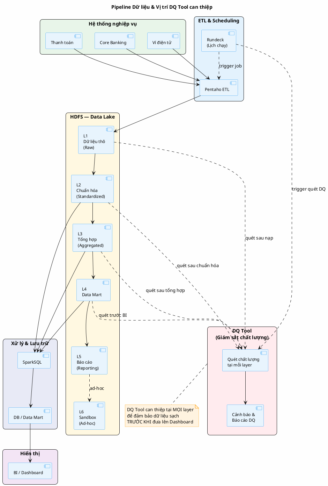
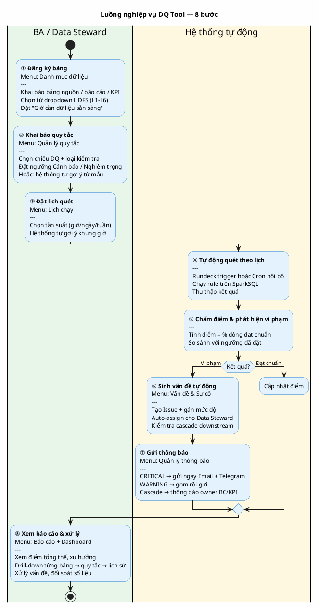
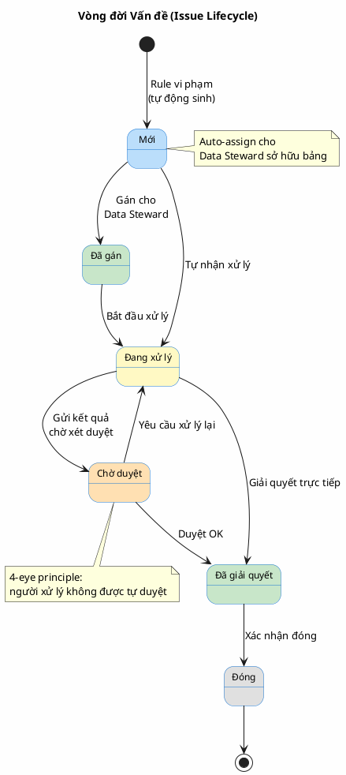
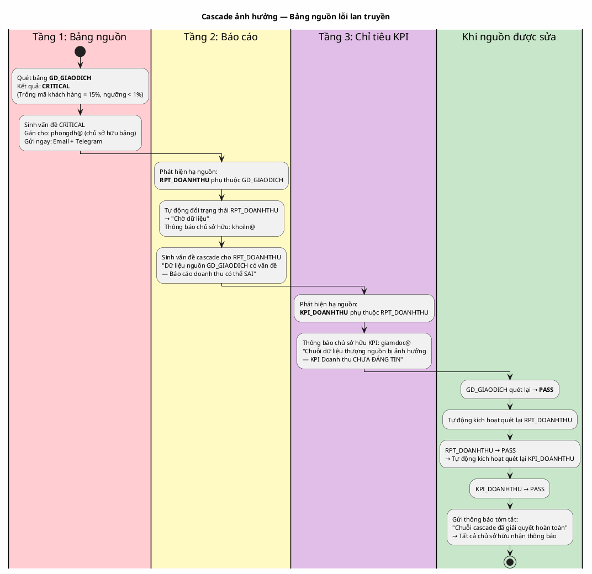
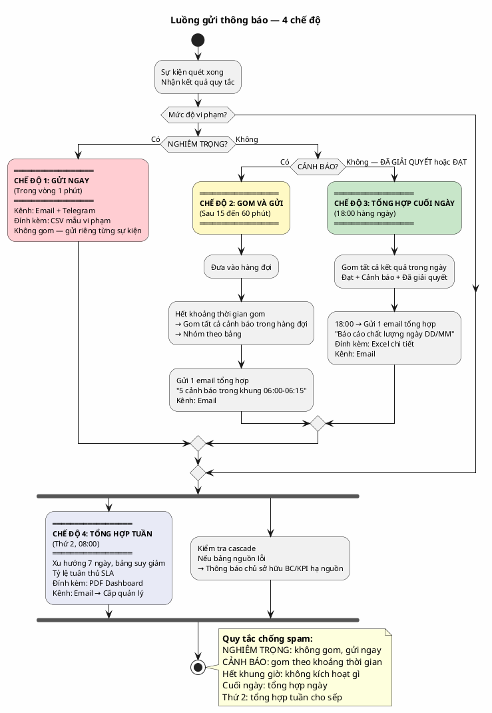

# Tài liệu Thuyết trình Hệ thống Quản lý Chất lượng Dữ liệu (DQ Tool)

**Phiên bản:** 1.0
**Ngày cập nhật:** 16/04/2026
**Phạm vi:** Toàn bộ pipeline dữ liệu từ hệ thống nghiệp vụ đến Dashboard
**Đối tượng:** Cấp quản lý, Data Steward, BA, Nhóm Kỹ thuật dữ liệu

---

## MỤC LỤC

1. [Tổng quan hệ thống](#phần-1--tổng-quan-hệ-thống)
2. [6 Chiều chất lượng dữ liệu](#phần-2--6-chiều-chất-lượng-dữ-liệu)
3. [Luồng nghiệp vụ tổng quan](#phần-3--luồng-nghiệp-vụ-tổng-quan-end-to-end)
4. [Chi tiết 10 menu chức năng](#phần-4--chi-tiết-10-menu-chức-năng)
5. [Các case nghiệp vụ xuyên suốt](#phần-5--các-case-nghiệp-vụ-xuyên-suốt)
6. [Bảng tổng hợp trạng thái và ý nghĩa](#phần-6--bảng-tổng-hợp-trạng-thái-và-ý-nghĩa)
7. [Câu hỏi thường gặp (FAQ)](#phần-7--câu-hỏi-thường-gặp-faq)

---

## PHẦN 1 — TỔNG QUAN HỆ THỐNG

### 1.1. Bài toán đặt ra

Trong môi trường Fintech, dữ liệu là nền tảng của mọi quyết định kinh doanh. Dashboard doanh thu, KPI tăng trưởng, báo cáo rủi ro — tất cả đều phụ thuộc vào chất lượng dữ liệu đầu vào. Khi dữ liệu lỗi, hậu quả có thể lan rộng:

- Giám đốc đọc số liệu sai trên Dashboard và ra quyết định không chính xác.
- Báo cáo gửi NHNN hoặc nội bộ có số không khớp với thực tế.
- Hệ thống AML bỏ sót giao dịch đáng ngờ do dữ liệu thiếu.
- Nhóm kỹ thuật mất nhiều giờ truy tìm nguyên nhân lỗi không có công cụ hỗ trợ.

DQ Tool giải quyết bài toán: **giám sát chất lượng dữ liệu tự động, liên tục, trên toàn bộ pipeline** — phát hiện vấn đề sớm, thông báo đúng người, trước khi dữ liệu xấu lên đến Dashboard.

### 1.2. Kiến trúc pipeline và vị trí can thiệp

Pipeline dữ liệu của tổ chức đi qua nhiều tầng. DQ Tool đứng ở vị trí **giám sát xuyên suốt**, can thiệp sau mỗi tầng HDFS để đảm bảo dữ liệu sạch trước khi tiến lên tầng tiếp theo.



### 1.3. Các thành phần hệ thống liên quan

| Thành phần | Vai trò | Liên quan đến DQ Tool |
|-----------|---------|----------------------|
| Pentaho ETL | Nạp dữ liệu từ hệ thống nghiệp vụ vào HDFS | DQ Tool quét sau khi Pentaho hoàn tất nạp |
| Rundeck | Quản lý và kích hoạt lịch chạy pipeline | Rundeck trigger DQ Tool; DQ Tool trả kết quả về Rundeck |
| HDFS (L1-L6) | Lưu trữ dữ liệu theo từng tầng xử lý | DQ Tool quét dữ liệu tại mỗi tầng |
| SparkSQL | Thực thi câu truy vấn kiểm tra chất lượng | DQ Tool dùng SparkSQL để chạy các quy tắc kiểm tra |
| SQLWF | Công cụ quản lý job pipeline nội bộ | DQ Tool đồng bộ danh sách job, bảng từ SQLWF |
| Ambari | Quản lý cluster Hadoop | Quản lý tài nguyên cluster mà DQ Tool sử dụng |

---

## PHẦN 2 — 6 CHIỀU CHẤT LƯỢNG DỮ LIỆU

### 2.1. Bảng 6 chiều chất lượng

| # | Chiều | Ý nghĩa | Ví dụ thực tế |
|---|-------|---------|---------------|
| 1 | Đầy đủ (Completeness) | Tỷ lệ dữ liệu không bị thiếu hoặc trống | Cột "Mã khách hàng" có 15% dòng trống, không xác định được giao dịch thuộc khách nào |
| 2 | Hợp lệ (Validity) | Dữ liệu đúng định dạng và giá trị quy định | Số điện thoại có ký tự chữ, địa chỉ email thiếu ký tự "@", tuổi khách hàng nhập giá trị âm |
| 3 | Nhất quán (Consistency) | Dữ liệu thống nhất giữa các bảng, không mâu thuẫn | Tổng giao dịch chi tiết trong bảng nguồn không bằng tổng trong báo cáo tổng hợp |
| 4 | Duy nhất (Uniqueness) | Không có bản ghi trùng lặp | Hai giao dịch cùng mã giao dịch, cùng thời điểm và cùng số tiền |
| 5 | Chính xác (Accuracy) | Dữ liệu phản ánh đúng thực tế | Tỷ giá ngoại tệ ghi sai ngày, số dư tài khoản âm không hợp lệ |
| 6 | Kịp thời (Timeliness) | Dữ liệu có mặt đúng giờ cam kết (SLA) | File dữ liệu nạp trễ 2 tiếng so với cam kết 06:00; Dashboard 08:00 chưa có dữ liệu |

### 2.2. Cách tính điểm chất lượng

Hệ thống tính điểm theo 4 cấp từ chi tiết lên tổng quát:

**Cấp 1 — Điểm quy tắc:** Mỗi quy tắc kiểm tra tính tỷ lệ phần trăm dòng dữ liệu đạt chuẩn.
Ví dụ: Kiểm tra "Mã khách hàng không trống" — 8,500 dòng đạt / 10,000 dòng tổng = Điểm 85.

**Cấp 2 — Điểm chiều:** Trung bình cộng điểm của tất cả quy tắc thuộc cùng một chiều.
Ví dụ: Chiều Đầy đủ có 3 quy tắc với điểm 85, 90, 78 → Điểm chiều Đầy đủ = (85+90+78)/3 = 84.

**Cấp 3 — Điểm bảng:** Trung bình cộng điểm 6 chiều của một bảng.
Ví dụ: Bảng GD_GIAODICH có 6 điểm chiều → Điểm bảng = trung bình 6 giá trị.

**Cấp 4 — Điểm hệ thống:** Trung bình cộng điểm tất cả bảng đã đăng ký và được quét.

### 2.3. Xếp hạng chất lượng

| Hạng | Điểm | Ý nghĩa |
|------|------|---------|
| A | Từ 90 trở lên | Chất lượng tốt — duy trì và giám sát định kỳ |
| B | Từ 80 đến dưới 90 | Chất lượng khá — cải thiện một vài điểm yếu |
| C | Từ 60 đến dưới 80 | Chất lượng trung bình — cần hành động cải thiện |
| D | Dưới 60 | Chất lượng kém — ưu tiên cao, cần sửa ngay |

---

## PHẦN 3 — LUỒNG NGHIỆP VỤ TỔNG QUAN (END-TO-END)

### 3.1. Sơ đồ luồng 8 bước



### 3.2. Bảng giải thích 8 bước

| Bước | Menu trên hệ thống | Người thực hiện | Mô tả |
|------|-------------------|-----------------|-------|
| ① Đăng ký bảng | Danh mục dữ liệu | BA / Data Steward | Khai báo bảng cần giám sát, đặt giờ cần dữ liệu sẵn sàng (SLA) |
| ② Khai báo quy tắc | Quản lý quy tắc | BA / Data Steward | Chọn loại kiểm tra từ 28 loại có sẵn, đặt ngưỡng cảnh báo và nghiêm trọng |
| ③ Đặt lịch quét | Lịch chạy | BA / Data Steward | Chọn khung giờ, tần suất quét; hệ thống gợi ý tự động dựa trên giờ SLA |
| ④ Quét tự động | (Hệ thống) | Tự động | Rundeck hoặc Cron trigger → SparkSQL chạy quy tắc → thu thập kết quả |
| ⑤ Chấm điểm | (Hệ thống) | Tự động | Tính phần trăm dòng đạt chuẩn, so sánh với ngưỡng đã đặt |
| ⑥ Sinh vấn đề | Vấn đề & Sự cố | Tự động | Tạo vấn đề khi vi phạm, tự động gán cho Data Steward sở hữu bảng |
| ⑦ Gửi thông báo | Quản lý thông báo | Tự động | Email/Telegram theo 4 chế độ gửi: gửi ngay, gom nhóm, tổng hợp ngày, tổng hợp tuần |
| ⑧ Xem & xử lý | Dashboard + Báo cáo | Quản lý / BA | Xem drill-down, đối soát số liệu, xử lý vấn đề |

---

## PHẦN 4 — CHI TIẾT 10 MENU CHỨC NĂNG

### 4.1. Tổng quan (Dashboard)

**Chức năng:** Bảng điều khiển tổng thể dành cho cấp quản lý. Cung cấp toàn cảnh chất lượng dữ liệu toàn hệ thống trong một màn hình.

**Đầu vào:** Dữ liệu kết quả quét từ tất cả bảng đã đăng ký, tổng hợp theo thời gian thực.

**Đầu ra:** Chỉ số tổng quan, biểu đồ xu hướng, danh sách bảng cần chú ý, danh sách vấn đề gần đây.

#### 4.1.1. Năm chỉ số chính

| Chỉ số | Ý nghĩa | Màu cảnh báo |
|--------|---------|-------------|
| Tổng bảng dữ liệu | Số bảng đã đăng ký, phân theo: Bảng nguồn / Báo cáo / KPI | Xanh (bình thường) |
| Điểm chất lượng trung bình | Trung bình điểm của tất cả bảng đã quét (thang 0-100) | Đỏ nếu dưới 60 |
| Vấn đề đang mở | Số vấn đề chưa xử lý (trạng thái Mới hoặc Đang xử lý) | Đỏ khi có vấn đề mới |
| Quy tắc đang hoạt động | Số quy tắc kiểm tra đang được áp dụng | Không cảnh báo |
| Chuỗi cảnh báo | Số chuỗi ảnh hưởng liên bảng (cascade) đang hoạt động | Đỏ khi có cascade đang xử lý |

#### 4.1.2. Biểu đồ và bảng hỗ trợ

- **Biểu đồ điểm tổng thể (dạng đồng hồ):** Điểm trung bình toàn hệ thống theo thang 0-100, so sánh với hôm qua.
- **Biểu đồ điểm theo 6 chiều (dạng thanh ngang):** Hiển thị điểm từng chiều (Đầy đủ, Hợp lệ, Nhất quán, Duy nhất, Chính xác, Kịp thời), màu sắc theo mức độ.
- **Biểu đồ xu hướng (đường):** Lọc được theo hôm nay / 7 ngày / 30 ngày. Quan sát điểm đang tăng hay giảm.
- **Bảng dữ liệu cần chú ý:** Top 8 bảng có điểm thấp nhất, hiển thị điểm 6 chiều và xu hướng. Click tên bảng → mở chi tiết bảng.
- **Bảng top quy tắc vi phạm nhiều nhất:** Top 8 quy tắc bị vi phạm nhiều nhất trong kỳ, kèm số bảng ảnh hưởng.
- **Bảng vấn đề gần đây:** 8 vấn đề mới nhất với mức độ, chiều dữ liệu, trạng thái. Click tên vấn đề → mở chi tiết.

#### 4.1.3. Lộ trình thiết lập hệ thống (5 bước)

Thanh tiến trình trên Dashboard hướng dẫn người dùng mới hoàn tất 5 bước cần thiết để hệ thống hoạt động đầy đủ:

| Bước | Nội dung | Menu đích |
|------|---------|-----------|
| 1 | Cấu hình ngưỡng mặc định | Cài đặt → Ngưỡng mặc định |
| 2 | Đăng ký bảng dữ liệu | Danh mục dữ liệu |
| 3 | Tạo quy tắc kiểm tra | Quản lý quy tắc |
| 4 | Đặt lịch chạy DQ | Lịch chạy |
| 5 | Cấu hình thông báo | Quản lý thông báo |

Mỗi bước hiển thị màu xanh (đã hoàn thành) hoặc màu vàng (chưa hoàn thành). Hệ thống tự tính tiến độ từ dữ liệu thực.

#### 4.1.4. Case nghiệp vụ

**Case: Giám đốc mở Dashboard sáng thứ Hai**

Giám đốc thấy ngay: Điểm hệ thống 78/100, tăng 1.2 so với tuần trước. 12 vấn đề đang mở, trong đó 3 vấn đề mới phát sinh hôm nay. Chuỗi cảnh báo: 1 đang xử lý. Bảng cần chú ý nhất: GD_GIAODICH (điểm 45). Click vào bảng → xem chi tiết ngay, không cần hỏi thêm nhóm kỹ thuật.

---

### 4.2. Danh mục dữ liệu

**Chức năng:** Quản lý toàn bộ danh sách bảng, báo cáo, và chỉ tiêu KPI cần giám sát chất lượng. Đây là bước đầu tiên để đưa một nguồn dữ liệu vào phạm vi quản lý của DQ Tool.

**Đầu vào:** Tên bảng (chọn từ SQLWF hoặc nhập thủ công), tầng HDFS, chủ sở hữu, danh mục, giờ cần dữ liệu sẵn sàng, ngưỡng riêng (tùy chọn).

**Đầu ra:** Danh sách bảng được giám sát kèm điểm chất lượng, kết quả phân tích cột, liên kết bảng nguồn — báo cáo — KPI.

#### 4.2.1. Ba loại đối tượng quản lý

| Loại | Ký hiệu | Ý nghĩa | Ví dụ |
|------|---------|---------|-------|
| Bảng nguồn | Màu xanh dương | Bảng dữ liệu gốc từ HDFS | GD_GIAODICH, KH_KHACHHANG |
| Báo cáo | Màu vàng cam | Bảng tổng hợp cho báo cáo | BC_DOANHTHU_NGAY, BC_TONGHOP_THANG |
| Chỉ tiêu KPI | Màu tím | Chỉ tiêu kinh doanh | KPI_DOANHTHU, KPI_TINHLAN |

#### 4.2.2. Các case nghiệp vụ quan trọng

**Case 1 — Đăng ký bảng từ SQLWF:**
Khi nhấn "Thêm bảng nguồn", hệ thống hiển thị dropdown danh sách bảng đã đăng ký trên SQLWF, nhóm theo tầng HDFS (L1 đến L6). Người dùng chọn bảng → hệ thống tự điền: schema, chủ sở hữu, chế độ ghi (ghi thêm hoặc ghi đè), chu kỳ phân vùng. Nếu bảng chưa có trên SQLWF, tick chọn "Nhập thủ công" để khai báo tay.

**Case 2 — Ý nghĩa 6 tầng HDFS:**

| Tầng | Tên | Nội dung |
|------|-----|---------|
| L1 | Dữ liệu thô | Dữ liệu nguyên bản từ hệ thống nghiệp vụ, chưa xử lý |
| L2 | Chuẩn hóa | Đã chuẩn hóa định dạng, kiểu dữ liệu, mã hóa |
| L3 | Tổng hợp | Đã tổng hợp: tính tổng, đếm, trung bình theo ngày/tháng |
| L4 | Data Mart | Sẵn sàng cho phân tích theo chủ đề nghiệp vụ |
| L5 | Báo cáo | Dữ liệu cho báo cáo chính thức, đối ngoại |
| L6 | Sandbox | Phân tích thử nghiệm, ad-hoc, không ảnh hưởng production |

**Case 3 — Import danh sách bảng theo lô (CSV):**
Hệ thống cung cấp 3 template tải về:
- Template 1 "Import bảng chuẩn": khai báo thông tin bảng và ngưỡng per chiều.
- Template 2 "Import quy tắc": khai báo bảng kèm danh sách quy tắc chi tiết.
- Template 3 "Import nhanh có mẫu bảng": chỉ cần khai báo tên bảng — hệ thống tự áp bộ quy tắc từ mẫu phù hợp.

**Case 4 — Ý nghĩa "Giờ cần dữ liệu sẵn sàng":**
Trường này thiết lập SLA dữ liệu cho từng bảng. Ví dụ: bảng GD_GIAODICH đặt giờ = 08:00 nghĩa là dữ liệu phải có mặt trên hệ thống trước 08:00 sáng (để Dashboard buổi sáng của giám đốc có số liệu chính xác). Hệ thống sử dụng thông tin này để:
- Tự động gợi ý lịch quét trước giờ SLA (ví dụ: gợi ý quét lúc 07:00).
- Phát cảnh báo "Quá hạn SLA" nếu đến giờ đó dữ liệu chưa được nạp đủ.

**Case 5 — Liên kết 3 tầng (Bảng nguồn → Báo cáo → KPI):**
Mỗi Báo cáo được liên kết với một hoặc nhiều Bảng nguồn. Mỗi KPI được liên kết với một hoặc nhiều Báo cáo. Khi Bảng nguồn gặp lỗi, hệ thống tự động phát hiện và cảnh báo toàn bộ Báo cáo, KPI phụ thuộc theo chuỗi cascade.

**Case 6 — Ngưỡng riêng per bảng:**
Mỗi bảng có thể được đặt ngưỡng riêng, khác với ngưỡng mặc định toàn hệ thống. Ưu tiên áp dụng theo thứ tự: Ngưỡng per quy tắc > Ngưỡng per bảng > Ngưỡng mặc định hệ thống. Ví dụ: bảng AML_GIAODICH_NGHINGO yêu cầu ngưỡng nghiêm khắc hơn (Đầy đủ cảnh báo = 99%) so với bảng tham chiếu thông thường (Đầy đủ cảnh báo = 90%).

**Case 7 — Xem chi tiết bảng:**
Click vào tên bảng → trang chi tiết hiển thị: điểm 6 chiều, kết quả phân tích cột (tỷ lệ trống, số giá trị phân biệt, giá trị nhỏ nhất/lớn nhất), danh sách quy tắc đang áp dụng, luồng dữ liệu thượng nguồn (bảng cấp trên) và hạ nguồn (báo cáo/KPI phụ thuộc).

#### 4.2.3. Trạng thái bảng

| Trạng thái | Màu | Ý nghĩa |
|-----------|-----|---------|
| Hoạt động | Xanh lá | Đang được giám sát bình thường |
| Không hoạt động | Xám | Tạm dừng giám sát |
| Lỗi | Đỏ | Đang có vấn đề nghiêm trọng |
| Chờ dữ liệu | Vàng | Bảng upstream bị lỗi, dữ liệu chưa tin cậy |
| Đang kiểm tra lại | Xanh dương | Đang chạy lại sau khi upstream phục hồi |

#### 4.2.4. Cases bổ sung — Quy mô doanh nghiệp lớn

**Case 8 — Đưa hàng loạt bảng vào hệ thống (mass onboarding 500+ bảng):**
Tình huống: Đội ngũ mới nhận bàn giao 500+ bảng từ data warehouse cũ, cần đưa lên DQ Tool trong 1 tuần. Nếu khai báo thủ công từng bảng → không khả thi. Luồng đề xuất:
1. Xuất danh sách toàn bộ bảng từ Hive metastore (dưới dạng CSV) gồm: tên bảng, schema, layer, owner, số cột, số dòng, ngày tạo.
2. Phân loại bằng chính sách: bảng L1/L2 (bảng nguồn + chuẩn hóa) → ưu tiên cao, bảng L5/L6 (báo cáo/sandbox) → ưu tiên thấp.
3. Dùng Template 3 "Import nhanh có mẫu bảng" — mỗi dòng chỉ cần: tên bảng + tên mẫu phù hợp (ví dụ: "bảng_giao_dịch", "bảng_khách_hàng").
4. Hệ thống import hàng loạt → với mỗi bảng, tự áp quy tắc từ mẫu tương ứng, tự tạo lịch quét mặc định theo lớp HDFS.
5. Báo cáo sau import: "Đã tạo thành công 487 bảng. 13 bảng thất bại do tên bảng trùng (danh sách đính kèm)".
6. Các bảng được import sẽ ở trạng thái "Nháp" — yêu cầu người có quyền phê duyệt để chính thức bật giám sát.

**Case 9 — Bảng bị xóa hoặc đổi tên trong SQLWF:**
Tình huống: Team Data Engineering xóa bảng DM_CHINHANH_OLD trên SQLWF (đã thay bằng DM_CHINHANH_V2). DQ Tool phát hiện khi đồng bộ định kỳ:
- Trạng thái bảng tự chuyển thành "Bảng nguồn không tồn tại".
- Các quy tắc gắn với bảng đó tự chuyển "Tạm treo" — không chạy, không sinh vấn đề mới.
- Hệ thống gửi thông báo cho chủ sở hữu bảng: "Bảng DM_CHINHANH_OLD không còn trên SQLWF. Vui lòng xác nhận: (A) Ngưng giám sát bảng này, (B) Đã đổi tên thành bảng mới — chọn bảng thay thế, (C) Vẫn quan sát (cảnh báo giả định là tạm thời)".
- Nếu người dùng chọn (B) — chuyển sang bảng mới: toàn bộ quy tắc, lịch chạy, ngưỡng, lịch sử được di chuyển sang bảng mới (giữ tính liên tục).

**Case 10 — Schema thay đổi (schema evolution/drift):**
Tình huống: Bảng GD_GIAODICH có 25 cột. Team Core Banking thêm 2 cột mới (LOAI_KENH, MA_DOITAC), đổi tên cột SO_TIEN → SO_TIEN_VND. Đồng bộ SQLWF phát hiện:
- Cột mới thêm → hệ thống tự đưa vào profiling, gợi ý quy tắc cho cột mới dựa trên Mẫu cột tầng 2.
- Cột bị đổi tên → quy tắc gắn với SO_TIEN cũ chuyển trạng thái "Lỗi cấu hình" → người dùng xác nhận mapping sang tên mới, hoặc xóa quy tắc.
- Cột bị xóa → quy tắc gắn với cột đó tự chuyển "Tạm treo" + thông báo cho chủ sở hữu.
- Lịch sử thay đổi schema được lưu trong tab "Lịch sử schema" của bảng — ai thay đổi, khi nào, thay đổi gì.

**Case 11 — Phân loại bảng theo phòng ban/domain:**
Tình huống: Ngân hàng có 1.500 bảng thuộc 8 phòng ban (Tín dụng, Thanh toán, Khách hàng, Rủi ro, AML, Báo cáo, Tài chính, Nhân sự). Mỗi phòng ban chỉ nhìn thấy và xử lý bảng của mình:
- Khai báo thuộc tính "Phòng ban phụ trách" cho mỗi bảng.
- Data Steward của phòng A chỉ nhìn thấy bảng của phòng A trong danh mục.
- Quản trị viên nhìn toàn bộ.
- Báo cáo điểm chất lượng được lọc theo phòng ban → mỗi trưởng phòng nhận báo cáo riêng.
- Khi thông báo cascade: bảng nguồn phòng A lỗi → nếu báo cáo phụ thuộc thuộc phòng B → thông báo kép cho cả 2 phòng (phòng A điều tra nguồn, phòng B biết để không dùng báo cáo).

**Case 12 — Bảng tạm (staging/trung gian) — có nên giám sát không?**
Nguyên tắc đề xuất:
- Bảng L1 (raw), L2 (chuẩn hóa) → bắt buộc giám sát (đầu vào ảnh hưởng toàn hệ thống).
- Bảng L3 (tổng hợp), L4 (data mart), L5 (báo cáo) → bắt buộc giám sát.
- Bảng L6 (sandbox), bảng staging trong quá trình ETL → KHÔNG cần giám sát (đánh dấu "Bảng tạm"), tránh spam vấn đề.
- Dùng trường "Bảng tạm (tmp)" trong khai báo để loại trừ khỏi Dashboard và báo cáo.

**Case 13 — Truy vết dòng đời dữ liệu (Data Lineage):**
Khi một bảng nguồn lỗi → người dùng cần biết ngay: bảng này ảnh hưởng đến những báo cáo/KPI nào?
- Click "Xem dòng đời dữ liệu" trên trang chi tiết bảng → hiển thị đồ thị: bảng thượng nguồn (input) → bảng hiện tại → bảng hạ nguồn (output: báo cáo, KPI, dashboard BI).
- Màu nút theo trạng thái DQ hiện tại (xanh/vàng/đỏ).
- Click vào nút bất kỳ → chuyển sang trang chi tiết bảng đó.
- Hữu ích khi quyết định "có nên dùng báo cáo X cho cuộc họp ban giám đốc không" (kiểm tra toàn bộ chuỗi thượng nguồn có bảng nào đang lỗi).

**Case 14 — Retire bảng (cho bảng không còn sử dụng):**
Tình huống: Bảng BC_DOANHTHU_2019 không còn được cập nhật từ năm 2020, nhưng vẫn có trên HDFS. Xử lý:
- Data Steward chuyển trạng thái bảng sang "Đã ngưng sử dụng".
- Hệ thống tự tắt toàn bộ lịch quét, tạm dừng quy tắc.
- Lịch sử điểm + vấn đề cũ vẫn được giữ (để audit), không xuất hiện trên Dashboard.
- Có thể khôi phục lại sau này (nếu bảng được dùng lại).

**Case 15 — Ngưỡng SLA theo ngày lễ/cuối tuần:**
Tình huống: Bảng GD_GIAODICH bình thường cần sẵn sàng trước 08:00. Nhưng chủ nhật và ngày lễ: hệ thống nguồn không giao dịch, nạp EOD có thể muộn hơn (10:00). Khai báo:
- Khai báo SLA chính: 08:00 (các ngày thường).
- Khai báo SLA thay thế: 10:00 (chủ nhật + ngày lễ), lấy từ lịch nghỉ của tổ chức.
- Hệ thống tự áp SLA đúng theo ngày trong tuần → tránh cảnh báo giả vào ngày lễ.

---

### 4.3. Quản lý quy tắc

**Chức năng:** Khai báo và quản lý các quy tắc kiểm tra chất lượng dữ liệu. Hệ thống cung cấp 28 loại kiểm tra có sẵn, không yêu cầu viết SQL.

**Đầu vào:** Chiều chất lượng, loại kiểm tra, bảng/cột áp dụng, ngưỡng cảnh báo/nghiêm trọng.

**Đầu ra:** Điểm chất lượng per quy tắc, lịch sử chạy, vấn đề tự động sinh khi vi phạm.

#### 4.3.1. Hai tab giao diện

- **Danh sách quy tắc:** Tất cả quy tắc đang áp dụng trên hệ thống. Lọc theo chiều, bảng, trạng thái.
- **Mẫu quy tắc:** Thư viện mẫu tái sử dụng. Tạo quy tắc mới nhanh từ mẫu có sẵn.

#### 4.3.2. 28 loại kiểm tra (không cần viết SQL)

Người dùng chọn loại kiểm tra từ danh sách — hệ thống tự sinh câu truy vấn SparkSQL tương ứng.

**Chiều Đầy đủ (4 loại):**

| Loại kiểm tra | Ý nghĩa |
|--------------|---------|
| Không có giá trị trống (not_null) | Kiểm tra cột không có dòng nào bị trống |
| Tỷ lệ điền đủ (fill_rate) | Tỷ lệ tối thiểu dòng có giá trị (VD: ít nhất 95% phải có) |
| Tỷ lệ trống theo kỳ (null_rate_by_period) | Theo dõi tỷ lệ trống theo ngày/tuần/tháng, phát hiện đột biến |
| Bắt buộc có giá trị theo điều kiện (conditional_not_null) | Bắt buộc có giá trị khi thỏa điều kiện (VD: loại GD = "chuyển khoản" thì số tài khoản đích bắt buộc) |

**Chiều Hợp lệ (4 loại):**

| Loại kiểm tra | Ý nghĩa |
|--------------|---------|
| Đúng định dạng (format_regex) | Kiểm tra theo mẫu biểu thức chính quy (VD: email, SĐT, mã giao dịch) |
| Không chứa giá trị cấm (blacklist_pattern) | Phát hiện chuỗi ký tự không được phép (VD: "test", "null", "xxx") |
| Nằm trong khoảng giá trị (value_range) | Giá trị số phải nằm giữa giá trị nhỏ nhất và lớn nhất quy định |
| Thuộc danh sách cho phép (allowed_values) | Giá trị phải thuộc một tập hợp xác định (VD: trạng thái chỉ được là "PENDING", "SUCCESS", "FAILED") |

**Chiều Nhất quán (3 loại):**

| Loại kiểm tra | Ý nghĩa |
|--------------|---------|
| Đúng kiểu dữ liệu (fixed_datatype) | Cột phải có kiểu dữ liệu cố định (chuỗi, số nguyên, số thực, ngày, thời gian) |
| Giá trị phổ biến (mode_check) | Giá trị xuất hiện nhiều nhất phải chiếm tỷ lệ tối thiểu quy định |
| Toàn vẹn tham chiếu (referential_integrity) | Giá trị phải tồn tại trong bảng tham chiếu (VD: mã chi nhánh phải có trong bảng danh mục chi nhánh) |

**Chiều Duy nhất (2 loại):**

| Loại kiểm tra | Ý nghĩa |
|--------------|---------|
| Không trùng lặp (1 cột) (duplicate_single) | Không có giá trị nào xuất hiện 2 lần trở lên trong cùng cột |
| Không trùng lặp (tổ hợp nhiều cột) (duplicate_composite) | Không có tổ hợp giá trị nào trùng lặp (VD: mã GD + ngày GD phải duy nhất) |

**Chiều Chính xác (5 loại):**

| Loại kiểm tra | Ý nghĩa |
|--------------|---------|
| Khớp dữ liệu chuẩn (reference_match) | So khớp giá trị với bảng chuẩn (VD: tỷ giá đúng ngày) |
| Nằm trong khoảng thống kê (statistics_bound) | Giá trị không được vượt quá ngưỡng thống kê (min, max, trung bình, độ lệch chuẩn) |
| Tổng trong khoảng (sum_range) | Tổng cột nằm trong khoảng kỳ vọng |
| Tỷ lệ đạt điều kiện (expression_pct) | Tỷ lệ tối thiểu dòng thỏa biểu thức điều kiện tùy chỉnh |
| Đối soát tổng hợp (aggregate_reconciliation) | So khớp giá trị tổng hợp của báo cáo với bảng nguồn |

**Chiều Kịp thời (2 loại):**

| Loại kiểm tra | Ý nghĩa |
|--------------|---------|
| Đúng giờ SLA (on_time) | Dữ liệu phải có mặt trước giờ cam kết |
| Mới nhất (freshness) | Dữ liệu không được quá cũ (VD: không quá 2 giờ kể từ lần cập nhật cuối) |

**Kiểm tra cấp bảng (7 loại):**

| Loại kiểm tra | Ý nghĩa |
|--------------|---------|
| Số dòng (row_count) | Số dòng trong bảng phải nằm trong khoảng kỳ vọng |
| Độ phủ thời gian (time_coverage) | Dữ liệu phải có đủ khoảng thời gian yêu cầu |
| Thay đổi khối lượng (volume_change) | Khối lượng dữ liệu không được thay đổi đột biến so với kỳ trước |
| Kích thước bảng (table_size) | Kích thước bảng trên HDFS nằm trong khoảng quy định |
| Biểu thức tùy chỉnh (custom_expression) | Câu điều kiện tùy chỉnh tự viết |
| Khớp số dòng báo cáo (report_row_count_match) | Số dòng báo cáo khớp với nguồn |
| Độ lệch KPI (kpi_variance) | Biến động KPI không vượt ngưỡng cho phép |
| Khớp tổng KPI cha-con (parent_child_match) | Tổng KPI con phải bằng KPI cha |

#### 4.3.3. Mẫu quy tắc 3 tầng (gợi ý tự động)

Khi đăng ký bảng mới, hệ thống tự động gợi ý quy tắc dựa trên 3 cấp mẫu:

- **Tầng 1 — Mẫu loại kiểm tra:** Ví dụ mẫu "Kiểm tra trống" áp dụng được cho nhiều cột khác nhau.
- **Tầng 2 — Mẫu cột:** Ví dụ mẫu "Cột email phải đúng định dạng" — khi bảng có cột tên "email" hoặc "EMAIL", hệ thống tự gợi ý áp mẫu này.
- **Tầng 3 — Mẫu bảng:** Ví dụ mẫu "Bảng giao dịch tài chính" — bộ quy tắc đầy đủ cho loại bảng này (null mã khách hàng, định dạng số tiền, trùng lặp mã giao dịch...). Khi thêm bảng mới → hệ thống tự đối chiếu tầng 2 và tầng 3 → gợi ý danh sách quy tắc, người dùng xác nhận 1 click.

#### 4.3.4. Tạo nhiều quy tắc cùng lúc (batch)

Chọn 1 loại kiểm tra + chọn nhiều cột → hệ thống tạo n quy tắc riêng biệt, mỗi quy tắc cho 1 cột. Ví dụ: chọn "Không có giá trị trống" + chọn 5 cột quan trọng → tạo 5 quy tắc trong 1 thao tác.

#### 4.3.5. Ngưỡng đánh giá

Mỗi quy tắc có 2 ngưỡng:
- **Ngưỡng cảnh báo (W):** Điểm dưới ngưỡng này → trạng thái Cảnh báo (vàng).
- **Ngưỡng nghiêm trọng (C):** Điểm dưới ngưỡng này → trạng thái Nghiêm trọng (đỏ).

Ví dụ: W = 80, C = 70. Nếu điểm = 72 → Cảnh báo. Nếu điểm = 65 → Nghiêm trọng.

Giao diện hiển thị dạng thanh kéo trực quan: Đỏ (từ 0 đến ngưỡng nghiêm trọng) | Vàng (từ ngưỡng nghiêm trọng đến ngưỡng cảnh báo) | Xanh (từ ngưỡng cảnh báo đến 100).

#### 4.3.6. Lịch sử chạy

Mỗi quy tắc lưu 30 lần chạy gần nhất: thời điểm chạy, nguồn kích hoạt (tự động hoặc thủ công), kết quả, điểm, liên kết đến vấn đề phát sinh (nếu có).

#### 4.3.7. Trạng thái quy tắc

| Trạng thái | Màu | Ý nghĩa |
|-----------|-----|---------|
| Hoạt động | Xanh lá | Đang được áp dụng, chạy theo lịch |
| Không hoạt động | Xám | Tạm dừng, không chạy |
| Nháp | Viền xám (chưa tô) | Mới tạo, chưa duyệt (khi bật chế độ phê duyệt) |

#### 4.3.8. Cases bổ sung — Quy mô doanh nghiệp lớn

**Case 6 — Bật/tắt hàng loạt quy tắc (maintenance window):**
Tình huống: Đội Core Banking có kế hoạch nâng cấp hệ thống vào cuối tuần (thứ 7 22:00 đến chủ nhật 06:00). Trong khoảng thời gian này, dữ liệu có thể không ổn định → không nên để DQ Tool cảnh báo giả. Luồng:
- Vào "Quản lý quy tắc" → chọn bộ lọc "Phòng ban = Core Banking" → chọn tất cả (250 quy tắc).
- Nhấn "Tạm tắt hàng loạt" → nhập lý do + thời gian: "Maintenance Core Banking, tắt từ thứ 7 22:00, bật lại chủ nhật 06:00".
- Hệ thống tự động bật lại sau khung giờ đã đặt.
- Log thao tác lưu đầy đủ: ai tắt, khi nào, lý do, quy tắc nào (phục vụ audit).

**Case 7 — Quy tắc chồng chéo (conflict):**
Tình huống: Cột SO_CMND của bảng KH_KHACHHANG có 2 quy tắc:
- QT1 (do team A tạo): "Định dạng đúng — 9 hoặc 12 số" — ngưỡng cảnh báo 95%.
- QT2 (do team B tạo): "Định dạng đúng — 12 số (chỉ CCCD)" — ngưỡng cảnh báo 80%.
Hai quy tắc mâu thuẫn vì CMND cũ 9 số sẽ fail QT2 nhưng pass QT1. Hệ thống cảnh báo:
- Khi tạo QT2, hệ thống phát hiện đã có QT1 trên cùng cột + cùng loại kiểm tra → hiện cảnh báo: "Đã có quy tắc tương tự. Xem xét: gộp thành 1 quy tắc, hoặc xóa quy tắc cũ".
- Trên trang chi tiết cột → hiển thị cảnh báo "Cột này đang có 2 quy tắc có thể chồng chéo".

**Case 8 — Quản lý phiên bản quy tắc (rule versioning):**
Tình huống: Ngưỡng cảnh báo của quy tắc "Tỷ lệ trống — Mã khách hàng" ban đầu đặt 95%. Sau 3 tháng, Data Steward đánh giá "quá nghiêm khắc, nhiều cảnh báo giả" → hạ xuống 90%. Hệ thống lưu:
- Lịch sử thay đổi: 14/02/2026 — tăng từ 90% lên 95% (bởi khoiln@, lý do: "tuân thủ yêu cầu audit"); 15/04/2026 — giảm từ 95% về 90% (bởi phongdh@, lý do: "quá nghiêm khắc, sau 3 tháng đánh giá").
- Có thể so sánh: điểm chất lượng trung bình 30 ngày trước vs 30 ngày sau khi đổi ngưỡng → đánh giá tác động của thay đổi.

**Case 9 — Quy tắc liên bảng (cross-table rules):**
Tình huống: Kiểm tra tính nhất quán giữa 2 bảng. Ví dụ:
- Mã chi nhánh trong bảng GD_GIAODICH phải tồn tại trong bảng DM_CHINHANH (toàn vẹn tham chiếu — referential integrity).
- Tổng cột số tiền trong BC_DOANHTHU_NGAY phải bằng tổng cột số tiền giao dịch trong GD_GIAODICH cùng ngày (đối soát tổng hợp — aggregate reconciliation).
- Hệ thống cho phép chọn 2 bảng + cột liên quan + loại so sánh → tự sinh câu SparkSQL JOIN.
- Khi 1 trong 2 bảng lỗi → vấn đề được gắn cho cả 2 chủ sở hữu.

**Case 10 — Biểu thức tùy chỉnh (custom expression):**
Tình huống: Case phức tạp vượt ngoài 28 loại kiểm tra có sẵn. Ví dụ: "Với các giao dịch có số tiền > 500 triệu, bắt buộc phải có trường NOTE không trống VÀ LOAI_GD không phải 'TEST'". Data Steward viết biểu thức:
```
CASE WHEN SO_TIEN > 500000000
     THEN (NOTE IS NOT NULL AND LOAI_GD != 'TEST')
     ELSE TRUE END
```
- Hệ thống hỗ trợ cú pháp SparkSQL chuẩn.
- Có tính năng "Chạy thử" trên mẫu 1000 dòng → xem kết quả trước khi lưu chính thức.
- Biểu thức tùy chỉnh yêu cầu phê duyệt bởi Quản trị viên (vì có rủi ro bảo mật + hiệu năng).

**Case 11 — Đánh giá hiệu quả quy tắc (effectiveness review):**
Tình huống: Hệ thống có 2.000 quy tắc, nhiều quy tắc không bao giờ fail (thừa) hoặc fail liên tục (sai ngưỡng). Báo cáo hiệu quả quy tắc:
- Quy tắc không fail suốt 90 ngày → đề xuất: kiểm tra lại ngưỡng (quá lỏng?) hoặc xem xét xóa.
- Quy tắc fail > 80% lần chạy → đề xuất: xem lại ngưỡng (quá khắt khe?) hoặc dữ liệu thực sự có vấn đề chưa giải quyết (cần root cause).
- Quy tắc trùng lặp (cùng bảng + cùng cột + cùng loại kiểm tra) → đề xuất gộp.
- Báo cáo chạy hàng quý, gửi cho Quản trị viên DQ.

**Case 12 — Quy tắc mùa vụ (seasonal rules):**
Tình huống: Cuối tháng, cuối quý, cuối năm có các quy tắc chỉ áp dụng trong kỳ đó.
- Ví dụ: Quy tắc "Tổng doanh thu tháng >= 90% dự kiến" chỉ chạy vào ngày cuối tháng (ngày 28-31).
- Ví dụ: Quy tắc "Đối soát báo cáo quý với tổng GD trong quý" chỉ chạy ngày 31/03, 30/06, 30/09, 31/12.
- Khai báo qua lịch chạy với Cron tùy chỉnh: `0 0 28-31 * *` (ngày 28-31 hàng tháng).

**Case 13 — Luồng phê duyệt quy tắc (approval workflow):**
Tình huống: Tổ chức lớn yêu cầu tách người đề xuất và người duyệt (4-eye principle).
- Phân tích viên (Analyst) tạo quy tắc → trạng thái "Nháp" → gửi yêu cầu phê duyệt.
- Data Steward (cùng phòng ban) nhận yêu cầu, xem xét: logic nghiệp vụ đúng không? ngưỡng hợp lý không? ảnh hưởng đến bảng/cột hiện có không?
- Duyệt → trạng thái "Hoạt động", bắt đầu chạy theo lịch. Từ chối → quay về "Nháp" kèm ghi chú lý do.
- Lịch sử phê duyệt: ai đề xuất, ai duyệt, khi nào — lưu đầy đủ cho audit.
- Trường hợp đặc biệt: Quản trị viên tạo quy tắc thì được tự duyệt (vì đã có quyền cao nhất).

---

### 4.4. Lịch chạy

**Chức năng:** Quản lý lịch chạy tự động cho từng bảng dữ liệu. Xác định khi nào hệ thống sẽ thực hiện quét chất lượng.

**Đầu vào:** Bảng cần quét, tần suất, giờ chạy, danh sách quy tắc áp dụng.

**Đầu ra:** Kết quả quét theo lịch, cập nhật điểm chất lượng, sinh vấn đề nếu vi phạm.

#### 4.4.1. Hai chế độ xem

- **Danh sách:** Xem tất cả lịch chạy dạng bảng, lọc theo bảng, tần suất, trạng thái.
- **Khung giờ (batch view):** Xem tổng quan lịch chạy theo 5 khung giờ trong ngày — giúp phát hiện các khung giờ bị quá tải.

#### 4.4.2. Các tần suất quét

| Tần suất | Ký hiệu | Phù hợp với loại bảng |
|---------|---------|----------------------|
| Thực thời (stream) | realtime | Bảng giao dịch quan trọng, kiểm tra hợp lệ per giao dịch |
| Hàng giờ | hourly | Bảng có dữ liệu cập nhật liên tục trong ngày |
| Hàng ngày | daily | Bảng tổng hợp EOD (cuối ngày) |
| Hàng tuần | weekly | Bảng tham chiếu, danh mục |
| Hàng tháng | monthly | Bảng báo cáo tháng, KPI tháng |
| Cron tùy chỉnh | custom | Lịch đặc biệt theo yêu cầu riêng |

#### 4.4.3. Năm khung giờ quét theo batch

| Khung giờ | Tên | Loại quét phù hợp |
|-----------|-----|------------------|
| 00:00 – 06:00 | Rạng sáng | Kiểm tra Đầy đủ và Duy nhất sau khi Pentaho nạp EOD xong |
| 06:00 – 10:00 | Buổi sáng | Kiểm tra Kịp thời (SLA trước 08:00), Đầy đủ |
| 10:00 – 14:00 | Giữa ngày | Kiểm tra Hợp lệ, Nhất quán cho dữ liệu intraday |
| 14:00 – 18:00 | Buổi chiều | Kiểm tra Chính xác, Đối soát cho báo cáo giám đốc |
| 18:00 – 24:00 | Buổi tối | Kiểm tra chéo bảng, chuẩn bị đóng sổ |

#### 4.4.4. Gợi ý lịch tự động

Khi tạo lịch chạy mới cho bảng đã có khai báo "Giờ cần dữ liệu sẵn sàng", hệ thống hiển thị gợi ý: "Bảng GD_GIAODICH có giờ cần dữ liệu sẵn sàng = 08:00. Đề xuất: quét hàng ngày lúc 07:00 (trước SLA 1 tiếng)". Lý do gợi ý được hiển thị rõ để người dùng quyết định có chấp nhận hay không.

#### 4.4.5. Bảng quét nhiều lần trong ngày

Một bảng có thể có nhiều lần nạp dữ liệu trong ngày (ví dụ: nạp intraday lúc 06:00 và nạp EOD lúc 23:30). Cách xử lý: tạo 2 lịch riêng cho cùng một bộ quy tắc, mỗi lịch một giờ chạy. Mỗi lần chạy được lưu thành bản ghi riêng. Giao diện hiển thị lần chạy gần nhất và cho phép xem toàn bộ danh sách các lần chạy trong ngày qua tooltip.

#### 4.4.6. Gom nhóm bảng quét (tránh nghẽn cluster)

Nếu 100 bảng cùng đặt lịch quét lúc 00:00, cluster sẽ bị quá tải. Cơ chế đề xuất:
- Phân bảng theo mức độ ưu tiên: P1 (quan trọng nhất: giao dịch, khách hàng), P2 (quan trọng vừa: báo cáo, hợp đồng), P3 (ít quan trọng: danh mục, tham chiếu).
- Phân bổ giờ chạy theo mức ưu tiên trong cùng khung giờ.
- Giới hạn số bảng chạy đồng thời, bảng tiếp theo chờ khi cluster đang bận.
- Cho phép đặt thứ tự phụ thuộc: bảng B chỉ quét sau khi bảng A đã xong.

#### 4.4.7. Tích hợp Rundeck

Rundeck gọi API của DQ Tool → DQ Tool thực thi quy tắc → trả kết quả (đạt/không đạt) về Rundeck. Rundeck dựa trên kết quả DQ để đánh dấu job thành công hay thất bại trong dashboard giám sát pipeline.

#### 4.4.8. Cases bổ sung — Quy mô doanh nghiệp lớn

**Case 8 — Xung đột khung giờ quét (scan window conflict):**
Tình huống: 80 bảng đều được đặt lịch "Quét hàng ngày lúc 06:00" (do auto-suggest hoạt động độc lập cho từng bảng). Hậu quả: 06:00 cluster quá tải, job xếp hàng chờ, hoàn tất vào 08:30 → miss SLA 08:00. Cơ chế xử lý:
- Khi tạo lịch mới, hệ thống kiểm tra "Số bảng đã đặt cùng khung giờ" → nếu vượt ngưỡng (ví dụ: >20 bảng/khung 15 phút), hiển thị cảnh báo: "Khung 06:00-06:15 đã có 23 bảng. Đề xuất dời sang 06:15-06:30".
- Màn hình "Khung giờ (batch view)" hiển thị heatmap 24 giờ × 15 phút → điểm đỏ là khung quá tải → Quản trị viên có thể "San lịch tự động": hệ thống đề xuất giãn cách các bảng cùng khung giờ theo mức ưu tiên.

**Case 9 — Cửa sổ bảo trì cluster (maintenance window):**
Tình huống: Đội Hạ tầng có lịch bảo trì Hadoop cluster thứ 7 23:00 — chủ nhật 04:00. Trong khung này, toàn bộ lịch quét phải tạm dừng. Luồng:
- Quản trị viên khai báo "Cửa sổ bảo trì": tên, thời gian bắt đầu/kết thúc, phạm vi (toàn hệ thống / cluster cụ thể / phòng ban).
- Trong thời gian bảo trì: lịch quét không kích hoạt, vấn đề SLA miss không sinh ra.
- Sau khung bảo trì: Catch-up — xem case 10.

**Case 10 — Chạy bù sau downtime (catch-up):**
Tình huống: DQ Tool down 3 giờ (từ 05:00 đến 08:00). Trong khoảng thời gian này, 40 lịch quét lẽ ra phải chạy nhưng bị bỏ qua. Cơ chế xử lý:
- Khi hệ thống khôi phục: Quản trị viên chọn chính sách chạy bù:
  - **Chạy bù toàn bộ:** Tuần tự chạy 40 lịch đã miss theo thứ tự ưu tiên (P1 → P2 → P3).
  - **Chỉ chạy bù bảng ưu tiên cao:** Chạy 15 bảng P1, bỏ qua phần còn lại (sẽ chạy vào lịch tiếp theo).
  - **Bỏ qua toàn bộ:** Chờ đến lịch tiếp theo.
- Trong lúc chạy bù: hiển thị thanh tiến trình "Đang chạy bù 15/40 lịch".
- Nếu bảng đã có lịch kế tiếp sắp đến (trong vòng 1 giờ) → bỏ qua chạy bù bảng đó, tránh trùng lặp.

**Case 11 — Lịch quét có tính đến tải cluster (resource-aware scheduling):**
Tình huống: Cluster Hadoop đang tải cao (80% CPU) do job ETL chạy chậm. Nếu DQ vẫn khởi chạy 20 job quét cùng lúc → có thể làm sập cluster. Cơ chế:
- DQ Tool query trạng thái cluster qua Ambari API trước khi khởi chạy batch.
- Nếu tải > 70%: defer 5 phút, thử lại; sau 3 lần defer vẫn không giảm → báo cáo Quản trị viên + skip lần quét này (đánh dấu "Chưa chạy — cluster tải cao").
- Quản trị viên có thể xem log: "Lịch 06:00 ngày 16/04: defer 3 lần, cuối cùng skip vì cluster 82%".

**Case 12 — Độ ưu tiên hàng đợi quét (scan queue priority):**
Tình huống: Trong cùng khung giờ, 30 bảng cùng đến lượt quét. Cluster chỉ cho phép 5 job đồng thời → 25 bảng phải xếp hàng. Thứ tự xử lý:
- Ưu tiên 1 (P1 — bảng quan trọng cao + có SLA sắp đến): xử lý trước.
- Ưu tiên 2 (P2 — bảng quan trọng vừa): xử lý tiếp.
- Ưu tiên 3 (P3 — bảng tham chiếu): xử lý cuối.
- Trong cùng mức ưu tiên: First-In-First-Out (FIFO) theo thời gian đặt lịch.
- Giao diện hiển thị hàng đợi thực: "Đang chạy: 5 bảng. Đang chờ: 25 bảng. Thứ tự chờ: 1. GD_GIAODICH (P1, 06:00), 2. KH_KHACHHANG (P1, 06:00), ...".

**Case 13 — Quét bị timeout (bảng quá lớn):**
Tình huống: Bảng LS_GIAODICH có 500 triệu dòng, quét toàn bộ mất 45 phút → vượt quá timeout mặc định (30 phút). Giải pháp:
- Khai báo riêng timeout cho bảng lớn: 60 phút (thay vì 30 phút mặc định).
- Hoặc: Chia nhỏ quét theo phân vùng (partition-based scan) — quét theo từng ngày trong bảng, không quét toàn bảng một lần.
- Khi timeout: kết quả quét đánh dấu "Không hoàn thành — timeout". Không chuyển thành "Fail" (tránh cảnh báo sai về chất lượng).

**Case 14 — Giới hạn job đồng thời trên SparkSQL:**
Cấu hình tại mức hệ thống:
- Tối đa 5 job DQ chạy đồng thời trên cluster SparkSQL (để không chiếm hết tài nguyên của Data Mart, BI).
- Tối đa 10 rule chạy đồng thời cho cùng 1 bảng (song song từng rule để rút ngắn thời gian quét).
- Khi vượt giới hạn → rule/bảng đó chờ trong hàng đợi.

**Case 15 — Lịch đặc biệt ngày cuối kỳ:**
Tình huống: Ngày 31 hàng tháng là ngày chốt sổ → dữ liệu GD phát sinh đến 23:59, nạp EOD xong khoảng 02:00 sáng ngày 1. Quét DQ cần dời sang 03:00 (bình thường 06:00 không phù hợp vì báo cáo cuối tháng cần sớm).
- Khai báo "Lịch bổ sung theo ngày": ngày cuối tháng (28/29/30/31 tùy tháng) → chạy lúc 03:00.
- Các ngày còn lại giữ lịch bình thường 06:00.
- Hệ thống tự nhận biết ngày cuối tháng từ Cron biểu thức hoặc từ lịch cuối kỳ được khai báo.

**Case 16 — Phụ thuộc liên bảng (dependency chain):**
Tình huống: BC_DOANHTHU_NGAY phụ thuộc vào GD_GIAODICH + KH_KHACHHANG + DM_CHINHANH. Chỉ nên quét BC_DOANHTHU_NGAY SAU KHI cả 3 bảng upstream đã quét xong và đạt. Luồng:
- Khai báo dependency: BC_DOANHTHU_NGAY phụ thuộc (GD_GIAODICH, KH_KHACHHANG, DM_CHINHANH).
- Lịch đặt cho BC_DOANHTHU_NGAY: "Sau khi 3 bảng upstream đã hoàn tất quét + đạt chuẩn".
- Nếu 1 trong 3 upstream lỗi → BC_DOANHTHU_NGAY không khởi chạy quét, trạng thái "Chờ dữ liệu thượng nguồn".
- Khi upstream được sửa + quét lại đạt → BC_DOANHTHU_NGAY tự động kích hoạt quét.

---

### 4.5. Phân tích dữ liệu (Profiling)

**Chức năng:** Quét thống kê toàn diện từng cột của bảng để hiểu cấu trúc và phân phối dữ liệu. Chạy thủ công khi cần khám phá dữ liệu trước khi viết quy tắc.

**Đầu vào:** Chọn bảng → nhấn "Chạy phân tích mới".

**Đầu ra:** Bản chụp thống kê tại thời điểm quét: tỷ lệ trống, số giá trị phân biệt, giá trị nhỏ nhất/lớn nhất, mẫu dữ liệu, điểm profiling kỹ thuật.

#### 4.5.1. Thông tin profiling cho từng cột

| Thông số | Ý nghĩa |
|---------|---------|
| Tỷ lệ trống (%) | Phần trăm dòng có giá trị trống/null |
| Số giá trị phân biệt | Số lượng giá trị khác nhau trong cột |
| Tỷ lệ phân biệt (%) | Phần trăm giá trị là duy nhất |
| Giá trị nhỏ nhất | Giá trị min (áp dụng cho số, ngày) |
| Giá trị lớn nhất | Giá trị max (áp dụng cho số, ngày) |
| Mẫu giá trị | Một số giá trị ví dụ thực tế |
| Vấn đề phát hiện | Cảnh báo kỹ thuật (VD: có ký tự đặc biệt, độ dài không đồng đều) |

#### 4.5.2. Các case nghiệp vụ

**Case 1 — Chạy trước khi viết quy tắc:**
Trước khi đặt quy tắc cho bảng mới, Data Steward chạy profiling để hiểu dữ liệu thực tế: cột nào có tỷ lệ trống cao? Cột nào ít giá trị phân biệt (cần kiểm tra danh mục)? Khoảng giá trị thực tế là bao nhiêu? Từ đó viết quy tắc phù hợp với thực tế, không quá chặt hoặc quá lỏng.

**Case 2 — So sánh 2 lần quét (phát hiện drift):**
Chạy profiling ngày đầu tháng và ngày cuối tháng → so sánh: tỷ lệ trống tăng từ 2% lên 8% = dữ liệu đang suy giảm chất lượng (data drift). Đây là tín hiệu cần điều tra ngay.

**Case 3 — Phân biệt điểm Profiling và điểm Quy tắc:**
- Điểm profiling = đo "chất lượng kỹ thuật" (tỷ lệ trống, phân biệt, định dạng kỹ thuật). Chạy thủ công, phản ánh thực trạng dữ liệu.
- Điểm quy tắc = đo "chất lượng nghiệp vụ" (đúng quy định kinh doanh). Chạy tự động theo lịch, phản ánh tuân thủ quy tắc.
- Hai điểm bổ sung cho nhau, không thay thế nhau.

#### 4.5.3. Trạng thái profiling

| Trạng thái | Biểu tượng | Ý nghĩa |
|-----------|-----------|---------|
| Đang chạy | Vòng xoay xanh | Đang phân tích, chờ kết quả |
| Hoàn thành | Tick xanh lá | Phân tích xong, xem kết quả được |
| Thất bại | X đỏ | Phân tích lỗi, xem nguyên nhân |

---

### 4.6. Vấn đề và Sự cố (Issues)

**Chức năng:** Quản lý toàn bộ vấn đề chất lượng dữ liệu từ khi phát hiện đến khi giải quyết. Theo dõi chuỗi ảnh hưởng liên bảng (cascade).

**Đầu vào:** Vấn đề tự động sinh từ kết quả quét (hoặc tạo thủ công).

**Đầu ra:** Vấn đề được gán cho người xử lý, theo dõi trạng thái, đóng khi hoàn tất. Chuỗi cascade được giải quyết theo thứ tự thượng/hạ nguồn.

#### 4.6.1. Vòng đời vấn đề



#### 4.6.2. Các case nghiệp vụ

**Case 1 — Vấn đề tự động sinh:**
Quy tắc "Không có giá trị trống — Mã khách hàng" chạy xong, điểm = 65. Ngưỡng nghiêm trọng = 70. Hệ thống tự sinh vấn đề mức "Nghiêm trọng", gán tự động cho Data Steward là chủ sở hữu bảng.

**Case 2 — Xem mẫu dữ liệu vi phạm:**
Trong trang chi tiết vấn đề, Data Steward xem trực tiếp 100 dòng đầu bị vi phạm. Ví dụ: xem các dòng có mã khách hàng trống, xem các dòng có email sai định dạng. Thông tin này giúp xác định nguyên nhân nhanh hơn.

**Case 3 — Chuỗi ảnh hưởng (Cascade):**
Khi bảng nguồn lỗi, hệ thống tự phát hiện toàn bộ báo cáo và KPI phụ thuộc → tạo chuỗi cảnh báo → thông báo chủ sở hữu từng tầng. Khi nguồn được sửa và quét lại đạt chuẩn → hệ thống tự kích hoạt quét lại các bảng hạ nguồn → khi tất cả đạt → gửi thông báo tổng kết "Chuỗi cascade đã giải quyết hoàn toàn".



#### 4.6.3. Trạng thái mức độ vấn đề

| Mức độ | Màu | Điều kiện xảy ra | Hành động cần thiết |
|--------|-----|-----------------|---------------------|
| Nghiêm trọng | Đỏ | Điểm dưới ngưỡng nghiêm trọng | Gửi thông báo ngay lập tức, ưu tiên cao nhất |
| Cao | Cam | Điểm dưới ngưỡng cảnh báo | Gom thông báo và gửi, xử lý trong ngày |
| Trung bình | Xanh dương | Vi phạm nhỏ, không ảnh hưởng ngay | Xem xét khi có thời gian |
| Thấp | Xám | Thông tin, ghi nhận | Không cần hành động ngay |

#### 4.6.4. Trạng thái xử lý vấn đề

| Trạng thái | Màu | Ý nghĩa |
|-----------|-----|---------|
| Mới | Xanh dương | Vừa phát hiện, chưa gán cho ai |
| Đã gán | Xanh dương | Đã gán cho người xử lý, chờ bắt đầu |
| Đang xử lý | Vàng | Đang trong quá trình điều tra và sửa |
| Chờ duyệt | Cam | Người xử lý đã xong, đợi người khác xét duyệt |
| Đã giải quyết | Xanh lá | Đã sửa xong, chờ xác nhận đóng |
| Đóng | Xám | Hoàn tất, không còn hoạt động |

#### 4.6.5. Cases bổ sung — Quy mô doanh nghiệp lớn

**Case 4 — Leo thang vấn đề (escalation):**
Tình huống: Vấn đề CRITICAL sinh lúc 06:05, gán cho Data Steward phongdh@. Đến 10:00 (4 giờ sau) vẫn chưa được xử lý (trạng thái "Mới"). Luồng leo thang:
- 10:00 (SLA cấp 1 hết): gửi email nhắc cho phongdh@ + gửi CC cho Team Lead.
- 14:00 (SLA cấp 2 hết): gửi Telegram cho Team Lead, yêu cầu xử lý ngay.
- 18:00 (SLA cấp 3 hết): gửi email cho Giám đốc phòng ban kèm báo cáo "Vấn đề tồn đọng".
- Khai báo SLA leo thang cho từng mức độ:
  - CRITICAL: Leo thang sau 4h, 8h, 12h.
  - WARNING: Leo thang sau 24h, 48h.
  - Thấp: Không leo thang, chỉ theo dõi định kỳ.

**Case 5 — Vấn đề tái diễn (recurring issue):**
Tình huống: Rule "Tỷ lệ trống — Mã khách hàng" trong bảng GD_GIAODICH fail 5 ngày liên tiếp. Mỗi lần fail đều sinh vấn đề mới → 5 vấn đề trùng nội dung trong tuần → nhiễu thông tin.
Luồng xử lý:
- Khi rule fail 2 lần liên tiếp cho cùng 1 bảng → hệ thống nhận diện "Vấn đề tái diễn" → KHÔNG sinh vấn đề mới, thay vào đó cập nhật vấn đề hiện có: tăng bộ đếm "Số lần lặp lại" + thêm timestamp lần mới nhất.
- Trên trang chi tiết vấn đề: tab "Lịch sử lần lặp" hiển thị 5 lần quét fail kèm điểm từng lần.
- Badge trên vấn đề: "Tái diễn 5 lần" (màu đỏ) — ưu tiên cao nhất, cần root cause analysis.
- Thông báo: chỉ gửi lại sau mỗi 3 lần lặp, tránh spam.

**Case 6 — Phân biệt false positive:**
Tình huống: Rule "Số tiền > 0" fail vì có dòng SO_TIEN = 0 (thực ra đây là giao dịch hủy hợp lệ, KHÔNG phải lỗi). Data Steward xử lý:
- Mở vấn đề → chọn "Đánh dấu là False Positive" → nhập lý do: "Giao dịch hủy có SO_TIEN=0 là hợp lệ theo quy định".
- Hệ thống ghi nhận: vấn đề chuyển trạng thái "Đóng — False Positive" (không tính vào điểm chất lượng xấu).
- Gợi ý: "Điều chỉnh rule thành: SO_TIEN >= 0 OR TRANG_THAI = 'HUY'" → Data Steward đồng ý áp dụng → rule tự cập nhật.
- Thống kê tỷ lệ false positive theo rule: nếu > 20% → cần xem lại rule.

**Case 7 — Phân bổ hàng loạt (bulk triage):**
Tình huống: Sau đêm quét EOD, 80 vấn đề mới phát sinh cùng lúc. Quản trị viên DQ cần triage nhanh:
- Giao diện "Danh sách vấn đề" có multi-select → chọn nhiều vấn đề cùng lúc.
- Thao tác hàng loạt: Gán cho 1 người, Đổi trạng thái, Đổi mức độ, Đóng, Xóa.
- Lọc nâng cao: Phòng ban + Mức độ + Thời gian phát sinh → focus vào nhóm cần xử lý.
- Export CSV danh sách vấn đề → phân chia thủ công trong Excel → import lại với bulk update "Gán người xử lý từ CSV".

**Case 8 — SLA xử lý vấn đề:**
Khai báo SLA theo mức độ, hệ thống tự đo và cảnh báo:

| Mức độ | SLA xử lý (kể từ lúc phát hiện) | Khi vi phạm SLA |
|--------|------------------------------|----------------|
| Nghiêm trọng | Đóng trong 4 giờ | Escalate cấp 1 sau 2h, cấp 2 sau 4h |
| Cao | Đóng trong 24 giờ | Email nhắc sau 12h, escalate sau 24h |
| Trung bình | Đóng trong 7 ngày | Email nhắc sau 5 ngày |
| Thấp | Đóng trong 30 ngày | Báo cáo tồn đọng hàng tháng |

Báo cáo tuân thủ SLA xử lý theo phòng ban → xếp hạng team nào xử lý nhanh nhất, team nào hay trễ.

**Case 9 — Phân tích xu hướng vấn đề:**
Tab "Phân tích" trong menu Vấn đề & Sự cố cung cấp:
- Top 10 rule sinh vấn đề nhiều nhất 30 ngày qua → gợi ý rule nào có thể không phù hợp.
- Top 10 bảng bị vấn đề nhiều nhất → ưu tiên cải thiện chất lượng cho nhóm bảng này.
- Tỷ lệ giải quyết theo phòng ban (bar chart) → đánh giá hiệu quả team.
- Thời gian giải quyết trung bình theo mức độ → so sánh với SLA.
- Xu hướng vấn đề mới theo ngày (line chart) → phát hiện tăng đột biến.

**Case 10 — Vấn đề liên team (cross-team issue):**
Tình huống: Bảng GD_GIAODICH thuộc team Thanh toán, nhưng lỗi "Trống mã khách hàng" có nguyên nhân từ team Onboarding (không nhập mã KH khi mở tài khoản). Luồng:
- Data Steward team Thanh toán mở vấn đề, xem 100 dòng mẫu → xác định nguyên nhân từ team Onboarding.
- Thao tác "Chuyển tiếp cho team khác" → chọn team Onboarding + chọn Data Steward phụ trách → nhập ghi chú.
- Vấn đề chuyển sang team Onboarding, trạng thái reset về "Mới", đồng thời giữ liên kết đến team gốc (để cả 2 team cùng theo dõi).
- Khi team Onboarding sửa xong → vấn đề đóng ở cả 2 team.

**Case 11 — Gắn tài liệu và bình luận:**
Trên trang chi tiết vấn đề, luồng collaboration:
- Tab "Bình luận": thread trao đổi giữa các bên liên quan (theo thứ tự thời gian, mention @username để thông báo).
- Tab "Tài liệu đính kèm": upload screenshot, file log, email traces từ team nguồn.
- Tab "Lịch sử thay đổi": ai thay đổi gì, khi nào — không ai sửa lén được.
- Tab "Cascade": nếu vấn đề thuộc chuỗi cascade → hiển thị cây ảnh hưởng.

**Case 12 — Đóng vấn đề với root cause:**
Khi đóng vấn đề, Data Steward bắt buộc điền:
- Nguyên nhân gốc (root cause): chọn từ danh mục chuẩn (Lỗi hệ thống nguồn / Lỗi ETL / Lỗi nhập liệu / Quy trình thiếu / Khác).
- Biện pháp khắc phục: mô tả ngắn gọn đã làm gì.
- Biện pháp phòng ngừa: đề xuất cải tiến để không tái diễn.
Các thông tin này dùng cho:
- Báo cáo phân tích nguyên nhân theo quý.
- Knowledge base: vấn đề tương tự sau này tra cứu được hướng xử lý cũ.

---

### 4.7. Báo cáo chất lượng

**Chức năng:** Cung cấp báo cáo tổng hợp chất lượng dữ liệu với khả năng xem chi tiết theo từng cấp độ. Hỗ trợ đối soát số liệu giữa báo cáo và bảng nguồn.

**Đầu vào:** Toàn bộ kết quả quét từ hệ thống.

**Đầu ra:** Dashboard drill-down, bảng xếp hạng, kết quả đối soát, xuất file CSV/PDF.

#### 4.7.1. Hai tab giao diện

- **Tổng quan:** Điểm toàn hệ thống, điểm per bảng, xếp hạng A/B/C/D, xu hướng.
- **Đối soát:** So khớp số liệu giữa báo cáo (đầu ra) và bảng nguồn (đầu vào).

#### 4.7.2. Drill-down từ tổng thể xuống chi tiết

Người dùng có thể đi từ tổng quát đến chi tiết nhất:

1. Hệ thống (điểm 78) → click bảng cần xem
2. Bảng GD_GIAODICH (điểm 45) → click chiều cần xem
3. Chiều Đầy đủ (điểm 30) → click quy tắc cần xem
4. Quy tắc "Không trống — Mã khách hàng" → xem 30 lần chạy gần nhất

Ở mỗi cấp, người dùng thấy lịch sử điểm, xu hướng, và vấn đề liên quan.

#### 4.7.3. Đối soát số liệu

So khớp giá trị tổng hợp giữa báo cáo và bảng nguồn theo quy tắc đối soát đã khai báo. Ví dụ: cột "Tổng doanh thu" trong báo cáo RPT_DOANHTHU phải bằng tổng cột "Số tiền giao dịch" trong bảng GD_GIAODICH.

Kết quả hiển thị:
- Giá trị từ báo cáo, giá trị từ bảng nguồn, chênh lệch (số tuyệt đối và phần trăm).
- Xanh (chênh lệch trong ngưỡng), đỏ (chênh lệch vượt ngưỡng → cần điều tra).

#### 4.7.4. Xuất file

| Định dạng | Nội dung | Dùng cho |
|----------|---------|---------|
| CSV | Dữ liệu thô toàn bộ kết quả quét | Nhóm kỹ thuật phân tích sâu |
| PDF | Báo cáo trình bày đẹp, có biểu đồ | Gửi sếp, gửi họp |

#### 4.7.5. Xếp hạng bảng

| Hạng | Điểm | Màu nền | Ý nghĩa |
|------|------|---------|---------|
| A | Từ 90 trở lên | Xanh lá | Chất lượng tốt |
| B | Từ 80 đến dưới 90 | Xanh dương | Chất lượng khá |
| C | Từ 60 đến dưới 80 | Vàng | Chất lượng trung bình |
| D | Dưới 60 | Đỏ | Chất lượng kém, cần xử lý ngay |

---

### 4.8. Giám sát Pipeline

**Chức năng:** Theo dõi trạng thái chất lượng dữ liệu của từng job pipeline. Đồng bộ từ SQLWF, hiển thị badge chất lượng per job, cảnh báo SLA.

**Đầu vào:** Danh sách job từ SQLWF (đồng bộ định kỳ), kết quả quét DQ cho bảng output của từng job.

**Đầu ra:** Trạng thái DQ per job, badge chất lượng tổng hợp, cảnh báo SLA, đồ thị pipeline trực quan.

#### 4.8.1. Đồng bộ từ SQLWF

Nhấn nút "Đồng bộ SQLWF" → hệ thống lấy danh sách job pipeline (tên, bảng đầu vào, bảng đầu ra, lịch chạy, người phụ trách). Mỗi job hiển thị danh sách bảng Input (nguồn) và bảng Output (kết quả sau xử lý).

#### 4.8.2. Badge chất lượng per job

| Badge | Màu | Ý nghĩa |
|-------|-----|---------|
| "X/X Đạt" | Xanh lá | Tất cả bảng output đạt chuẩn |
| "X/Y Cảnh báo" | Vàng | Có bảng output ở mức cảnh báo |
| "X/Y Lỗi" | Đỏ | Có bảng output ở mức nghiêm trọng |
| "Chưa quét" | Xám | Bảng output chưa có quy tắc DQ nào |

#### 4.8.3. Luồng tự động sau khi Pentaho hoàn tất

1. Pentaho hoàn tất job ETL_EOD.
2. Rundeck ghi nhận job done → gọi API DQ Tool.
3. DQ Tool chạy quy tắc trên bảng output.
4. Cập nhật badge chất lượng trên màn hình Giám sát Pipeline.
5. Nếu vi phạm → sinh vấn đề, gửi thông báo.

#### 4.8.4. Cảnh báo SLA

Bảng GD_GIAODICH cần dữ liệu trước 08:00. Đến 08:15 mà chưa có dữ liệu đầy đủ → giao diện hiển thị cảnh báo đỏ "Quá hạn SLA 08:00" trên badge của job liên quan.

#### 4.8.5. Job chạy nhiều lần trong ngày

Giao diện hiển thị kết quả lần chạy gần nhất. Hover chuột vào badge → hiện tooltip danh sách các lần chạy trong ngày: "06:30 — Đạt, 23:30 — Đang chờ". Ví dụ kết hợp: lần 1 (06:00) lỗi, lần 2 (23:30) đạt → badge hiển thị "1/2 lỗi trong ngày" để phản ánh đúng thực trạng.

#### 4.8.6. Đồ thị pipeline trực quan

Giao diện đồ thị thể hiện luồng dữ liệu dạng đồ thị có hướng: nút bảng Input → nút Job → nút bảng Output. Màu nút theo mức chất lượng DQ: xanh lá (đạt), vàng (cảnh báo), đỏ (lỗi), xám (chưa quét).

#### 4.8.7. Cases bổ sung — Quy mô doanh nghiệp lớn

**Case 1 — Đồng bộ danh sách job định kỳ:**
Tình huống: SQLWF có 300 job pipeline, mỗi ngày thêm/sửa/xóa khoảng 5-10 job. DQ Tool đồng bộ:
- Chế độ 1 — Đồng bộ tự động hàng giờ: ít thao tác, phát hiện chậm (1 giờ).
- Chế độ 2 — Đồng bộ on-demand: nhấn nút khi cần, nhanh nhất.
- Chế độ 3 — Đồng bộ qua webhook: SQLWF gọi API DQ ngay khi có thay đổi → real-time.
- Báo cáo đồng bộ: "Đã đồng bộ 298 job (5 job mới, 3 job xóa). 2 job lỗi đồng bộ: thiếu thông tin owner".

**Case 2 — Job thuộc nhiều pipeline (shared job):**
Tình huống: Job JOB_CHUANHOA_KH (chuẩn hóa bảng khách hàng) được dùng bởi 5 pipeline khác nhau: pipeline doanh thu, pipeline rủi ro, pipeline AML, pipeline báo cáo, pipeline BI. Nếu job này fail → ảnh hưởng cả 5 pipeline. Trên Pipeline Monitor:
- Tab "Phụ thuộc": hiển thị "Job này là upstream của 5 job khác: ..." → click xem chuỗi ảnh hưởng.
- Khi job fail: thông báo gửi cho owner của job + owner của 5 pipeline hạ nguồn.

**Case 3 — Chuỗi job nhiều stage (multi-stage DAG):**
Tình huống: Pipeline EOD_FULL gồm chuỗi job: JOB_1 (trích xuất) → JOB_2 (chuẩn hóa) → JOB_3 (tổng hợp) → JOB_4 (nạp Data Mart). JOB_2 fail → JOB_3, JOB_4 không chạy. Hiển thị:
- Đồ thị DAG: JOB_2 màu đỏ, JOB_3 + JOB_4 màu xám "Không chạy — upstream failed".
- Bảng output của JOB_3, JOB_4 đánh dấu "Không có dữ liệu mới hôm nay" thay vì cảnh báo DQ (tránh cảnh báo giả).
- Thông báo "Pipeline EOD_FULL thất bại tại JOB_2 — chi tiết và link khôi phục".

**Case 4 — Phân tích đường găng (critical path) trong pipeline:**
Tình huống: Pipeline EOD có 40 job, tổng thời gian chạy 4 giờ. Trưởng team muốn biết: cải thiện job nào giảm được thời gian tổng? Báo cáo:
- Đường găng (critical path): chuỗi job quyết định thời gian tổng — VD: JOB_5 → JOB_12 → JOB_28 → JOB_40.
- Mỗi job hiển thị: thời gian chạy trung bình, thời gian chờ upstream, thời gian chạy thực.
- Cải thiện job nào trên critical path mới giảm được thời gian tổng pipeline.

**Case 5 — SLA end-to-end vs per-stage SLA:**
Tình huống: Pipeline EOD phải hoàn tất trước 06:00 (SLA end-to-end). Chia thành per-stage SLA:
- JOB_1 (trích xuất): hoàn tất trước 02:00.
- JOB_2 (chuẩn hóa): hoàn tất trước 03:30.
- JOB_3 (tổng hợp): hoàn tất trước 04:30.
- JOB_4 (nạp Data Mart): hoàn tất trước 06:00.
- Mỗi stage miss SLA của stage đó → cảnh báo sớm, không cần chờ đến 06:00 mới biết pipeline trễ.
- Dashboard hiển thị tiến trình pipeline theo thời gian thực, đỏ khi miss stage SLA.

**Case 6 — Retry thất bại job (job retry):**
Tình huống: JOB_2 fail lúc 02:30 → Rundeck tự retry 2 lần (03:00, 03:30) → retry 2 thành công. Hiển thị:
- Pipeline Monitor badge: "OK (retry lần 2/3)".
- Tooltip chi tiết: lần 1 fail (OutOfMemory), lần 2 fail (Timeout), lần 3 OK.
- Thông báo: "Job đã thành công sau 2 lần retry. Cần xem xét nguyên nhân lỗi ban đầu".

**Case 7 — Bảng output bị 2 job cùng ghi:**
Tình huống: Bảng BC_DOANHTHU_NGAY có 2 job ghi vào: JOB_EOD_FULL (23:30, ghi toàn bộ ngày) và JOB_INTRADAY_REFRESH (06:00, cập nhật bổ sung cho ngày hôm trước). DQ cần biết quét lúc nào:
- Khai báo: bảng BC_DOANHTHU_NGAY có 2 job upstream, chọn job "chính" = JOB_EOD_FULL (quét sau job này).
- JOB_INTRADAY_REFRESH khi chạy xong → không trigger DQ (tránh quét 2 lần, mỗi lần 1 kết quả).
- Hoặc khai báo "Quét sau job cuối cùng trong ngày" → hệ thống tự track cả 2 job, quét sau khi cả 2 xong.

**Case 8 — Dashboard tổng hợp pipeline ở quy mô lớn:**
Giao diện tổng hợp cho 300 job:
- Bộ lọc: Phòng ban, Pipeline, Trạng thái, SLA, Thời gian chạy trong ngày.
- Heatmap 24h × job: màu theo trạng thái → xem nhanh lịch sử ngày.
- Top 10 job chạy chậm nhất (giúp tối ưu).
- Top 10 job thất bại nhiều nhất (giúp phân bổ nguồn lực khắc phục).
- Tỷ lệ đạt SLA end-to-end theo pipeline trong 30 ngày qua.

**Case 9 — Thông báo khi pipeline thất bại:**
Khi JOB fail (Rundeck trả fail về DQ qua webhook):
- Không sinh "Vấn đề DQ" (vì đó là lỗi infrastructure, không phải lỗi chất lượng dữ liệu).
- Chỉ hiển thị trên Pipeline Monitor với badge đỏ + gửi thông báo cho owner pipeline.
- Tuy nhiên: nếu job fail kéo dài → SLA miss → sinh vấn đề DQ mức "Kịp thời" (vì dữ liệu không sẵn sàng đúng giờ là vấn đề chất lượng).

**Case 10 — Overlay kết quả DQ trên đồ thị pipeline:**
Trên đồ thị DAG pipeline:
- Mỗi nút bảng hiển thị 2 layer: layer ngoài (trạng thái job) + layer trong (điểm DQ).
- Ví dụ: nút bảng màu xanh lá (job thành công) + chấm nhỏ màu đỏ (DQ lỗi) → người xem biết "Dữ liệu nạp xong nhưng chất lượng kém".
- Hoặc: nút màu đỏ (job fail) + chấm xám (DQ chưa quét) → rõ ràng "Không có dữ liệu mới".

**Case 11 — Phục hồi sau pipeline failure:**
Khi pipeline được khôi phục sau failure:
- Nút "Quét lại DQ cho toàn bộ bảng output bị ảnh hưởng" → tự động kích hoạt lại DQ cho tất cả bảng hạ nguồn.
- Xóa các cảnh báo "Không có dữ liệu mới".
- Kích hoạt lại cascade nếu có vấn đề downstream đang mở.

---

### 4.9. Quản lý thông báo

**Chức năng:** Cấu hình hệ thống gửi cảnh báo tự động khi phát hiện vấn đề chất lượng. Đảm bảo đúng người nhận thông báo đúng lúc, không gây spam.

**Đầu vào:** Kênh gửi (Email/Telegram/SMS/Webhook), danh sách người nhận, điều kiện kích hoạt, phạm vi bảng, chế độ gom nhóm.

**Đầu ra:** Thông báo được gửi đúng thời điểm, đúng người, đúng mức độ ưu tiên.

#### 4.9.1. Sơ đồ luồng gửi thông báo (4 chế độ)



#### 4.9.2. Bốn chế độ gửi thông báo

| Chế độ | Khi nào kích hoạt | Đối tượng nhận | Kênh | File đính kèm |
|--------|-----------------|----------------|------|--------------|
| Gửi ngay | Nghiêm trọng + SLA miss | Data Steward + Chủ sở hữu | Email + Telegram | CSV 100 dòng vi phạm |
| Gom và gửi | Cảnh báo (sau 15-60 phút) | Chủ sở hữu bảng | Email | Không |
| Tổng hợp cuối ngày | 18:00 hàng ngày | Nhóm DQ | Email | Excel chi tiết |
| Tổng hợp tuần | Thứ 2, 08:00 | Cấp quản lý | Email | PDF Dashboard |

#### 4.9.3. Gom nhóm gửi mail (chống spam)

Tình huống thực tế: 06:00 đến 06:15, có 5 bảng cùng vi phạm ở mức cảnh báo. Nếu gửi riêng từng bảng → 5 email trong 15 phút = spam. Cơ chế gom:
- 5 cảnh báo được đưa vào hàng đợi.
- Sau 15 phút (tùy cấu hình: 15/30/60 phút), hệ thống gom tất cả và gửi 1 email duy nhất.
- Email được nhóm theo bảng: mỗi bảng 1 section.
- Nếu trong khoảng thời gian gom xuất hiện vi phạm nghiêm trọng → tách ra gửi ngay lập tức, phần cảnh báo còn lại vẫn chờ gom.

#### 4.9.4. File đính kèm theo từng loại thông báo

| Loại file | Khi nào kèm | Định dạng |
|----------|------------|---------|
| Mẫu dữ liệu vi phạm | Khi có vấn đề nghiêm trọng | CSV (100 dòng đầu vi phạm) |
| Báo cáo chi tiết | Tổng hợp cuối ngày | Excel |
| Tổng hợp profiling | Sau khi chạy phân tích xong | Excel |
| Dashboard snapshot | Tổng hợp tuần | PDF |

#### 4.9.5. Ví dụ nội dung email thực tế

**Email gửi ngay — Vấn đề nghiêm trọng:**

```
Tiêu đề: [DQ NGHIÊM TRỌNG] GD_GIAODICH — Trống mã khách hàng 15% (ngưỡng <1%)

Phát hiện vi phạm NGHIÊM TRỌNG:

Bảng:          GD_GIAODICH (Bảng giao dịch)
Quy tắc:       Không có giá trị trống — Mã khách hàng
Chiều DQ:      Đầy đủ
Điểm:          15/100 (ngưỡng nghiêm trọng: 70)
Số dòng lỗi:   1.500 / 10.000
Phát hiện lúc: 06:15 ngày 16/04/2026

[Xem chi tiết trên DQ Tool]

File đính kèm: mau_vi_pham.csv (100 dòng vi phạm đầu tiên)
```

**Email gom nhóm — Cảnh báo:**

```
Tiêu đề: [DQ Cảnh báo] 5 cảnh báo trong khung 06:00-06:15

Tổng hợp cảnh báo chất lượng dữ liệu:

Bảng GD_GIAODICH (3 cảnh báo):
  - Định dạng số tiền      — Hợp lệ    — Điểm 72 (ngưỡng: 80)
  - Giá trị trạng thái     — Duy nhất  — Điểm 75 (ngưỡng: 80)
  - Số dòng hôm nay        — Đầy đủ   — Điểm 78 (ngưỡng: 80)

Bảng KH_KHACHHANG (2 cảnh báo):
  - Định dạng email        — Hợp lệ    — Điểm 71 (ngưỡng: 80)
  - Trống số điện thoại    — Đầy đủ   — Điểm 68 (ngưỡng: 70)

[Xem tất cả trên DQ Tool]
```

#### 4.9.6. Kênh gửi hỗ trợ

| Kênh | Phù hợp với |
|------|------------|
| Email | Tất cả loại thông báo, đặc biệt digest và file đính kèm |
| Telegram | Thông báo nhanh nghiêm trọng, cần phản ứng tức thì |
| SMS | Thông báo khẩn khi không có kết nối internet |
| Webhook | Tích hợp với hệ thống bên ngoài (Slack, Teams, tự động hóa) |

#### 4.9.7. Cases bổ sung — Quy mô doanh nghiệp lớn

**Case 1 — Chống mệt mỏi thông báo (notification fatigue):**
Tình huống: Data Steward phongdh@ quản lý 80 bảng, mỗi ngày nhận 30-40 email DQ → dần bỏ qua email quan trọng. Cơ chế chống mệt:
- User tự cấu hình "Độ nhạy thông báo" trong Settings cá nhân: Nhận tất cả / Chỉ Nghiêm trọng / Chỉ gom ngày / Chỉ gom tuần.
- Snooze: tạm tắt thông báo cho 1 bảng cụ thể trong N giờ/ngày khi đang điều tra (tránh spam cùng 1 vấn đề).
- Digest đề mở (deep digest): gom 20 thông báo nhỏ thành 1 email lớn có cấu trúc + link click đi sâu.
- Nút "Không liên quan đến tôi" trên email → user đánh dấu thông báo nào không cần nhận → hệ thống học pattern để lọc tương lai.

**Case 2 — Chuỗi leo thang thông báo (escalation chain):**
Khai báo chuỗi escalation cho từng phòng ban:
- Cấp 1: Data Steward phụ trách bảng (nhận thông báo đầu tiên).
- Cấp 2: Team Lead phòng ban (sau N giờ vẫn chưa xử lý).
- Cấp 3: Giám đốc phòng ban (sau N giờ tiếp).
- Cấp 4: Giám đốc IT / Giám đốc Dữ liệu (cho vấn đề ảnh hưởng toàn hệ thống).
Cơ chế:
- Vấn đề CRITICAL chưa được "acknowledge" (người nhận xác nhận đã thấy) trong 1 giờ → leo thang cấp 2.
- Cấp 2 chưa xử lý trong 2 giờ → leo thang cấp 3.
- Chuỗi có thể vô hiệu hóa cho cảnh báo thông thường (WARNING), chỉ áp cho CRITICAL.

**Case 3 — Gửi đa kênh theo mức độ:**
Ma trận quyết định kênh theo mức độ:

| Mức độ | Email | Telegram | SMS | Webhook (Teams) |
|--------|-------|----------|-----|----------------|
| Nghiêm trọng (CRITICAL) | Gửi | Gửi | Gửi nếu sau giờ hành chính | Gửi |
| Cao (WARNING) | Gom 15-60 phút | Không | Không | Gom 15-60 phút |
| Trung bình | Chỉ trong digest ngày | Không | Không | Không |
| Thấp | Chỉ trong digest tuần | Không | Không | Không |

Người dùng có thể ghi đè mặc định này theo nhu cầu cá nhân.

**Case 4 — Tùy chỉnh mẫu email theo phòng ban:**
Tình huống: Phòng AML cần nội dung email khác với phòng Báo cáo (thuật ngữ, cấu trúc, link kèm theo khác). Luồng:
- Mỗi phòng ban có template email riêng được khai báo trong Settings → Template thông báo.
- Template dùng biến động: `{{ten_bang}}`, `{{chieu_dl}}`, `{{diem}}`, `{{nguong}}`, `{{so_dong_loi}}`, `{{link_chi_tiet}}`.
- Template có thể khai báo: tiêu đề, chào, nội dung chính, kết, chân email.
- Quản trị viên duyệt template trước khi áp dụng.

**Case 5 — Nhật ký gửi thông báo (audit log):**
Tình huống: "Tại sao tôi không nhận được email về vấn đề X?" — cần tra cứu log gửi.
- Menu "Nhật ký thông báo" cho Quản trị viên: lọc theo thời gian / người nhận / kênh / trạng thái.
- Mỗi dòng: timestamp gửi, người gửi (hệ thống), người nhận, kênh, chủ đề, trạng thái (Đã gửi / Đang chờ / Thất bại — lý do), thời gian đọc (nếu có tracking).
- Giữ 180 ngày lịch sử để phục vụ audit.
- Báo cáo thống kê: tỷ lệ gửi thành công theo kênh → phát hiện kênh nào hay lỗi (SMTP down, Telegram bot bị revoke).

**Case 6 — Tùy chỉnh Digest cá nhân:**
User tự cấu hình nhận digest:
- Digest ngày (mặc định 18:00) — có thể đổi sang giờ khác, ngày cụ thể trong tuần.
- Digest tuần (mặc định Thứ 2 08:00) — có thể đổi sang ngày/giờ khác.
- Chọn phạm vi digest: "Chỉ bảng tôi phụ trách" / "Phòng ban của tôi" / "Toàn hệ thống".
- Chọn format: HTML đầy đủ / text tóm tắt / PDF đính kèm.

**Case 7 — Giờ yên lặng (quiet hours):**
Tình huống: Data Steward không muốn nhận Telegram vào ban đêm (22:00-06:00) trừ khi thực sự CRITICAL. Cấu hình:
- Giờ yên lặng: 22:00 — 06:00.
- Kênh áp dụng: Telegram + SMS (Email không áp — email thì OK 24/7).
- Vẫn gửi: Nghiêm trọng (override quiet hours) + Leo thang cấp cao.
- Không gửi: Cảnh báo, Tổng hợp → dồn về 06:00 sáng.

**Case 8 — Ủy quyền khi nghỉ phép (delegation):**
Tình huống: Data Steward đi nghỉ 5 ngày. Cấu hình:
- Khai báo "Ủy quyền" trong Settings cá nhân: từ ngày A đến ngày B, ủy quyền cho user X.
- Tất cả thông báo dành cho user gốc trong khoảng này → tự động chuyển tiếp sang user X.
- Vấn đề tự gán cho user X thay vì user gốc.
- Khi kết thúc ủy quyền → tự khôi phục về user gốc, vấn đề đang mở vẫn ở lại user X (không revert).

**Case 9 — Thông báo cascade đặc biệt:**
Khi chuỗi cascade được giải quyết hoàn toàn → gửi email tổng kết cho tất cả bên liên quan:
```
Tiêu đề: [DQ Thông báo] Chuỗi cascade đã giải quyết — GD_GIAODICH

Chuỗi cascade bắt đầu lúc 06:05 ngày 16/04 đã được giải quyết hoàn toàn lúc 07:10.

Các bảng liên quan đã trở về trạng thái đạt:
- GD_GIAODICH (nguồn) — Đã sửa, quét lại đạt 95 điểm
- RPT_DOANHTHU (báo cáo) — Quét lại đạt 92 điểm
- KPI_DOANHTHU — Kích hoạt lại, dữ liệu đã tin cậy

Thời gian giải quyết: 1 giờ 5 phút (SLA mục tiêu: 4 giờ — TUÂN THỦ)

Trân trọng, DQ Tool
```

**Case 10 — Tóm lược bằng AI cho digest (đề xuất tương lai):**
Với digest ngày có 50 vấn đề — khó đọc hết. Đề xuất tương lai:
- Dùng AI tóm lược: "Hôm nay 50 vấn đề. 3 vấn đề CRITICAL trên bảng giao dịch (phòng Thanh toán — đã được khắc phục). 20 vấn đề WARNING trên bảng khách hàng (phòng CRM — đang điều tra). 27 vấn đề tái diễn cần root cause analysis."
- Link click vào từng nhóm để xem chi tiết.

**Case 11 — Chống gửi trùng lặp:**
Cơ chế deduplication:
- Nếu vấn đề A đã gửi thông báo → quét lại 15 phút sau vẫn fail → không gửi lại lần nữa (tránh spam cùng 1 nội dung).
- Chỉ gửi lại sau mỗi 24 giờ (reminder) hoặc khi escalate cấp cao.

**Case 12 — Thông báo qua webhook cho tích hợp:**
Webhook gửi JSON payload cho hệ thống bên ngoài:
```json
{
  "event": "dq.issue.critical",
  "timestamp": "2026-04-16T06:05:23+07:00",
  "table": "GD_GIAODICH",
  "rule": "not_null — MA_KH",
  "score": 15,
  "threshold": 70,
  "violated_rows": 1500,
  "total_rows": 10000,
  "link": "https://dq.bank.vn/issues/12345",
  "severity": "CRITICAL"
}
```
Tích hợp với:
- MS Teams: hiển thị thẻ tin nhắn trong channel DQ.
- Slack: bot gửi tin nhắn.
- ServiceNow/Jira: tự động tạo ticket.
- Grafana: trigger alert trên dashboard monitoring.

---

### 4.10. Cài đặt (Settings)

**Chức năng:** Cấu hình mặc định cho toàn hệ thống. Bao gồm 4 màn hình con: Ngưỡng mặc định, Quy tắc mặc định, Lịch mặc định, Quản lý người dùng.

**Đầu vào:** Cấu hình do Quản trị viên thiết lập.

**Đầu ra:** Các giá trị mặc định được kế thừa khi đăng ký bảng hoặc tạo quy tắc mới.

#### 4.10.1. Ngưỡng mặc định

Thiết lập ngưỡng cảnh báo và nghiêm trọng cho 6 chiều chất lượng áp dụng cho toàn hệ thống. Bảng mới đăng ký sẽ kế thừa các ngưỡng này (trừ khi thiết lập ngưỡng riêng ở cấp bảng).

| Chiều chất lượng | Ngưỡng cảnh báo (mặc định) | Ngưỡng nghiêm trọng (mặc định) |
|-----------------|--------------------------|-------------------------------|
| Đầy đủ | 90% | 80% |
| Hợp lệ | 85% | 70% |
| Nhất quán | 85% | 70% |
| Duy nhất | 95% | 90% |
| Chính xác | 85% | 70% |
| Kịp thời | 80% | 60% |

Lưu ý: Các giá trị trên là ví dụ minh họa. Quản trị viên điều chỉnh theo yêu cầu thực tế của tổ chức.

#### 4.10.2. Quy tắc mặc định

Chọn các quy tắc sẽ tự động áp dụng cho mọi bảng mới đăng ký. Ví dụ: bật "Không có giá trị trống" và "Không trùng lặp" → mọi bảng mới đều tự có 2 quy tắc cơ bản mà không cần thao tác thêm.

#### 4.10.3. Lịch mặc định (3 tầng theo mức ưu tiên)

| Tầng | Loại bảng | Tần suất mặc định | Ví dụ |
|------|----------|------------------|-------|
| L1 — Quan trọng cao | Giao dịch, khách hàng | Quét hàng giờ | GD_GIAODICH, KH_KHACHHANG |
| L2 — Quan trọng vừa | Báo cáo, hợp đồng | Quét hàng ngày lúc 06:00 | BC_DOANHTHU_NGAY |
| L3 — Ít quan trọng | Danh mục, tham chiếu | Quét hàng tuần | DM_CHINHANH, DM_NHANVIEN |

#### 4.10.4. Quản lý người dùng (4 vai trò)

| Vai trò | Quyền hạn |
|---------|---------|
| Quản trị viên | Toàn quyền: cấu hình hệ thống, tạo và duyệt quy tắc, gán vấn đề, quản lý người dùng |
| Data Steward | Quản lý bảng và quy tắc trong phạm vi được giao, xử lý vấn đề, chạy profiling |
| Phân tích viên | Xem toàn bộ, đề xuất quy tắc mới (cần Quản trị viên duyệt), bình luận trên vấn đề |
| Người xem | Chỉ xem Dashboard và báo cáo, không thao tác |

Nguyên tắc 4 mắt (4-eye principle): Người tạo quy tắc không được tự duyệt quy tắc đó. Người xử lý vấn đề không được tự đóng vấn đề mà không qua bước xét duyệt.

---

## PHẦN 5 — CÁC CASE NGHIỆP VỤ XUYÊN SUỐT

### 5.1. Case: Thêm bảng mới vào hệ thống (end-to-end)

Kịch bản: BA muốn đưa bảng GD_GIAODICH (bảng giao dịch, HDFS L2) vào hệ thống DQ để giám sát tự động.

**Diễn giải từng bước:**

| Bước | Hành động | Người thực hiện | Kết quả |
|------|----------|----------------|---------|
| 1 | Mở menu Danh mục dữ liệu → nhấn "Thêm bảng nguồn" | BA | Mở form khai báo |
| 2 | Chọn bảng GD_GIAODICH từ dropdown HDFS L2 | BA | Hệ thống tự điền Schema=DWH, Owner=phongdh, Layer=L2 |
| 3 | Đặt "Giờ cần dữ liệu sẵn sàng" = 08:00 | BA | Ghi nhận SLA |
| 4 | Xem lại ngưỡng (giữ mặc định hoặc điều chỉnh) | BA | Ngưỡng per bảng được thiết lập |
| 5 | Lưu → hệ thống hiển thị gợi ý | Hệ thống | "Bảng giao dịch tài chính — Áp 8 quy tắc từ mẫu?" |
| 6 | Xác nhận áp mẫu | BA | 8 quy tắc tự động tạo: Trống mã KH, Định dạng SĐT, Trùng mã GD... |
| 7 | Hệ thống gợi ý lịch | Hệ thống | "Quét hàng ngày lúc 07:00 (trước SLA 08:00 1 tiếng)" |
| 8 | Xác nhận lịch | BA | Lịch quét tự động tạo |
| 9 | Chờ đến 07:00 hôm sau | Hệ thống | Quét lần đầu tự động |
| 10 | Kết quả hiện trên Dashboard | Quản lý / BA | Bảng GD_GIAODICH xuất hiện trên Dashboard với điểm đầu tiên |

---

### 5.2. Case: Pentaho nạp xong → DQ quét → phát hiện lỗi → xử lý (end-to-end)

Kịch bản: Luồng vận hành hàng ngày khi Pentaho nạp bảng giao dịch.

| Thời gian | Sự kiện | Hệ thống thực hiện |
|-----------|---------|------------------|
| 05:30 | Pentaho bắt đầu nạp GD_GIAODICH từ Core Banking vào HDFS L1 | Pentaho |
| 06:00 | Pentaho hoàn tất nạp | Rundeck ghi nhận job done |
| 06:01 | Rundeck kích hoạt DQ Tool: "Chạy quy tắc cho GD_GIAODICH" | DQ Tool nhận lệnh |
| 06:05 | DQ Tool chạy xong 8 quy tắc trên SparkSQL | Kết quả: 7 quy tắc đạt, 1 quy tắc nghiêm trọng (Trống mã KH = 15%) |
| 06:05 | Tự động sinh vấn đề Nghiêm trọng, gán cho phongdh | Vấn đề được tạo |
| 06:05 | Gửi Email + Telegram ngay lập tức kèm file mẫu vi phạm | phongdh nhận thông báo |
| 06:05 | Phát hiện cascade: RPT_DOANHTHU phụ thuộc GD_GIAODICH | Thông báo gửi cho khoiln (owner báo cáo) |
| 06:10 | phongdh nhận thông báo, mở DQ Tool, xem 100 dòng vi phạm | phongdh xác định nguyên nhân |
| 06:30 | phongdh xác nhận lỗi từ hệ thống nguồn, yêu cầu team Core Banking sửa và nạp lại | Ghi chú vào vấn đề |
| 07:00 | Pentaho nạp lại sau khi nguồn sửa xong → Rundeck trigger DQ → Quét lại → Đạt | 8/8 quy tắc đạt |
| 07:00 | Vấn đề tự động chuyển trạng thái "Đã giải quyết", cascade tự động xóa | Thông báo tóm tắt gửi cho tất cả liên quan |

---

### 5.3. Case: Bảng quét 2 lần trong ngày — lần 1 lỗi, lần 2 đạt

Kịch bản: Bảng GD_GIAODICH được nạp 2 lần: intraday (06:00) và EOD (23:30). Lần nạp intraday chưa đầy đủ nên bị lỗi.

**Diễn giải:**

1. Bảng GD_GIAODICH có 2 lịch quét riêng: lịch 1 lúc 06:00, lịch 2 lúc 23:30.
2. 06:00 — Quét lần 1: dữ liệu intraday chưa đủ → vi phạm nghiêm trọng. Sinh vấn đề + gửi thông báo.
3. Giao diện Giám sát Pipeline hiển thị badge "1/2 lỗi trong ngày".
4. 23:30 — Quét lần 2: dữ liệu EOD đầy đủ → Đạt.
5. **Vấn đề từ lần 1 KHÔNG tự động đóng** — vì lần 1 thực sự lỗi tại thời điểm đó, cần Data Steward xem xét và quyết định.
6. Data Steward review → xác nhận "Lỗi do dữ liệu intraday chưa đủ, không phải lỗi thật, lần 2 đã đạt" → đóng vấn đề thủ công với ghi chú giải thích.
7. Badge cuối ngày: "1/2 Đạt" — hover xem chi tiết 2 lần chạy riêng biệt.

**Lý do thiết kế này:** Mỗi lần chạy là một thực thể độc lập có ghi lại lịch sử. Hệ thống không tự giải quyết vấn đề khi lần sau đạt, vì cần người có hiểu biết nghiệp vụ xác nhận xem đó có thực sự là lỗi hay không.

---

### 5.4. Case: Cascade — bảng nguồn lỗi ảnh hưởng báo cáo và KPI

Kịch bản: Bảng GD_GIAODICH lỗi nghiêm trọng → RPT_DOANHTHU phụ thuộc → KPI_DOANHTHU phụ thuộc tiếp.

**Tầng 1 — Bảng nguồn:**
- GD_GIAODICH vi phạm nghiêm trọng.
- Sinh vấn đề, gán cho phongdh (owner).
- Gửi Email + Telegram ngay.

**Tầng 2 — Báo cáo:**
- Hệ thống tự phát hiện RPT_DOANHTHU phụ thuộc GD_GIAODICH.
- Tự động chuyển trạng thái RPT_DOANHTHU → "Chờ dữ liệu".
- Sinh vấn đề cascade: "Dữ liệu nguồn GD_GIAODICH có vấn đề — Báo cáo doanh thu có thể SAI".
- Thông báo khoiln (owner báo cáo): không dùng số liệu báo cáo này cho đến khi có xác nhận.

**Tầng 3 — KPI:**
- Hệ thống phát hiện KPI_DOANHTHU phụ thuộc RPT_DOANHTHU.
- Thông báo giám đốc (owner KPI): "Dữ liệu thượng nguồn bị ảnh hưởng — KPI Doanh thu chưa đáng tin cậy trong thời điểm này".

**Khi nguồn được sửa:**
1. GD_GIAODICH được nạp lại → quét → Đạt.
2. Hệ thống tự kích hoạt quét lại RPT_DOANHTHU → Đạt.
3. Hệ thống tự kích hoạt quét lại KPI_DOANHTHU → Đạt.
4. Gửi thông báo tóm tắt cho tất cả chủ sở hữu: "Chuỗi cascade đã giải quyết hoàn toàn lúc 07:05".

---

### 5.5. Case: Đối soát số liệu báo cáo so với bảng nguồn

Kịch bản: Kiểm tra xem số liệu doanh thu trên báo cáo có khớp với bảng giao dịch nguồn không.

**Các bước thực hiện:**

1. Mở menu Báo cáo chất lượng → chọn tab "Đối soát".
2. Chọn báo cáo RPT_DOANHTHU.
3. Hệ thống so khớp: cột "Tổng doanh thu" trong RPT_DOANHTHU so với tổng cột "Số tiền giao dịch" trong GD_GIAODICH.
4. Kết quả hiển thị:

| Nguồn | Giá trị |
|-------|---------|
| Báo cáo RPT_DOANHTHU | 1.234.567.890 đồng |
| Bảng nguồn GD_GIAODICH | 1.234.000.000 đồng |
| Chênh lệch | 567.890 đồng (0,046%) |

5. Ngưỡng cho phép: 0,1% → Kết quả: Đạt (hiển thị xanh).
6. Nếu chênh lệch > 0,5% → hiển thị đỏ → sinh vấn đề "Đối soát sai lệch vượt ngưỡng" → cần điều tra ngay.

---

### 5.6. Case: Đưa hàng loạt bảng vào hệ thống (mass onboarding)

Kịch bản: Dự án mới tiếp nhận 500 bảng từ Data Warehouse cũ. Cần đưa vào DQ Tool giám sát trong 1 tuần.

| Ngày | Hoạt động | Người thực hiện | Kết quả |
|------|----------|----------------|---------|
| Ngày 1 | Xuất danh sách 500 bảng từ Hive metastore | Data Engineer | File CSV gồm: tên bảng, schema, layer, owner, số dòng |
| Ngày 1 | Phân loại theo layer + domain | Data Steward | 500 bảng chia theo 6 layer L1-L6 và 8 phòng ban |
| Ngày 2 | Tạo mẫu bảng (Table Profile Template) cho các loại phổ biến | Data Steward | 12 mẫu bảng chuẩn: bảng giao dịch, bảng khách hàng, bảng danh mục... |
| Ngày 3 | Chuẩn bị file import theo Template 3 (Import nhanh có mẫu bảng) | Data Steward | Mỗi dòng: tên bảng + tên mẫu |
| Ngày 3 | Import hàng loạt vào DQ Tool | Quản trị viên | 487 bảng thành công + 13 bảng lỗi (trùng tên) |
| Ngày 4 | Xử lý 13 bảng lỗi thủ công | Data Steward | Đổi tên hoặc gán owner khác, tất cả 500 bảng import xong |
| Ngày 5 | Kiểm tra và phê duyệt 500 bảng (từ "Nháp" → "Hoạt động") | Quản trị viên | 500 bảng đang giám sát |
| Ngày 6 | Tạo lịch quét tự động (theo 3 tầng mặc định) | Hệ thống | L1/L2 quét hàng giờ, L3/L4 hàng ngày, L5/L6 hàng tuần |
| Ngày 7 | Quét lần đầu tiên → tạo baseline điểm chất lượng | Hệ thống | Điểm ban đầu cho từng bảng, báo cáo cho lãnh đạo |

---

### 5.7. Case: Xử lý sự cố khung giờ quét bị quá tải

Kịch bản: Sáng nay 06:00, 80 bảng cùng chạy → cluster quá tải → nhiều bảng miss SLA 08:00.

**Phân tích vấn đề (06:30):**
1. Pipeline Monitor hiển thị: 35 bảng đang trạng thái "Đang chạy" (đã quá lâu), 45 bảng "Chờ trong hàng đợi".
2. Ambari cho thấy: cluster CPU 95%, RAM 92%.
3. Nhiều job Pentaho ETL đang chạy cùng giờ → cạnh tranh tài nguyên với DQ scan.

**Xử lý tức thời (06:35):**
1. Quản trị viên pause các lịch quét P3 (bảng tham chiếu ít quan trọng) — giải phóng ~30 job trong hàng đợi.
2. Tăng mức ưu tiên các bảng có SLA 08:00 để quét trước.
3. Thông báo: "Khung 06:00 quá tải — 45 bảng bị defer, sẽ chạy lại sau 09:00 sau khi Pentaho xong".

**Phân tích sau sự cố (trong ngày):**
1. Vẽ heatmap "Khung giờ quét" → phát hiện 06:00 có 80 bảng (vượt ngưỡng 30 bảng/khung).
2. Nguyên nhân: auto-suggest gợi ý 06:00 cho nhiều bảng độc lập → không ai xem tổng thể.
3. Giải pháp dài hạn: chạy tính năng "San lịch tự động" → giãn 80 bảng ra 5 khung: 05:30, 05:45, 06:00, 06:15, 06:30.
4. Thiết lập cảnh báo mới: "Khung giờ có > 25 bảng → cảnh báo khi đặt lịch".

---

### 5.8. Case: Chuỗi cascade lan rộng ảnh hưởng 50+ bảng

Kịch bản: Bảng nguồn KH_KHACHHANG_MASTER lỗi CRITICAL → ảnh hưởng 50 bảng hạ nguồn (báo cáo, KPI, dashboard BI).

**Diễn biến:**
1. 06:00 — KH_KHACHHANG_MASTER nạp EOD xong, quét DQ → fail CRITICAL (50% mã KH trùng lặp).
2. 06:02 — Hệ thống tự phát hiện 50 bảng hạ nguồn phụ thuộc (qua lineage đã khai báo).
3. 06:02 — Tự động chuyển trạng thái 50 bảng → "Chờ dữ liệu nguồn".
4. 06:02 — Gửi thông báo: owner bảng nguồn (CRITICAL, gửi ngay); 50 owner bảng hạ nguồn (gom nhóm, 1 email tổng hợp).
5. 06:05 — Dashboard hiển thị: cảnh báo đỏ top screen "1 chuỗi cascade đang hoạt động — ảnh hưởng 50 bảng".

**Xử lý (06:30 - 08:00):**
1. Team Khách hàng điều tra → nguyên nhân: lỗi ETL không dedup đúng.
2. 07:00 — Fix ETL, rerun Pentaho → nạp lại KH_KHACHHANG_MASTER.
3. 07:15 — DQ quét lại → PASS.
4. 07:15 — Hệ thống tự kích hoạt quét lại 50 bảng hạ nguồn (theo thứ tự ưu tiên).
5. 07:45 — Tất cả 50 bảng đã quét lại, 48 bảng PASS, 2 bảng vẫn lỗi (lỗi khác, không liên quan cascade gốc).
6. 07:46 — Email tổng kết: "Chuỗi cascade đã giải quyết. 48/50 bảng hạ nguồn đạt. 2 bảng còn lỗi (xem chi tiết tại link...)".

**Học được:**
- Chuỗi lineage phải được khai báo đầy đủ → hệ thống mới phát hiện cascade được.
- Bảng nguồn CRITICAL phải có ưu tiên cao trong hàng đợi quét (được quét đầu tiên sau khi Pentaho xong).
- Owner bảng hạ nguồn nhận thông báo gom → không bị spam, nhưng vẫn biết ngay.

---

### 5.9. Case: Audit compliance — xuất báo cáo cho cơ quan quản lý

Kịch bản: Ngân hàng Nhà nước yêu cầu báo cáo chất lượng dữ liệu AML quý 1/2026.

**Các bước chuẩn bị:**
1. Mở menu Báo cáo chất lượng → chọn tab "Xuất báo cáo tuân thủ".
2. Lọc theo: Phòng ban = AML, Thời gian = Quý 1/2026, Mức độ = Tất cả.
3. Chọn template: "Báo cáo tuân thủ AML" (chuẩn NHNN).
4. Báo cáo PDF xuất ra gồm:
   - Danh sách bảng AML được giám sát (50 bảng).
   - Điểm chất lượng trung bình quý (so với mục tiêu).
   - Danh sách vấn đề CRITICAL + thời gian giải quyết (tuân thủ SLA).
   - Danh sách vấn đề chưa giải quyết (tồn đọng).
   - Biểu đồ xu hướng điểm 3 tháng.
   - Đánh giá độc lập (nếu có): Nhận xét của Quản trị viên DQ.
5. Chữ ký số + timestamp không sửa đổi được.
6. Lưu vào tủ hồ sơ audit.

---

## PHẦN 6 — BẢNG TỔNG HỢP TRẠNG THÁI VÀ Ý NGHĨA

### 6.1. Trạng thái chung trên giao diện

| Trạng thái | Màu | Dùng ở đâu | Ý nghĩa |
|-----------|-----|-----------|---------|
| Đạt | Xanh lá | Kết quả quét | Điểm đạt hoặc vượt ngưỡng cảnh báo |
| Cảnh báo | Vàng | Kết quả quét | Điểm nằm giữa ngưỡng nghiêm trọng và ngưỡng cảnh báo |
| Không đạt | Đỏ | Kết quả quét | Điểm dưới ngưỡng nghiêm trọng |
| Hoạt động | Xanh lá | Quy tắc, Lịch | Đang được áp dụng và chạy theo lịch |
| Không hoạt động | Xám | Quy tắc, Lịch | Tạm dừng, không chạy |
| Mới | Xanh dương | Vấn đề | Vừa phát hiện, chưa gán cho ai xử lý |
| Đã gán | Xanh dương | Vấn đề | Đã gán cho người xử lý, chờ bắt đầu |
| Đang xử lý | Vàng | Vấn đề | Đang trong quá trình điều tra và sửa |
| Chờ duyệt | Cam | Vấn đề | Đã xử lý xong, chờ người khác xét duyệt |
| Đã giải quyết | Xanh lá | Vấn đề | Đã sửa, chờ xác nhận đóng |
| Đóng | Xám | Vấn đề | Hoàn tất, không còn hoạt động |
| Chờ dữ liệu | Vàng | Cascade | Bảng báo cáo/KPI đang chờ bảng nguồn được sửa |
| Đang chạy | Xanh dương | Profiling, Lịch | Đang quét, chờ kết quả |
| Thành công | Xanh lá | Pipeline job | Job chạy hoàn tất, không lỗi |
| Thất bại | Đỏ | Pipeline job | Job chạy bị lỗi |
| Chưa quét | Xám | Pipeline badge | Bảng output chưa có quy tắc DQ nào |

### 6.2. Mức độ vấn đề

| Mức độ | Màu | Điều kiện | Hành động tương ứng |
|--------|-----|-----------|---------------------|
| Nghiêm trọng | Đỏ | Điểm dưới ngưỡng nghiêm trọng | Gửi thông báo ngay, ưu tiên xử lý tức thì |
| Cao | Cam | Điểm dưới ngưỡng cảnh báo | Gom thông báo và gửi, xử lý trong ngày |
| Trung bình | Xanh dương | Vi phạm nhẹ, ít ảnh hưởng | Xem xét khi có thời gian |
| Thấp | Xám | Thông tin ghi nhận | Không cần hành động, theo dõi định kỳ |

### 6.3. Xếp hạng chất lượng bảng

| Hạng | Điểm | Màu | Ý nghĩa | Hành động đề xuất |
|------|------|-----|---------|------------------|
| A | Từ 90 trở lên | Xanh lá | Chất lượng tốt | Duy trì, giám sát định kỳ |
| B | Từ 80 đến dưới 90 | Xanh dương | Chất lượng khá | Cải thiện một vài điểm yếu |
| C | Từ 60 đến dưới 80 | Vàng | Chất lượng trung bình | Cần lập kế hoạch cải thiện |
| D | Dưới 60 | Đỏ | Chất lượng kém | Ưu tiên cao nhất, cần sửa ngay |

---

## PHẦN 7 — CÂU HỎI THƯỜNG GẶP (FAQ)

**1. Dữ liệu kết quả quét được lưu bao lâu?**

Mỗi lần quét tạo một bản ghi lịch sử riêng biệt. Mặc định hệ thống lưu 90 ngày lịch sử. Quản trị viên có thể thay đổi thời gian lưu trữ theo chính sách của tổ chức.

---

**2. Lần quét sau có ghi đè lên kết quả lần quét trước không?**

Không. Mỗi lần quét là một bản ghi riêng biệt, được lưu độc lập. Giao diện mặc định hiển thị kết quả "mới nhất", nhưng người dùng có thể xem toàn bộ lịch sử các lần quét trước đó. Đây là cơ sở để phát hiện xu hướng (điểm đang tăng hay giảm theo thời gian).

---

**3. Ai được tạo quy tắc? Ai duyệt?**

Quản trị viên và Data Steward đều được tạo quy tắc. Nếu quản trị viên bật chế độ phê duyệt: quy tắc mới tạo có trạng thái "Nháp" → cần người có quyền phê duyệt duyệt qua → mới chuyển sang "Hoạt động". Người tạo quy tắc không được tự duyệt quy tắc của chính mình (nguyên tắc 4 mắt).

---

**4. Quét lúc nào để không ảnh hưởng đến hiệu suất hệ thống?**

Hệ thống phân bảng theo 3 tầng ưu tiên:
- Tầng 1 (bảng quan trọng cao: giao dịch, khách hàng): quét hàng giờ.
- Tầng 2 (bảng quan trọng vừa: báo cáo, hợp đồng): quét hàng ngày lúc rạng sáng (ngoài giờ cao điểm).
- Tầng 3 (bảng tham chiếu: danh mục, phân quyền): quét hàng tuần.

Đồng thời có cơ chế gom nhóm để tránh nhiều bảng cùng quét một lúc gây nghẽn cluster.

---

**5. Tại sao cần gom nhóm thông báo?**

Nếu chạy 200 quy tắc một đêm và 30 quy tắc vi phạm, sẽ có 30 email riêng biệt = spam. Cơ chế gom nhóm: vi phạm nghiêm trọng gửi ngay (1 email, ngay lập tức), vi phạm cảnh báo gom trong 15 phút (1 email tổng hợp), cuối ngày tổng hợp tất cả (1 email daily digest). Kết quả: người nhận chỉ nhận tối đa 3-4 email có giá trị thay vì 30 email spam.

---

**6. Khi bảng nguồn lỗi, báo cáo có bị ảnh hưởng không?**

Có. Hệ thống tự động phát hiện quan hệ phụ thuộc (được khai báo khi đăng ký Báo cáo và KPI): bảng nguồn lỗi → báo cáo phụ thuộc tự động chuyển sang trạng thái "Chờ dữ liệu" → thông báo chủ sở hữu báo cáo → KPI phụ thuộc tiếp tục được thông báo. Chuỗi này chạy tự động, không cần thao tác thủ công. Khi nguồn được sửa, chuỗi cũng tự giải quyết ngược lại.

---

**7. Khác nhau gì giữa Phân tích dữ liệu (Profiling) và Quét quy tắc?**

- **Phân tích dữ liệu (Profiling)** = khám phá dữ liệu kỹ thuật (tỷ lệ trống, số giá trị phân biệt, min/max, mẫu giá trị). Chạy thủ công khi cần, giúp hiểu dữ liệu trước khi viết quy tắc. Không tự động.
- **Quét quy tắc** = kiểm tra tuân thủ quy định nghiệp vụ (đúng định dạng, đúng giá trị, đúng giờ). Chạy tự động theo lịch. Đây là cơ sở để chấm điểm chất lượng.

Hai chức năng bổ sung cho nhau: dùng Profiling để hiểu dữ liệu, dùng Quy tắc để giám sát liên tục.

---

**8. Làm sao hệ thống biết Pentaho đã nạp dữ liệu xong?**

Rundeck (hệ thống quản lý lịch chạy pipeline) gửi tín hiệu webhook đến DQ Tool ngay khi Pentaho job hoàn tất. DQ Tool nhận tín hiệu → tự động kích hoạt quét → thực thi quy tắc trên SparkSQL → trả kết quả về Rundeck. Rundeck dựa trên kết quả DQ để đánh dấu job thành công hay thất bại trên dashboard pipeline của mình.

---

**9. Có cần viết SQL để tạo quy tắc không?**

Không cần. Hệ thống cung cấp 28 loại kiểm tra có sẵn, người dùng chỉ cần chọn từ danh sách (loại kiểm tra + bảng/cột + ngưỡng). Hệ thống tự sinh câu truy vấn SparkSQL tương ứng và thực thi. Chỉ trong trường hợp đặc biệt, Data Steward có thể viết biểu thức tùy chỉnh cho loại kiểm tra "Biểu thức tùy chỉnh".

---

**10. Đối soát là gì và khi nào cần dùng?**

Đối soát là so khớp số liệu giữa báo cáo (đầu ra) và bảng nguồn (đầu vào). Ví dụ: "Tổng doanh thu" trên báo cáo RPT_DOANHTHU phải bằng tổng cột "Số tiền giao dịch" từ bảng GD_GIAODICH. Chênh lệch vượt ngưỡng (ví dụ 0,5%) → cảnh báo, cần điều tra xem ETL có lỗi không, có dòng nào bị loại bỏ sai không.

Nên dùng đối soát thường xuyên cho các báo cáo quan trọng gửi ban lãnh đạo hoặc cơ quan quản lý nhà nước.

---

**11. Hệ thống xử lý được bao nhiêu bảng?**

Thiết kế hỗ trợ quy mô lớn (1000+ bảng, 5000+ quy tắc). Các kỹ thuật hỗ trợ:
- Import hàng loạt qua CSV (3 template).
- Mẫu quy tắc 3 tầng — tự gợi ý quy tắc khi thêm bảng mới (không phải khai báo tay từng bảng).
- Gom nhóm bảng theo phòng ban, layer HDFS, mức ưu tiên — giảm thao tác lặp lại.
- Cascade & lineage tự động phát hiện — không cần khai báo tay từng liên kết.

---

**12. Nếu 100 bảng cùng đặt lịch quét một giờ thì sao?**

Cluster có giới hạn (5-10 job đồng thời). Hệ thống xử lý bằng:
- Hàng đợi ưu tiên: P1 (quan trọng cao) chạy trước, P3 (tham chiếu) chạy sau.
- Phát hiện sớm: khi đặt lịch, nếu khung giờ đó đã có nhiều bảng → cảnh báo "Khung đang quá tải, đề xuất dời lịch".
- Tính năng "San lịch tự động" — giãn các bảng cùng khung ra nhiều khung 15 phút.
- Resource-aware: nếu cluster tải cao > 70% → defer quét, tránh sập cluster.

---

**13. Khi DQ Tool bị down thì sao? Mất dữ liệu quét không?**

Không mất dữ liệu quét đã có. Luồng phục hồi:
- Kết quả quét được lưu trong DB DQ Tool (không mất khi service down).
- Nếu down trong khoảng có lịch quét → các lịch bị miss được lưu lại trong hàng đợi "Chưa chạy".
- Khi hệ thống khôi phục → Quản trị viên chọn: chạy bù toàn bộ / chỉ chạy bù ưu tiên cao / bỏ qua.
- Nếu Rundeck/Pentaho down → DQ Tool phát hiện qua webhook timeout → hiển thị cảnh báo "Pipeline không hoạt động", không cảnh báo giả về chất lượng dữ liệu.

---

**14. Vấn đề tái diễn liên tục thì làm sao xử lý?**

Cơ chế nhận diện "Tái diễn" — nếu cùng 1 rule + cùng 1 bảng fail 2 lần liên tiếp → không sinh vấn đề mới, mà cập nhật vấn đề hiện có (tăng bộ đếm lần lặp). Tránh nhiễu thông báo. Khi số lần lặp cao → báo cáo lên cấp quản lý, yêu cầu root cause analysis (tìm nguyên nhân gốc, không chỉ vá hiện trạng).

---

**15. Phân quyền theo phòng ban hoạt động thế nào?**

- Mỗi bảng có thuộc tính "Phòng ban phụ trách".
- Data Steward chỉ thấy/xử lý bảng + vấn đề của phòng ban mình.
- Quản trị viên thấy toàn bộ (có quyền cao nhất).
- Phân tích viên có quyền xem rộng nhưng hạn chế thao tác.
- Báo cáo tự lọc theo phòng ban → trưởng phòng mỗi phòng nhận báo cáo riêng.
- Khi cascade xuyên phòng ban → thông báo kép cho cả 2 phòng liên quan.

---

**16. Làm sao biết ai thay đổi cấu hình nào trong hệ thống?**

Tất cả thao tác thay đổi được lưu trong Audit Log:
- Thay đổi quy tắc (ngưỡng, bật/tắt) — ai, khi nào, thay đổi gì.
- Thêm/sửa/xóa bảng, lịch chạy.
- Duyệt vấn đề, gán vấn đề.
- Cấu hình thông báo.
- Đăng nhập/đăng xuất người dùng.

Audit Log giữ 1 năm (cấu hình được), không xóa được bởi user thường (chỉ Quản trị viên cấp cao mới xóa log cũ).

---

*Hết tài liệu*
